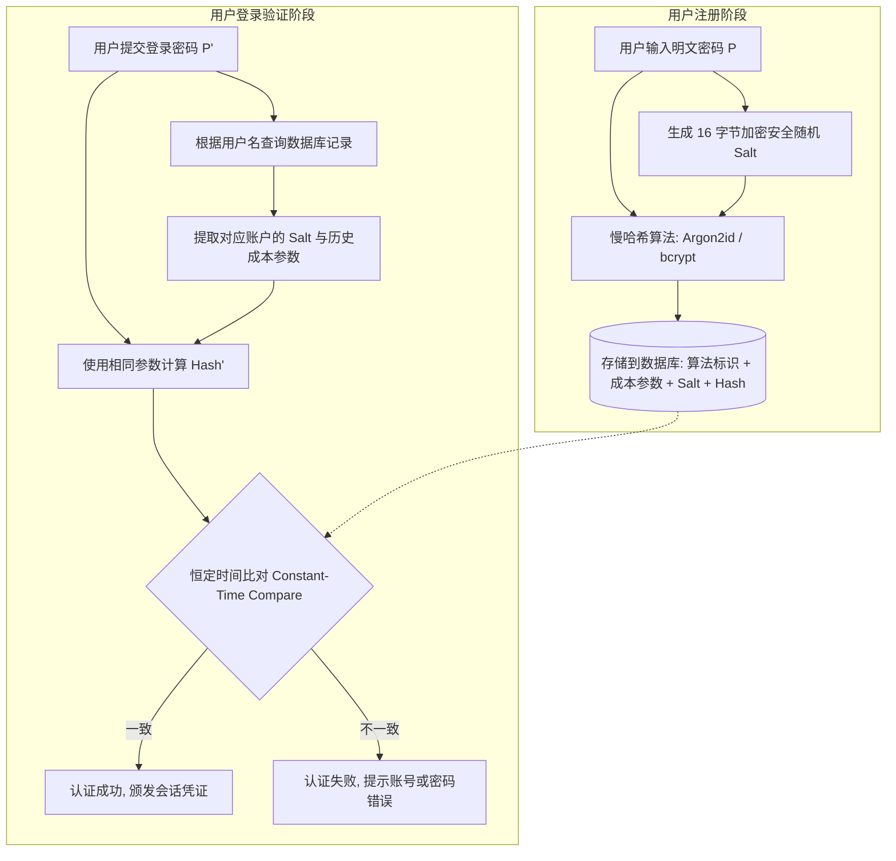
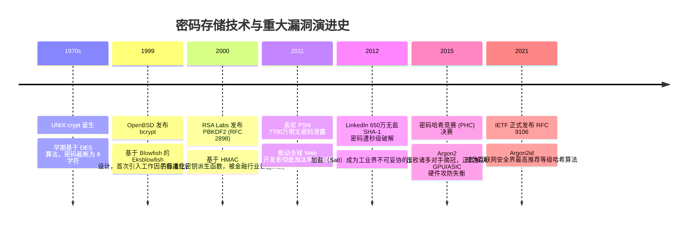

# 密码与哈希存储 🔐

## 1. 概述（What）

**密码与哈希存储（Password Hashing & Storage）** 是指应用系统在存储用户密码时，绝不保留原始明文，而是使用经过专门设计的单向密码学密钥拉伸算法（Key Derivation / Password Hashing Function），将用户输入的明文密码与随机盐值（Salt）结合，转换成不可逆的固定长度摘要字符串并持久化的技术。

- **核心解决问题**：即使底层数据库被黑客拖库（SQL 注入、数据泄露、内部人员未授权导出），攻击者也无法直接还原用户明文密码，有效抵御彩虹表（Rainbow Tables）、字典攻击与专用 ASIC/GPU 高并发暴力破解。
- **典型应用场景**：所有包含用户账户注册、登录鉴权、密码重置的 Web、App 及操作系统底层的身份验证中枢。

---

## 2. 原理详解（How it works）

普通的单向哈希函数（如 MD5、SHA-1、SHA-256）设计初衷是高速校验数据完整性，单台配备现代 GPU（如 RTX 4090）的机器每秒可计算数百亿次 SHA-256 哈希，若直接用于密码存储会引发灾难性破解风险。

现代密码存储必须满足三大密码学特征：
1. **单向不可逆性（Pre-image Resistance）**：已知哈希值 $H$，无法在计算可行时间内反推原密码 $P$。
2. **密码加盐（Salt）**：为每个用户在注册时生成唯一、加密安全的随机字节串（至少 16 字节），使相同明文密码在不同账户中生成完全不同的哈希值，从数学上彻底瓦解彩虹表预计算攻击。
3. **可调工作因子与资源硬度（Work Factor & Resource Hardness）**：
   - **时间硬度（CPU 迭代）**：增加哈希轮数，迫使单次验证耗时达到工程可接受的上限（通常为 100ms ~ 500ms）。
   - **内存硬度（Memory Hardness）**：强制算法在计算过程中频繁读写大量 RAM，极大增加了定制 ASIC 芯片和 GPU 显存带宽的制造成本（Argon2 与 scrypt 的核心创新）。

### 密码注册与验证交互流程

图 1-2：现代加盐慢哈希密码注册与恒定时间验证流程图

### 进阶纵深防御：胡椒（Pepper）与密钥托管
- **盐（Salt）**：随哈希值一同公开放置于数据库中，公开无妨，核心作用是消除预计算。
- **胡椒（Pepper）**：由应用服务器配置文件或 KMS/HSM 单独托管的全局保密密钥。在哈希前通过 HMAC 或追加方式参与运算。即便数据库全库泄露，若黑客未入侵 KMS 或取得 Pepper，依然无法启动离线碰撞。

---

## 3. 协议与标准（Protocols & Standards）

| 标准 / 推荐文档 | 组织 / 来源 | 核心内容与指引 |
| :--- | :--- | :--- |
| **RFC 9106** [1] | IETF CFRG (2021) | 《Argon2 密码哈希函数》，正式推荐 Argon2id 作为首选方案 |
| **NIST SP 800-63B** [2] | NIST (2020) | 《数字身份指南：身份验证与生命周期》，明确要求必须加盐并使用批准的 PBKDF/Argon2 |
| **OWASP Password Storage Cheat Sheet** [3] | OWASP (2023) | 推荐优先级：Argon2id > scrypt > bcrypt > PBKDF2 |
| **RFC 2898 / RFC 8018** [4] | IETF (2000/2017) | 《PKCS #5: 基于密码的密码学规范 v2.1 (PBKDF2)》 |

### 主流密码哈希算法对比矩阵

| 算法特性 | Argon2id | bcrypt | PBKDF2-HMAC-SHA256 | scrypt |
| :--- | :--- | :--- | :--- | :--- |
| **设计年份** | 2015 (PHC冠军) | 1999 (OpenBSD) | 2000 (PKCS#5) | 2009 |
| **内存抗性 (ASIC)** | ⭐⭐⭐⭐⭐ (完全可调) | ⭐⭐ (固定 4KB Blowfish) | ❌ (几乎无内存消耗) | ⭐⭐⭐⭐ (较高) |
| **旁路侧信道攻击** | ⭐⭐⭐⭐⭐ (混合模式) | ⭐⭐⭐ (存在 Cache 攻击风险) | ⭐⭐⭐⭐ (无内存查找表) | ⭐⭐⭐ (易受侧信道分析) |
| **密码长度上限** | 无限制 (可达 $2^{32}-1$) | **截断至 72 字节** ⚠️ | 无限制 | 无限制 |
| **行业推荐状态** | 强烈推荐 (首选) | 广泛兼容 (备选) | 仅推荐合规兼容场景 | 逐渐被 Argon2 取代 |

---

## 4. 发展历史（Timeline）

图 1-3：密码安全存储与重大数据泄露驱动的演进时间线

---

## 5. 优缺点与安全性分析

### 核心优势
1. **计算成本不对称性**：合法用户认证单次消耗 100ms 对用户无感知；但黑客要穷举十亿个弱密码需要数百年算力，彻底粉碎离线碰撞的可行性。
2. **防范彩虹表与批量对齐**：每个账户独立的密码学伪随机 Salt，迫使攻击者必须逐个账户单独跑字典，无法复用彩虹表成果。
3. **恒定时间校验防侧信道**：密码校验在代码层必须采用 `crypto.timingSafeEqual()`，杜绝根据字符串提前返回导致的字节时序侧信道攻击。

### 已知弱点与攻击防范
- **弱口令字典命中**：无论哈希算法多强，若用户密码为 `123456`，黑客在常用 Top 1000 弱口令字典中前几秒即可命中。**对策**：在注册和改密环节强制对接 HaveIBeenPwned 等泄露凭证黑名单检测 [2]。
- **截断陷阱（bcrypt 特有）**：bcrypt 会悄悄截断超过 72 字节的密码，使得 `password_longer_than_72_chars_AAAA...` 与 `password_longer_than_72_chars_BBBB...` 生成相同哈希。**对策**：在交给 bcrypt 前先使用 SHA-512 做一次预哈希，或直接改用 Argon2id。
- **配置参数停滞不前**：十年前配置的 PBKDF2 迭代 1,000 次在今天已被 GPU 轻松突破。**对策**：根据摩尔定律与 OWASP 年报动态更新成本参数，并在用户每次成功登录时静默重新哈希（Re-hash on login）。

---

## 6. 关联知识点（Related）

- **上下游技术**：
  - [TOTP 动态密码](./03-otp-totp)：在密码之上增加时间因素的第二道防线。
  - [Passkey / WebAuthn](./05-passkey-webauthn)：基于非对称密码学的终极无密码方案，从根本上消除了共享秘密在服务端的存储。
- **常见对比**：
  - **Argon2id vs bcrypt**：Argon2id 具备内存硬度且不受 72 字节限制，在新系统中建议无条件优先选用；已稳定运行 bcrypt 的老系统无需推倒重来，提升 Cost 参数（如 12~14）即可保持高强度。

---

## 7. 参考资料（References）

[1] IETF. RFC 9106: Argon2 Memory-Hard Function for Password Hashing and Proof-of-Work Applications.  
https://datatracker.ietf.org/doc/html/rfc9106

[2] NIST Special Publication 800-63B. Digital Identity Guidelines: Authentication and Lifecycle Management.  
https://pages.nist.gov/800-63-3/sp800-63b.html

[3] OWASP Foundation. Password Storage Cheat Sheet.  
https://cheatsheetseries.owasp.org/cheatsheets/Password_Storage_Cheat_Sheet.html

[4] IETF. RFC 8018: PKCS #5: Password-Based Cryptography Specification Version 2.1.  
https://datatracker.ietf.org/doc/html/rfc8018
