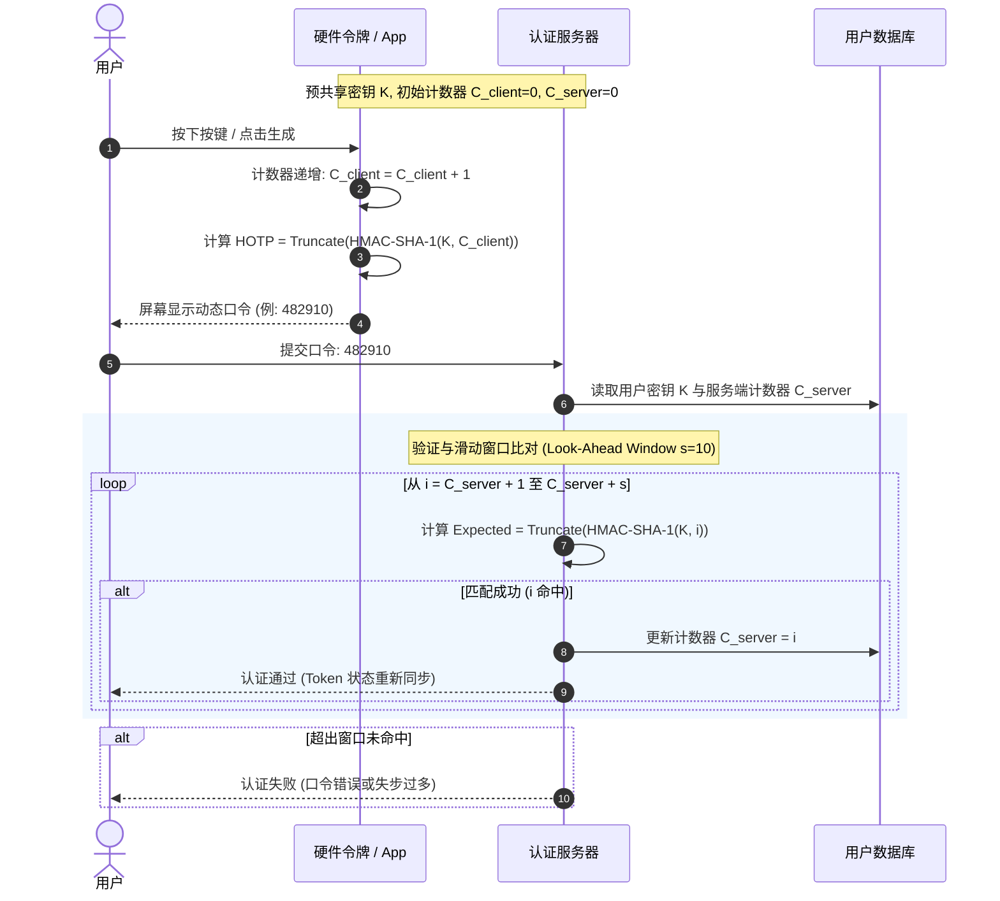
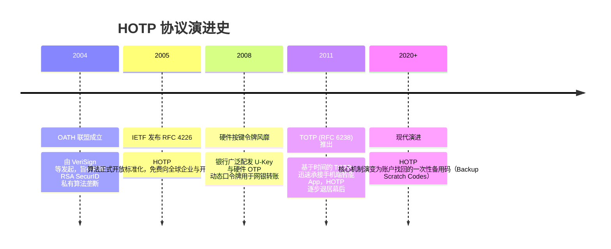

# HOTP 基于计数器的一次性密码 📟

## 1. 概述（What）

**HOTP（HMAC-Based One-Time Password Algorithm）** 是一种基于事件计数器与哈希消息认证码（HMAC-SHA-1）的动态口令算法。用户每次触发认证（例如按下物理硬件令牌上的按键），计数器自增 1，结合共享密钥生成一个通常为 6 位或 8 位的数字一次性密码。

- **核心解决问题**：摆脱对物理时钟的依赖，在无电池时钟芯片的廉价硬件令牌或网络隔离设备上实现高强度的双因素认证（2FA），杜绝静态密码被窃听复用攻击。
- **典型应用场景**：银行早期的电子按键动态令牌（Token Key）、工控与隔离网络系统的物理密钥、应急单次救援代码（Backup Codes）。

---

## 2. 原理详解（How it works）

HOTP 的核心公式极为简洁优雅：

$$\text{HOTP}(K, C) = \text{Truncate}(\text{HMAC-SHA-1}(K, C)) \pmod{10^d}$$

其中：
- $K$ 为服务端与客户端预共享的对称密钥（Secret Key）。
- $C$ 为 8 字节（64 位）的事件计数器（Counter），双方在初始阶段同步为 0。
- $d$ 为输出动态口令的位数（通常为 6 或 8 位）。

### 核心机制拆解：动态截断（Dynamic Truncation）
HMAC-SHA-1 计算结果为 20 字节（160 位）的哈希值。由于用户无法手动输入 20 字节的哈希，RFC 4226 规定了精妙的**动态截断算法**：
1. 取哈希最后一个字节（Byte 19）的低 4 位作为偏移量（Offset, 范围 0~15）。
2. 从哈希值的第 `Offset` 个字节开始，提取连续的 4 个字节。
3. 将这 4 个字节的最高位（MSB）置为 0（屏蔽符号位，防止有符号整数溢出），转换为一个 31 位的无符号整数。
4. 对 $10^d$（例如 $10^6$）取模，不足位数前面补零，得到用户可见的 6 位数字验证码。

### HOTP 交互时序与计数器漂移窗口（Look-Ahead Window）

图 1-4：HOTP 客户端与服务端事件触发及滑动窗口（Look-Ahead Window）认证时序图

> **图注说明**：若用户误触令牌按键多次而未提交验证，客户端计数器会超过服务端（发生计数器脱节）。服务端在验证时引入了前瞻搜索窗口（Look-Ahead Window，通常为 10~20 次）。一旦在窗口内匹配成功，服务端自动将计数器前移同步，杜绝死锁。

---

## 3. 协议与标准（Protocols & Standards）

| 标准规范 | 制定组织 | 发布年份 | 核心贡献与地位 |
| :--- | :--- | :--- | :--- |
| **RFC 4226** [1] | IETF / OATH (开放认证倡议) | 2005 | 《HOTP: 基于 HMAC 的一次性密码算法》，奠定了现代动态口令数学基石 |
| **ISO/IEC 29115** | ISO / IEC | 2013 | 《实体身份鉴别保障框架》，明确了计数器与时间令牌的安全保证级别（LoA 3） |

### 主流实现与替代方案对比

| 对比维度 | HOTP (RFC 4226) | TOTP (RFC 6238) | 短信验证码 (SMS OTP) |
| :--- | :--- | :--- | :--- |
| **驱动源** | 事件/按键自增计数器 | Unix 时间戳 (通常 30s) | 服务端下发随机串 |
| **物理硬件依赖** | 极低（仅需存储计数器） | 需具备精确 RTC 实时时钟芯片 | 需基带芯片与电信信号 |
| **失步问题** | 误按导致计数器单向超前 | 时钟漂移（NTP 可校正） | 无失步（但有时延丢失） |
| **抗拦截能力** | ⭐⭐⭐⭐ (无无线信号) | ⭐⭐⭐⭐ (端侧计算) | ⭐ (易遭 SIM 劫持与伪基站) |
| **现代应用热度** | 边缘化 (应急码为主) | 广泛主流 | 高风险，逐步收紧 |

---

## 4. 发展历史（Timeline）

图 1-5：HOTP 标准化与演变历史脉络

---

## 5. 优缺点与安全性分析

### 优势
- **极简工程实现**：无需网络、无需时间芯片，运算量极小，非常适宜烧录在超低功耗的嵌入式智能卡芯片中。
- **单次消耗即废**：口令使用后计数器强制递增，旧口令无论何时被窃听都无法再次回放。

### 弱点与安全风险
- **拒绝服务失步（Desynchronization DoS）**：恶意攻击者若拿到物理令牌连续按下 100 次，将导致计数器超出服务端的前瞻窗口，使合法用户无法登录。**对策**：设置两阶段重新同步机制（输入连续两个有效口令完成同步）。
- **截断熵值限制**：6 位数字口令的搜索空间仅为 $10^6$。若无频率限制，攻击者可在滑动窗口内暴力猜解。**对策**：RFC 4226 强制要求认证端必须实施阈值熔断（连续失败 3~5 次立即锁定）。
- **当前推荐状态**：部分保留。作为纯认证方式已被 TOTP 和 WebAuthn 超越，但其计数递增机制是现代系统"离线备用救援码"的黄金标准。

---

## 6. 关联知识点（Related）

- **技术演进**：[TOTP 时间戳动态密码](./03-otp-totp)（HOTP 的时间变体，将计数值换为时间戳步长）。
- **复合防御**：[多因素认证 MFA](./11-mfa)（与静态密码组合构成 2FA 架构）。

---

## 7. 参考资料（References）

[1] IETF. RFC 4226: HOTP: An HMAC-Based One-Time Password Algorithm.  
https://datatracker.ietf.org/doc/html/rfc4226

[2] OATH. Initiative for Open Authentication Reference Architectures.  
https://openauthentication.org/
