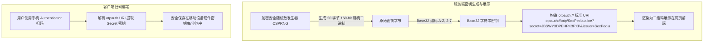
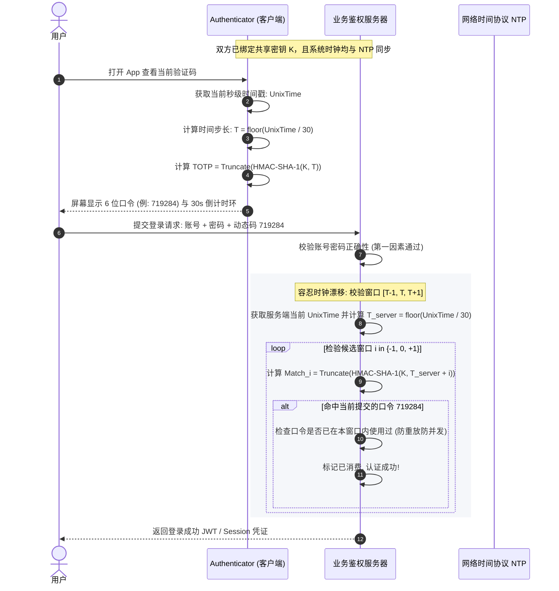
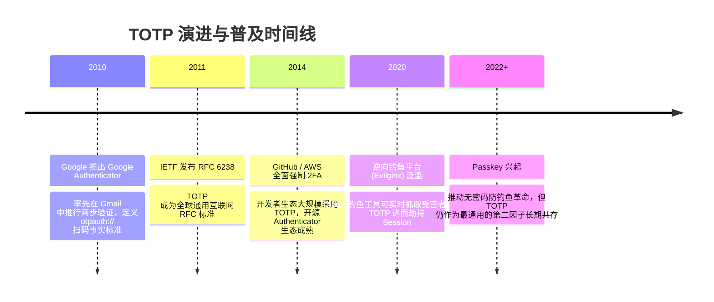

# TOTP 时间同步一次性密码 ⏱️

## 1. 概述（What）

**TOTP（Time-Based One-Time Password Algorithm）** 是一种基于当前 Unix 时间戳的一次性密码算法。它是 HOTP 算法的延伸，通过将原计数器替换为按固定时间步长（通常为 30 秒）流逝的离散时间切片，使客户端设备与服务端在无需网络通信的情况下，各自独立计算出当前周期的动态 6 位（或 8 位）数字验证码。

- **核心解决问题**：彻底解决了 HOTP 的计数器手动误触失步问题，无需昂贵专有硬件，仅凭用户智能手机安装的 Authenticator App（如 Google Authenticator、Microsoft Authenticator、1Password）即可实现强大的双因素认证（2FA）。
- **典型应用场景**：GitHub、Google、AWS、各大加密货币交易所等所有高价值线上平台的双重认证防线。

---

## 2. 原理详解（How it works）

TOTP 的数学本质就是将 HOTP 的事件计数器 $C$ 替换为时间因子 $T$：

$$T = \left\lfloor \frac{\text{Current Unix Time} - T_0}{X} \right\rfloor$$

$$\text{TOTP} = \text{HOTP}(K, T) = \text{Truncate}(\text{HMAC-SHA-1}(K, T)) \pmod{10^d}$$

关键参数解释：
- $\text{Current Unix Time}$：自 1970-01-01 00:00:00 UTC 起经过的物理秒数。
- $T_0$：纪元起始时间，默认取值为 0。
- $X$：时间步长窗口大小（Time Step），默认为 **30 秒**。
- $K$：服务端与客户端共享的对称密钥（通常为 160 位/20 字节二进制串，以 Base32 字符串或二维码形式呈现）。
- $d$：输出口令长度，默认为 6 位十进制数。

### 图表一：密钥生成与 Base32 编码绑定流程

图 1-6：TOTP 共享密钥生成、Base32 编码与手机扫码绑定流程图

> **图注说明**：Base32 编码（RFC 4648）仅使用大写字母 A~Z 及数字 2~7，特意剔除了 0、1、8、9 及容易与小写字母混淆的字符（如 O、I、L），不仅便于生成密集的二维码，更方便用户在摄像头损坏时手动从键盘无歧义录入。

### 图表二：客户端与服务端时间同步验证时序图

图 1-7：TOTP 客户端-服务端时间同步计算与容差验证时序图

> **图注说明**：现实中用户手机或服务器时钟可能存在数秒误差，RFC 6238 明确建议服务端验证时接受当前步长前后各 1 个周期的验证码（即 $[T-1, T, T+1]$ 窗口，覆盖前后 30 秒），保证良好体验。同时，服务端必须维护已消耗口令缓存，防止同一 30 秒窗口内被重放。

---

## 3. 协议与标准（Protocols & Standards）

| 标准规范 | 制定组织 | 发布年份 | 说明与核心指导 |
| :--- | :--- | :--- | :--- |
| **RFC 6238** [1] | IETF | 2011 | 《TOTP: 基于时间的一次性密码算法》，正式规范 |
| **Key URI Format** [2] | Google Authenticator / IETF Draft | 2011 | 标准化 `otpauth://totp/...` 统一扫码协议 |
| **NIST SP 800-63B** [3] | NIST | 2020 | 将 TOTP 认定为合规的**带外受限软件认证因子（AAL2）** |

### 主流哈希算法支持对比
RFC 6238 允许使用 SHA-1、SHA-256 及 SHA-512。但在现实生态中：
- **HMAC-SHA-1**：由于 Google Authenticator 早期实现的统治级地位，95% 以上的 App 默认且仅保证兼容 SHA-1。在 TOTP 场景下，HMAC 的抗碰撞攻击弱点不影响截断认证的安全性。
- **HMAC-SHA-256 / SHA-512**：部分现代客户端（如 YubiKey Authenticator、Ente Auth）已支持，适合国防与金融高合规场景。

---

## 4. 发展历史（Timeline）

图 1-8：TOTP 技术演进与钓鱼对抗历程

---

## 5. 优缺点与安全性分析

### 核心优势
1. **完全离线运行**：客户端生成验证码无需蜂窝网络或 Wi-Fi，即使在飞机、深山或地下室也能正常登录。
2. **跨平台零成本**：无需购买专用硬件，开源生态完善（iOS、Android、macOS、Linux 均有客户端）。
3. **免疫电信劫持**：不依赖短信通道，天然免疫 SIM-Swapping（SIM 卡补卡攻击）和伪基站窃听。

### 致命弱点与现代攻击面
- **无法防御实时中间人钓鱼（Real-Time Reverse Proxy Phishing）**：
  攻击者搭建钓鱼镜像站（如通过 Evilginx2），在克隆页面中诱导受害者输入账号密码及即时 TOTP。黑客的自动化脚本在 30 秒内直接将 TOTP 转发给真实服务器，瞬间获取登录 Cookie [4]。
- **备份同步风险**：云端同步 Authenticator（如未端到端加密的账户）存在云端主账号被盗导致 2FA 凭据集体失窃的风险。
- **当前推荐状态**：强烈推荐（作为 2FA 第二因子广泛使用；但在最高安全防线场景，正逐步被防钓鱼的 Passkey / WebAuthn 升级）。

---

## 6. 关联知识点（Related）

- **底层算法**：[HOTP 计数器动态口令](./02-otp-hotp)（TOTP 的父算法）。
- **终极演进**：[Passkey 与 WebAuthn](./05-passkey-webauthn)（基于公私钥签名与 Origin 域绑定的抗钓鱼无密码体系）。
- **对比对象**：[短信与邮箱验证码](./04-otp-sms-email)（对比安全性与运营成本）。

---

## 7. 参考资料（References）

[1] IETF. RFC 6238: TOTP: Time-Based One-Time Password Algorithm.  
https://datatracker.ietf.org/doc/html/rfc6238

[2] Google. Key Uri Format for Authenticator.  
https://github.com/google/google-authenticator/wiki/Key-Uri-Format

[3] NIST SP 800-63B. Section 5.1.4: Multi-Factor OTP Authenticators.  
https://pages.nist.gov/800-63-3/sp800-63b.html

[4] Cloudflare Learning Center. What is a Time-Based One-Time Password (TOTP)?  
https://www.cloudflare.com/learning/access-management/what-is-totp/
