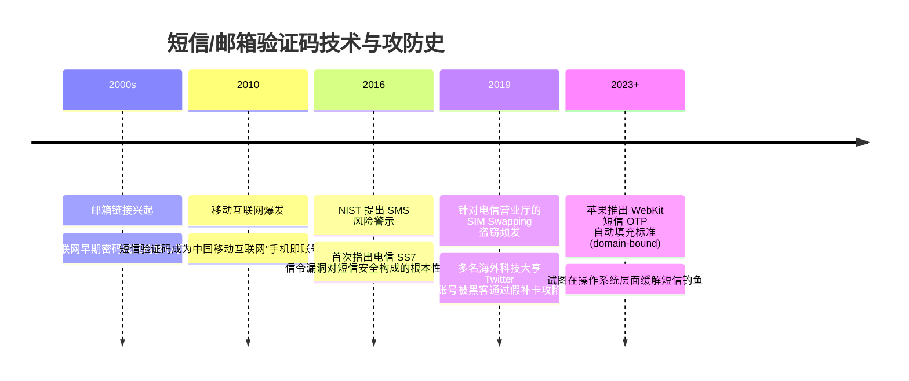

# 短信与邮箱验证码 📩

## 1. 概述（What）

**短信与邮箱验证码（SMS & Email OTP）** 是一种将一次性动态随机凭证通过电信移动网络（蜂窝 SMS）或互联网邮件传输协议（SMTP）发送至用户注册手机或电子邮箱的**带外身份验证（Out-of-Band, OOB）**方案。

- **核心解决问题**：在用户未安装任何安全 Authenticator App、未持有专用硬件的情况下，以极低的认知门槛完成身份初次绑定、两步验证或密码重置。
- **典型应用场景**：国内主流互联网产品的手机一键注册/快捷登录、银行大额交易短信提醒二次确认、海外网站忘记密码时的邮件重置确认。

---

## 2. 原理详解（How it works）

短信与邮箱验证码的核心逻辑是利用运营商的通信信道作为第二信道传递保密信息：

```mermaid
sequenceDiagram
    autonumber
    actor User as 用户
    participant App as 网页 / 客户端
    participant Server as 业务鉴权服务端
    participant Provider as 电信运营商网关 / SMTP 服务
    actor Attacker as 潜在攻击者 (伪基站/SIM劫持)

    User->>App: 请求登录/改密，输入手机号/邮箱
    App->>Server: 发起发送验证码请求
    Server->>Server: 生成加密伪随机 6 位数字，绑定 Session，设置 5 分钟 TTL
    Server->>Provider: 调用 API 异步下发验证码 (含频率限制)
    
    par 正常通路
        Provider->>User: 手机接收短信 / 邮箱接收邮件通知
    and 潜在攻击面
        Provider-.->|SS7 信令漏洞 / SIM 卡补卡| Attacker
    end

    User->>App: 手动输入接收到的验证码
    App->>Server: 提交验证码
    Server->>Server: 恒定时间校验验证码一致性并立即销毁该验证码
    Server-->>App: 校验成功，通过认证
```
<div class="diagram-caption">图 1-16：短信/邮箱带外验证码交互时序与潜在攻击面示意图</div>

> **图注说明**：虽然验证码生成在安全后端，但传输通道暴露在复杂的不可控公网和电信基建中。电信信令协议的漏洞或营业厅社会工程学可能导致验证码在半路被旁路窃听。

---

## 3. 协议与标准（Protocols & Standards）

| 标准 / 规范 | 制定机构 | 评估意见与合规限制 |
| :--- | :--- | :--- |
| **NIST SP 800-63B (Section 5.1.3)** [1] | NIST (美国国家标准) | 明确将基于 SMS 的带外验证码降级为**受限（Restricted）**因子，强烈建议向软件 OTP/WebAuthn 迁移 |
| **3GPP TS 23.040** | 3GPP | 短消息业务（SMS）技术实现标准 |
| **RFC 5321 / RFC 7208** [2] | IETF | 邮件传输 SMTP 与防伪造 SPF / DKIM / DMARC 标准 |

---

## 4. 发展历史（Timeline）


<div class="diagram-caption">图 1-17：短信与邮箱验证码演进与安全博弈</div>

---

## 5. 优缺点与安全性分析

### 优点
- **极佳的用户覆盖率**：几乎所有现代人都拥有手机号和邮箱，无需安装任何前置软件，老少皆宜。
- **与用户身份自然绑定**：在国内实名制体系下，手机号天然与个人法定身份强关联。

### 安全缺陷与攻击方式
1. **SIM 换卡攻击（SIM Swapping）**：攻击者利用伪造身份证件或买通营业厅员工，将受害者的手机号挂失补卡到攻击者的空白 SIM 卡上，受害者手机瞬间无服务，攻击者直接截获后续所有验证码。
2. **SS7 信令漏洞与伪基站拦截**：全球电信漫游信令网（SS7/Diameter）存在结构性设计缺陷，具备电信接入资质的黑客可在境外直接定位并嗅探短信下发内容。
3. **极易遭受社会工程学与钓鱼网站中继**：受害者极易在虚假客服电话或钓鱼网站中毫无防备地将短信验证码告诉攻击者。
4. **当前推荐状态**：<span class="badge-pill status-caution">谨慎使用 / 降级兜底</span>。在金融支付和高密权限系统，不应将短信作为唯一核心认证因子。

---

## 6. 关联知识点（Related）

- **更安全的动态口令**：[TOTP 时间动态口令](./03-otp-totp)（端侧离线计算，杜绝通信信道窃听）。
- **无密码方案**：[Magic Link 魔法链接](./06-magic-link)（邮箱机制的直接演进）。

---

## 7. 参考资料（References）

[1] NIST. SP 800-63B: Digital Identity Guidelines - Section 5.1.3.3 Out-of-Band Authenticators.  
https://pages.nist.gov/800-63-3/sp800-63b.html

[2] IETF. RFC 7208: Sender Policy Framework (SPF) for Authorizing Use of Domains in Email.  
https://datatracker.ietf.org/doc/html/rfc7208
