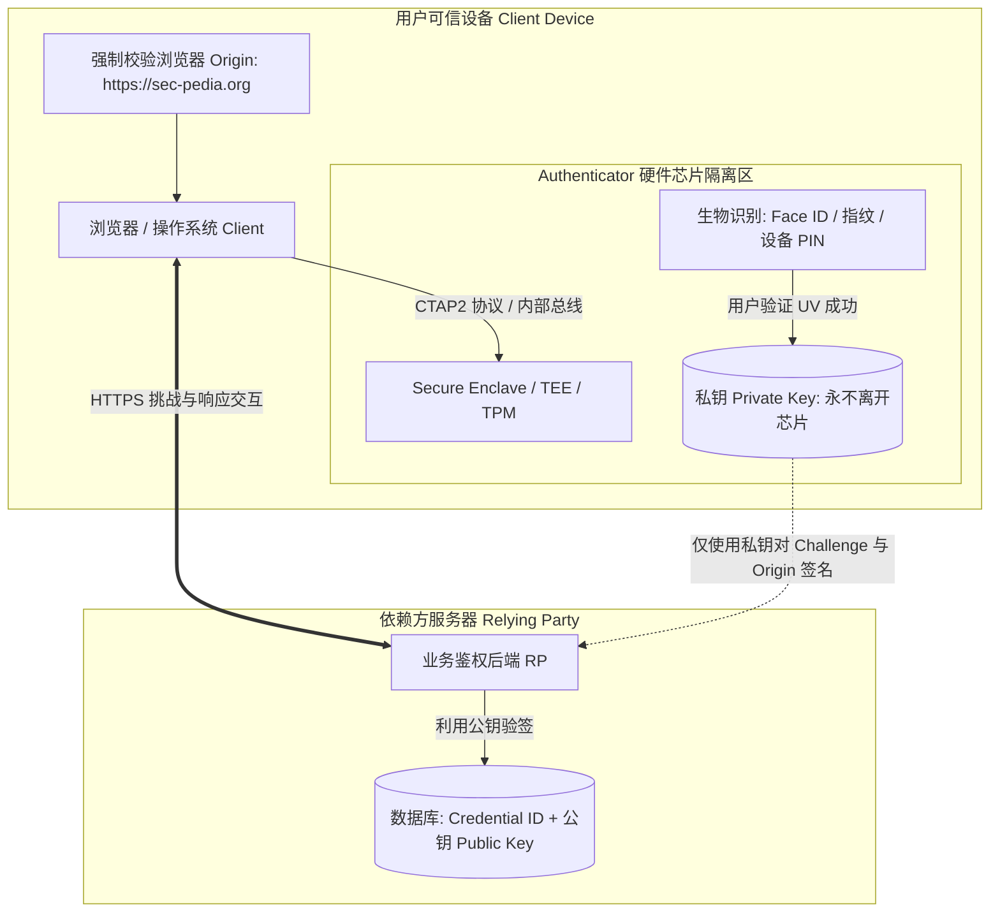
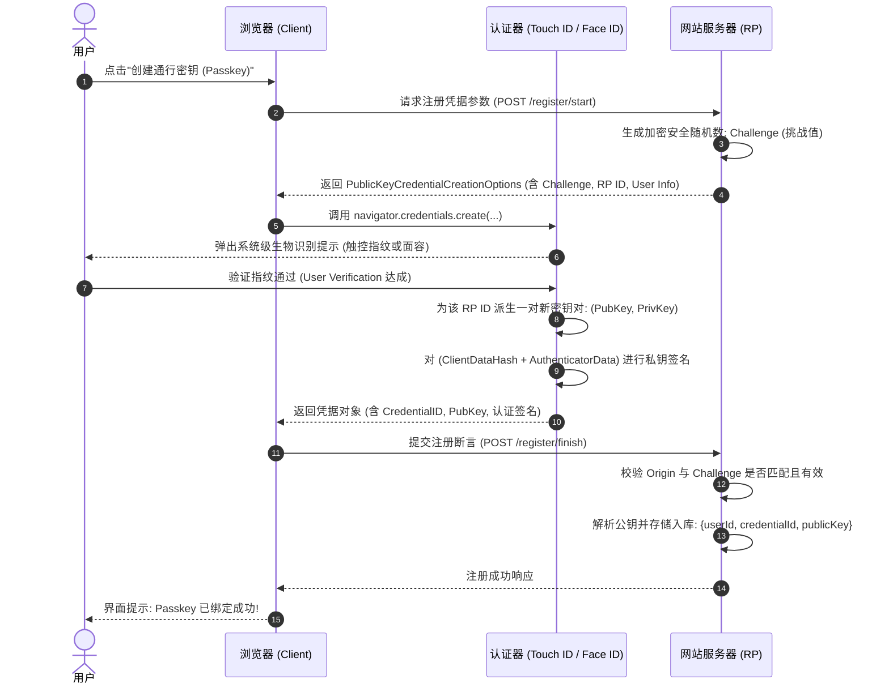
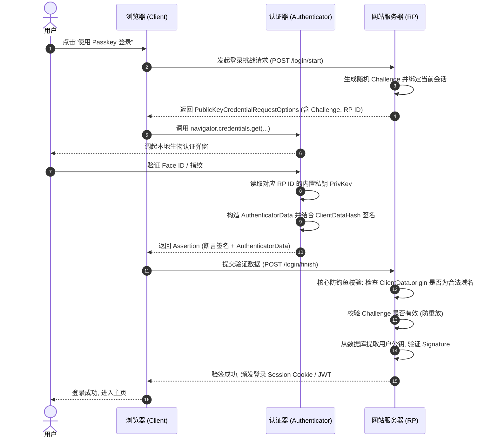
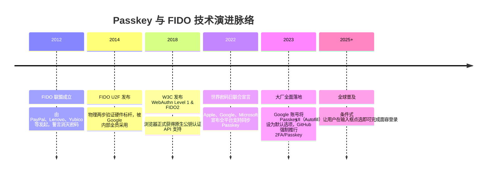

# Passkey 与 WebAuthn / FIDO2 🔑

## 1. 概述（What）

**Passkey（通行密钥）** 是基于 **W3C WebAuthn** 与 **FIDO2** 标准构建的下一代现代无密码身份凭据体系。它用非对称公私钥对（Asymmetric Key Pairs）彻底取代了传统密码。在用户设备（如 iPhone、Android 手机、Mac、Windows PC 或 YubiKey 物理密钥）内创建私钥并由安全硬件保护，服务端仅保存公钥。

- **核心解决问题**：彻底根除凭证填充（Credential Stuffing）、弱口令撞库、服务端数据库泄露风险，并从协议级杜绝了针对传统密码和 TOTP 的**中间人钓鱼攻击（Phishing-resistant）**。
- **典型应用场景**：Apple ID、Google 账号、GitHub、Microsoft 账号、各大金融 App 以及现代 Web 应用的原生一键生物识别登录。

---

## 2. 原理详解（How it works）

WebAuthn 标准定义了三方角色：
1. **Relying Party（RP，依赖方 / 网站服务端）**：发起认证挑战，存储用户公钥并验证断言签名。
2. **Client（客户端 / 浏览器 / 操作系统）**：实现 `navigator.credentials.create()` 与 `get()` 原生 JavaScript API，并在请求中注入强绑定的 Origin（域名源）。
3. **Authenticator（认证器）**：负责生成并安全存储私钥、执行用户在场证明（User Presence, UP）或用户验证（User Verification, UV，如指纹/Face ID/PIN）。

### 图表一：架构图 — 认证器、公私钥与安全边界

图 1-9：WebAuthn 认证器架构与硬件隔离安全边界

> **图注说明**：私钥由设备内部的隔离安全硬件（Secure Enclave 或 TPM）生成并牢牢锁死在芯片中，甚至操作系统内核都无法导出。认证器仅向外部返回由私钥签名的挑战结果。

---

### 图表二：Passkey 注册时序图（MakeCredential）

图 1-10：WebAuthn Passkey 注册凭据（MakeCredential）交互时序图

---

### 图表三：Passkey 登录认证时序图（GetAssertion）

图 1-11：WebAuthn Passkey 登录验证（GetAssertion）与防钓鱼时序图

> **图注说明（防钓鱼核心机理）**：若用户被欺骗访问了钓鱼网站 `https://fake-login.com`，浏览器在调用底层 API 时会**强制将当前真实访问的 Origin** 注入数据包中。攻击者无法伪造浏览器的 Origin，服务器收到签名后校验域名不符直接拒绝，从而在数学和协议层面免疫钓鱼！

---

## 3. 协议与标准（Protocols & Standards）

| 规范名称 | 标准组织 | 状态 / 版本 | 覆盖领域 |
| :--- | :--- | :--- | :--- |
| **Web Authentication (WebAuthn)** [1] | W3C | Level 3 推荐草案 / Level 2 推荐规范 | 浏览器与 Web 应用程序之间的 JavaScript API 规范 |
| **CTAP2 (Client to Authenticator Protocol)** [2] | FIDO 联盟 | CTAP 2.1 / 2.2 | 浏览器与外置硬件密钥（USB/NFC/BLE）之间的双向通信底层报文 |
| **FIDO2 标准体系** | FIDO Alliance | 工业标准 | 涵盖 WebAuthn 与 CTAP2 的整体无密码框架体系 |

### Passkey 分类：设备绑定型 vs 多端同步型

| 特性维度 | 设备绑定 Passkey (Device-bound / U2F) | 多端同步 Passkey (Synced Passkey) |
| :--- | :--- | :--- |
| **代表产品** | YubiKey、Google Titan 硬件安全 Key | Apple iCloud 钥匙串、Google 密码管理器、1Password |
| **密钥可导出性** | 绝对锁死在单个硬件，物理不可复制 | 经端到端加密（E2EE）在同一生态账号的设备间安全同步 |
| **丢失应对** | 必须通过备用 Key 或管理员重置 | 新设备登录 iCloud/Google 账号即可自动恢复 |
| **适用场景** | 极高安全级别要求（企业内网运维、特权账号） | 亿级大众互联网用户日常丝滑无密码体验 |

---

## 4. 发展历史（Timeline）

图 1-12：FIDO 联盟与 Passkey 发展演进历史

---

## 5. 优缺点与安全性分析

### 卓越优势
1. **彻底终结钓鱼攻击（Phishing Resistant）**：浏览器端强制写入并验证 `clientDataJSON.origin`，中间人代理根本无法骗取合法域名的签名。
2. **免受撞库与拖库风险**：即便服务端数据库全盘遭窃，泄露的也仅为无害的公开公钥，黑客无法凭此发起离线暴力破解。
3. **极致用户体验**：无需记忆复杂字符，手指轻触指纹或注视屏幕即可完成秒级安全登录。

### 挑战与注意事项
- **生态锁定与跨系统流转**：不同操作系统生态（如 iOS 迁至 Android）之间的 Passkey 原生转移仍处于协议磨合期（正由 FIDO 联盟制定跨平台安全导出标准）。
- **账号恢复与凭据丢失**：若用户唯一的单设备绑定 Key 损坏或遗失，服务方必须提供兼顾安全性与易用性的账户恢复通路。
- **当前推荐状态**：顶级推荐（未来标准）。所有新建现代 Web/App 系统的首选身份认证方案。

---

## 6. 关联知识点（Related）

- **硬件基础**：[U2F 硬件密钥](./07-u2f-hardware-token)（Passkey 的前身与高安全硬件载体）。
- **传统替代**：[密码与哈希存储](./01-password-hashing)（Passkey 取代的核心对象）。
- **终端保护**：[TEE 与 Secure Enclave](/05-endpoint-security/02-tee-secure-enclave)（底层私钥存放的硬件隔离区）。

---

## 7. 参考资料（References）

[1] W3C. Web Authentication: An API for accessing Public Key Credentials Level 2.  
https://www.w3.org/TR/webauthn-2/

[2] FIDO Alliance. Client to Authenticator Protocol (CTAP) Implementation Draft.  
https://fidoalliance.org/specs/fido-v2.1-ps-20210615/fido-client-to-authenticator-protocol-v2.1-ps-errata-20220621.html

[3] Passkeys.dev. Official Developer Guides for Passkey Deployment.  
https://passkeys.dev/

[4] Cloudflare Learning Center. What is FIDO2 and WebAuthn?  
https://www.cloudflare.com/learning/access-management/what-is-fido2/
