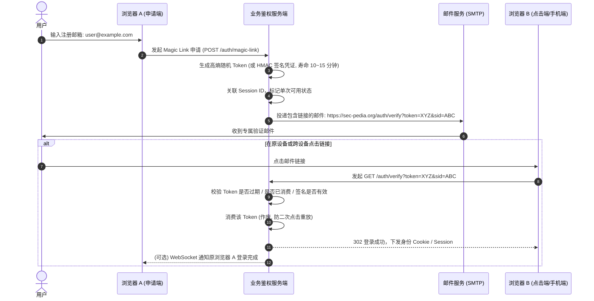
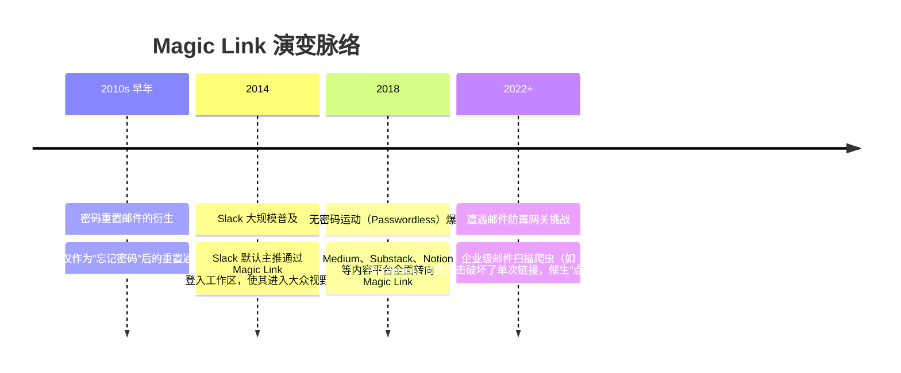

# Magic Link 魔法链接 🪄

## 1. 概述（What）

**Magic Link（魔法链接）** 是一种通过电子邮件下发的单次有效（Single-Use）、具有严格时间窗口限制的**签名 URL 认证机制**。用户在登录时只需输入注册邮箱，点击收件箱中的专属链接，即可直接完成身份核验并登录系统，全程无需记忆或输入任何静态密码。

- **核心解决问题**：彻底免除用户的密码记忆负担，消除密码重用与凭据泄露，是中低频 Web 服务与开发者工具极其青睐的无密码实践。
- **典型应用场景**：Slack 快速登录、Notion 账号验证、Substack、Medium 及各类 SaaS 平台的一次性注册与激活。

---

## 2. 原理详解（How it works）

Magic Link 的底层本质是**基于密码学数字签名或高熵随机数映射的临时有状态授权凭证**。

图 1-18：Magic Link 生成、邮件分发与单次核验时序图

> **图注说明**：Magic Link 必须保证在服务端是**绝对单次消费（Burn after use）**的。当用户或邮件安全网关的自动扫描爬虫点击链接后，Token 立即被销毁，防止任何二次重放。

---

## 3. 协议与标准（Protocols & Standards）

| 标准 / 规范 | 说明 |
| :--- | :--- |
| **OWASP Authentication Cheat Sheet** [1] | 规定了免密临时链接的生命周期（建议 < 15分钟）、单次有效性与高熵要求 |
| **RFC 7515 (JWS)** [2] | 可选的无状态 Magic Link 构造标准（使用 HMAC-SHA256 对 `exp` 和 `email` 进行密文签名） |
| **DMARC / SPF / DKIM 邮件合规** | 必须严格配置，防止钓鱼攻击者伪造官方域名下发虚假登录链接 |

---

## 4. 发展历史（Timeline）

图 1-19：Magic Link 推广历程与企业防毒网关对抗

---

## 5. 优缺点与安全性分析

### 优点
- **极高转化率**：注册转化率显著高于传统要求设置 8 位复杂密码的表单。
- **无密码拖库风险**：系统数据库完全不保存用户密码哈希，黑客拖库无法拿到任何离线凭据。

### 弱点与风险
- **依赖邮箱终端安全**：如果用户的邮箱账号失窃或设备被劫持，其所有依赖 Magic Link 的外部平台均形同虚设。
- **邮件扫描器误触**：现代企业邮箱安全反垃圾系统会自动点击邮件中所有外部链接以检测病毒，导致合法用户点开时提示"链接已失效"。**解决对策**：页面采用 GET 展示"确认登录"按钮，由用户在页面主动点击 POST 完成真正的 Token 消费。
- **当前推荐状态**：良好（中等安全性业务适用）。非常适合博客、社区、轻量 SaaS，但不推荐作为银行或核心云资产的主认证方式。

---

## 6. 关联知识点（Related）

- **短信与邮箱验证码**：[短信与邮箱验证码](./04-otp-sms-email)（同一信道的数字验证码形态）。
- **终极抗钓鱼无密码**：[Passkey / WebAuthn](./05-passkey-webauthn)（无需借助邮件通道的本地硬件级无密码认证）。

---

## 7. 参考资料（References）

[1] OWASP. Forgot Password and Passwordless Cheat Sheet.  
https://cheatsheetseries.owasp.org/cheatsheets/Forgot_Password_Cheat_Sheet.html

[2] IETF. RFC 7515: JSON Web Signature (JWS).  
https://datatracker.ietf.org/doc/html/rfc7515
