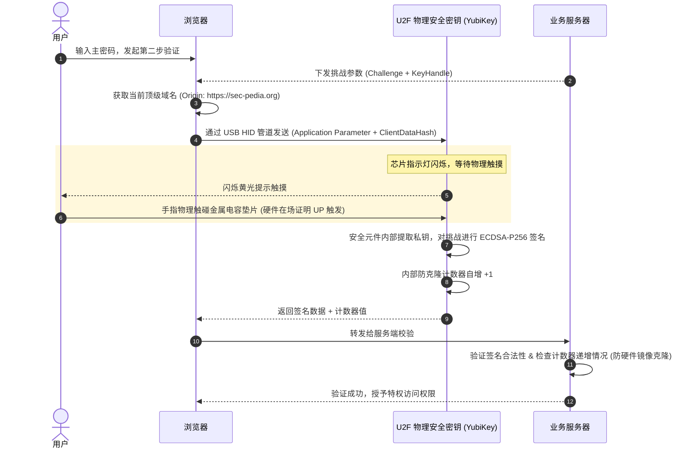
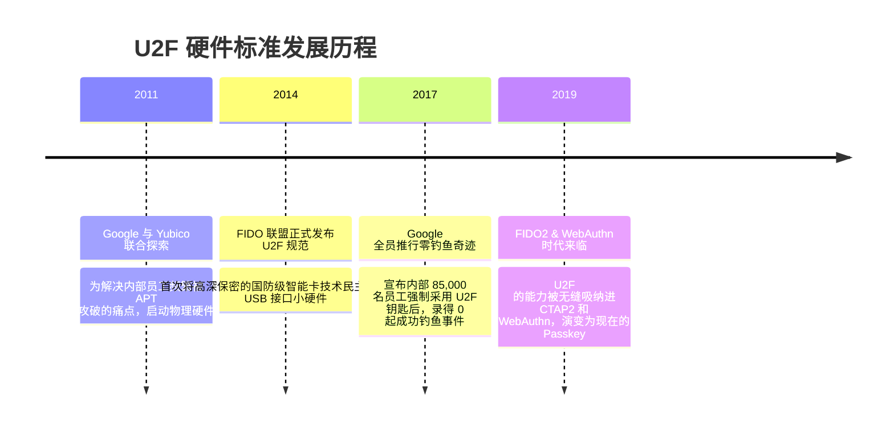

# U2F 硬件安全密钥 🛡️

## 1. 概述（What）

**FIDO U2F（Universal 2nd Factor，通用第二因素）** 是一种基于物理硬件安全芯片的开放身份认证标准。用户通过将物理安全密钥（如 YubiKey、Google Titan Key）插入计算机 USB 接口或轻触 NFC，在触摸物理电容感应按键后，由硬件芯片内部完成非对称数字签名，作为高强度的第二重身份凭证。

- **核心解决问题**：以物理不可复制的专有硬件，彻底抵御大规模远程凭证窃取、软件木马内存窃听与中间人网络钓鱼攻击。
- **典型应用场景**：Google、Cloudflare 内部全员强制推行的运维与管理后台防御、大型跨国银行高额资金拨划、开源核心维护者（如 Linux 内核维护团队）代码签名鉴权。

---

## 2. 原理详解（How it works）

U2F 严格依赖两个不可违背的安全铁律：
1. **物理在场证明（User Presence, UP）**：必须由物理人体触碰芯片外壳上的金属电容感应区。该机制直接在芯片硬件总线上硬连线控制签名触发，恶意后台木马无法通过程序模拟点击。
2. ** Origin（域名）通道强绑定**：浏览器向芯片传递的哈希参数中包含当前访问网站的真实域名与 TLS 证书摘要，确保密钥永远不会为仿冒钓鱼网站签署合法的响应。

图 1-20：U2F 物理硬件密钥防钓鱼与硬件触摸确认时序图

> **图注说明**：即使目标机器被注入了远程控制木马（RAT），黑客发起攻击时由于没有真实手指物理接触钥匙金属感应片，芯片依然拒不签名。

---

## 3. 协议与标准（Protocols & Standards）

| 规范 | 制定组织 | 发布年份 | 说明 |
| :--- | :--- | :--- | :--- |
| **FIDO U2F 1.2** [1] | FIDO 联盟 | 2017 | 通用第二因素标准终版规范，确立基于 ECDSA secp256r1 算法的硬件通信规范 |
| **FIPS 140-2 / FIPS 140-3** [2] | NIST | 工业级 | 硬件防篡改等级认证（YubiKey 5 FIPS 达到 Level 3，防探针与防侧信道） |
| **CTAP1 / WebAuthn** | W3C / FIDO | 2019+ | WebAuthn 向下完全兼容 U2F 协议（称为 AppID / FacetID 兼容层） |

---

## 4. 发展历史（Timeline）

图 1-21：U2F 硬件标准的诞生与实战零钓鱼记录

---

## 5. 优缺点与安全性分析

### 优点
- **物理不可窃听**：密钥私钥在工厂烧录时直接封装在芯片的安全区域（Secure Element），无论任何调试指令都无法被读出。
- **内置克隆检测计数器**：每次签名芯片内计数器都会强制递增，若黑客在物理实验室用电镜复制了一枚副本，服务端一旦检测到计数器倒退或停滞，立即永久冻结该凭据。

### 缺点
- **硬件采购成本与携带门槛**：每把物理 Key 售价 50~100 美元，且用户外出容易遗失。
- **当前推荐状态**：企业与极客最高安全防线。日常消费级应用正被基于手机端安全芯片的 Passkey 逐步取代，但跨平台离线物理密钥仍是高权限基础设施（如 AWS Root、GitHub 组织所有者）的顶配推荐。

---

## 6. 关联知识点（Related）

- **标准升级**：[Passkey 与 WebAuthn](./05-passkey-webauthn)（U2F 的纯软件与现代多端同步演进版）。
- **硬件隔离**：[TEE 与 Secure Enclave](/05-endpoint-security/02-tee-secure-enclave)（物理硬件芯片内部机制）。

---

## 7. 参考资料（References）

[1] FIDO Alliance. Universal 2nd Factor (U2F) Overview.  
https://fidoalliance.org/specs/fido-u2f-v1.2-ps-20170411/fido-u2f-overview-v1.2-ps-20170411.html

[2] NIST. FIPS PUB 140-3: Security Requirements for Cryptographic Modules.  
https://csrc.nist.gov/pubs/fips/140-3/final
