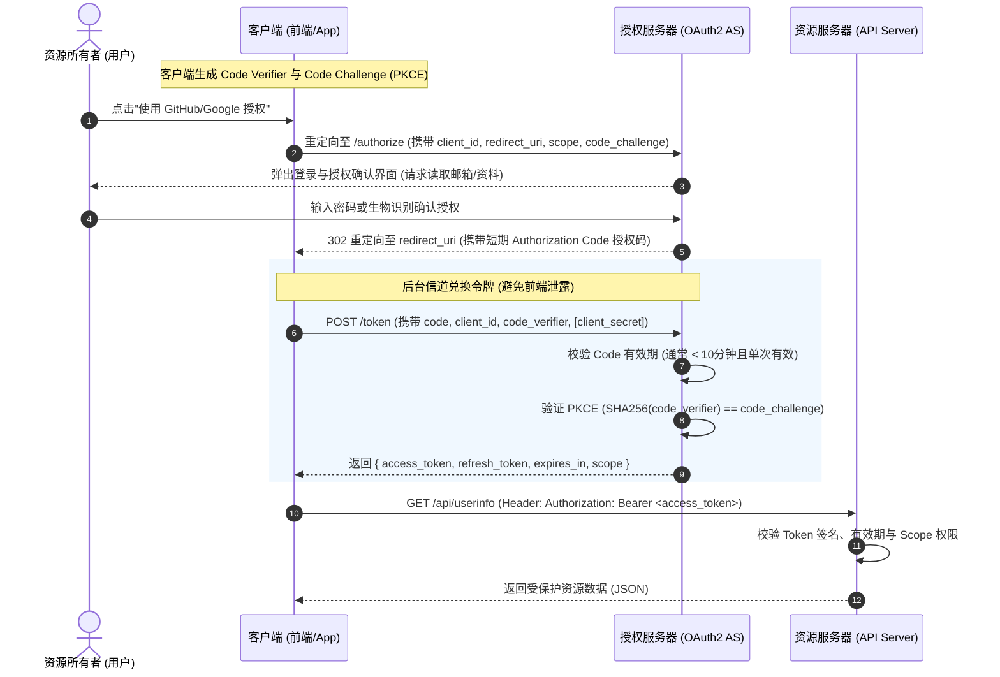
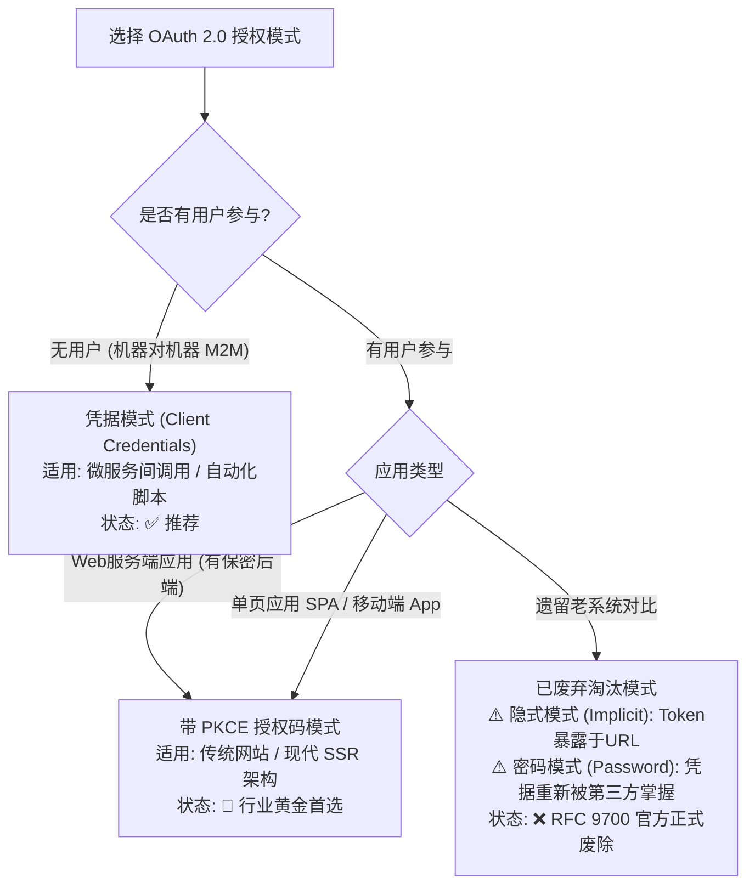
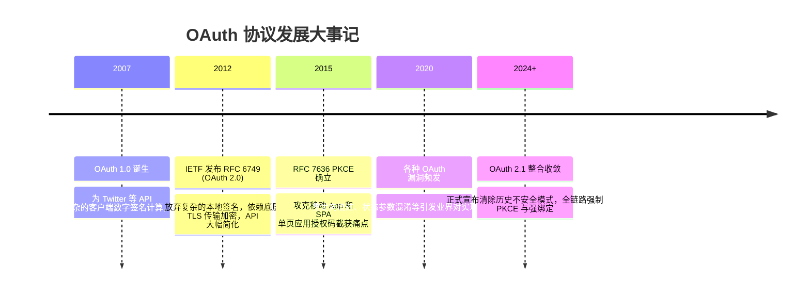

# OAuth 2.0 授权框架 🛡️

## 1. 概述（What）

**OAuth 2.0（Open Authorization 2.0）** 是一种开放标准的**委托授权框架（Delegated Authorization Framework）**。它允许第三方应用程序在不获取资源所有者（用户）账号密码的前提下，代表用户获取对受保护 HTTP 资源的有限访问权限。

- **核心解决问题**：彻底消除"为让第三方软件访问数据而把用户账号密码拱手相让"的反模式凭据共享，引入访问令牌（Access Token），实现作用域隔离与随时吊销。
- **典型应用场景**："使用微信/GitHub/Google 账号登录第三方网站"、移动 App 调用云端 API、微服务间的令牌传递与鉴权。

---

## 2. 原理详解（How it works）

OAuth 2.0 严格区分了四大核心角色：
1. **Resource Owner（资源所有者）**：即用户本人。
2. **Client（客户端）**：代表用户发起 API 调用的第三方应用。
3. **Authorization Server（授权服务器）**：验证用户身份并下发 Access Token。
4. **Resource Server（资源服务器）**：托管受保护数据的 API 服务，校验 Token 并响应请求。

---

### 图表一：授权码模式（Authorization Code Grant with PKCE）完整时序图

图 1-13：OAuth 2.0 授权码模式结合 PKCE 扩展交互全时序图

> **图注说明**：授权码模式通过浏览器的前台重定向换取一次性短期 Code，再在后台服务器之间直接兑换 Access Token。RFC 7636 引入的 PKCE（代码交换证明密钥）强制客户端生成动态随机密钥挑战，彻底粉碎了恶意应用在操作系统内劫持自定义 Redirect URI 的授权码注入攻击。

---

### 图表二：OAuth 2.0 四大经典模式与现代安全选型对比

图 1-14：OAuth 2.0 授权模式选型决策树与现代废弃说明

---

## 3. 协议与标准（Protocols & Standards）

| 规范文档 | 发布组织 | 年份 | 关键内容与重要地位 |
| :--- | :--- | :--- | :--- |
| **RFC 6749** [1] | IETF OAuth WG | 2012 | 《OAuth 2.0 授权框架核心规范》 |
| **RFC 6750** [2] | IETF OAuth WG | 2012 | 《Bearer Token 令牌使用规范》 |
| **RFC 7636** [3] | IETF OAuth WG | 2015 | 《基于 PKCE 的公共客户端授权码安全增强规范》 |
| **RFC 9700 / Best Current Practice** [4] | IETF OAuth WG | 2024 | 《OAuth 2.0 最佳安全实践 (BCP)》，明确禁止隐式与密码模式 |

### 现代 OAuth 2.1 演进要点
当前正在草案阶段的 **OAuth 2.1** 整合了十余年来的安全实践补丁：
- 全面强制启用 PKCE，无论客户端是否有独立安全后端；
- 彻底剔除 Implicit Grant（隐式模式）与 Resource Owner Password Credentials（密码模式）；
- 强制校验绝对完全匹配的 Redirect URI，拒绝通配符匹配。

---

## 4. 发展历史（Timeline）

图 1-15：OAuth 协议演进史

---

## 5. 优缺点与安全性分析

### 架构优势
1. **最小权限原则（Scope）**：用户可以精细授予第三方"仅查看公开个人资料"，杜绝全量权限失控。
2. **凭据隔离与快速吊销**：用户修改密码不会连带影响已发放的 Token；用户亦可单键撤回指定第三方的访问权。

### 常见安全陷阱与攻击防护
- **缺少 state 参数导致 CSRF 登录绑定攻击**：攻击者利用自己的授权码诱导受害者完成回调，将受害者系统账号与黑客第三方账号恶意绑定。**对策**：必须在 `/authorize` 请求中传递加密随机的 `state` 参数，并在回调中强校验。
- **开放重定向漏洞（Open Redirector）**：若授权服务器允许宽松通配符匹配 Redirect URI，黑客可拼接重定向链接将 Code 盗取至恶意服务器。**对策**：严格实行白名单精准字符串全词比对。
- **Token 泄露与重放**：Bearer Token 谁拥有谁使用。**对策**：引入 DPoP（RFC 9449）进行基于公钥的持有者证明绑定。

---

## 6. 关联知识点（Related）

- **重要身份层延伸**：[OIDC 身份协议](./09-oidc)（OAuth 2.0 仅负责**授权**，OIDC 在其之上补充了专门负责**认证**的 ID Token）。
- **令牌安全规范**：[Session / JWT / Cookie 安全](/03-access-control/03-session-jwt-cookie)。

---

## 7. 参考资料（References）

[1] IETF. RFC 6749: The OAuth 2.0 Authorization Framework.  
https://datatracker.ietf.org/doc/html/rfc6749

[2] IETF. RFC 6750: The OAuth 2.0 Authorization Framework: Bearer Token Usage.  
https://datatracker.ietf.org/doc/html/rfc6750

[3] IETF. RFC 7636: Proof Key for Code Exchange by OAuth Public Clients.  
https://datatracker.ietf.org/doc/html/rfc7636

[4] IETF OAuth WG. OAuth 2.0 Security Best Current Practice.  
https://datatracker.ietf.org/doc/html/draft-ietf-oauth-security-topics
