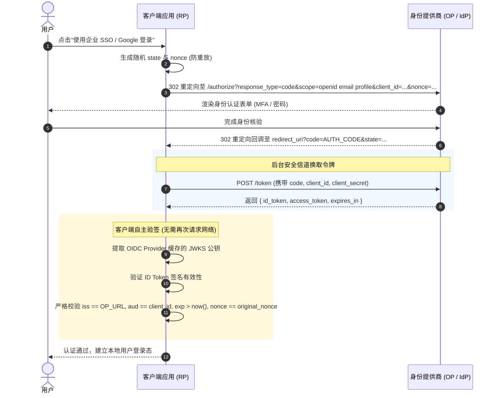
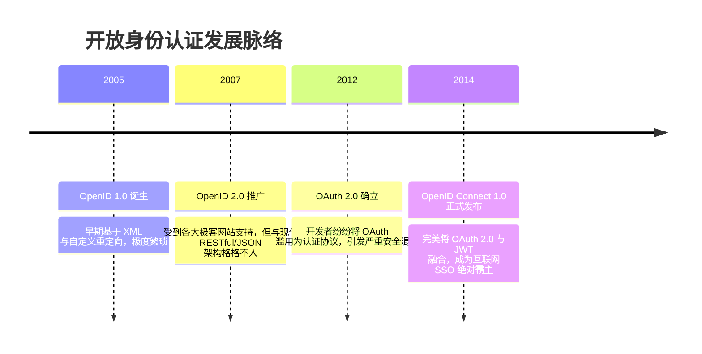

# OpenID Connect (OIDC) 身份层协议 🪪

## 1. 概述（What）

**OpenID Connect（OIDC）** 是构建在 **OAuth 2.0 授权框架之上的身份认证层协议（Identity Layer）**。OAuth 2.0 解决的是授权问题（"你能读取照片吗"），而 OIDC 通过引入经过密码学签名的 **ID Token（JSON Web Token, JWT）** 与标准化的 `UserInfo` 端点，彻底规范了身份认证（"你是谁"），实现了跨域的单点登录（SSO）。

- **核心解决问题**：终结了以往各大厂商基于 OAuth 2.0 各自为政拼凑私有 `get_user_info` 接口的乱象，为全互联网提供了一致的、防篡改的通用身份声明规范。
- **典型应用场景**：企业内部统一单点登录（Okta, Keycloak, Auth0, Authing）、Google / Apple 联合登录、Kubernetes 针对云身份提供商的 RBAC 绑定。

---

## 2. 原理详解（How it works）

OIDC 对 OAuth 2.0 进行了精准的三大扩展：
1. **强制引入 `openid` scope**：客户端请求必须在 `scope` 参数中包含 `openid`。
2. **下发规范的 ID Token**：授权服务器颁发的响应中必须包含一个经非对称签名（JWS）的 ID Token。
3. **元数据发现协议（Discovery）**：通过 `/.well-known/openid-configuration` 端点自描述公钥集（JWKS）、颁发者（Issuer）及各端点 URL。

### ID Token 核心声明结构（Claims）
```json
{
  "iss": "https://auth.sec-pedia.org",       // 颁发者 (Issuer)
  "sub": "usr_99812736",                    // 唯一主体用户 ID (Subject)
  "aud": "my-client-app-id",                // 受众客户端 ID (Audience)
  "exp": 1789452000,                        // 过期时间戳 (Expiration)
  "iat": 1789448400,                        // 签发时间戳 (Issued At)
  "nonce": "n-0S6_WzA2Mj",                  // 防重放随机数
  "email": "alice@sec-pedia.org",           // 用户邮箱
  "email_verified": true                    // 邮箱是否已核实
}
```

### OIDC 登录认证交互全流程


<div class="diagram-caption">图 1-22：OIDC 基于授权码模式换取并本地校验 ID Token 全时序图</div>

> **图注说明**：客户端拿到 ID Token 后，借助 OIDC 提供的公钥（JWKS）在本地即可零延迟完成数学验签与声明核对，大幅减轻了集中认证网关的查询并发压力。

---

## 3. 协议与标准（Protocols & Standards）

| 规范 | 制定组织 | 年份 | 核心定位 |
| :--- | :--- | :--- | :--- |
| **OpenID Connect Core 1.0** [1] | OpenID Foundation | 2014 | 核心协议，定义了 ID Token 规范与三大流程（授权码、隐式、混合） |
| **OpenID Connect Discovery 1.0** [2] | OpenID Foundation | 2014 | 定义 `/.well-known/openid-configuration` 自动发现标准 |
| **RFC 7517 (JWK / JWKS)** [3] | IETF | 2015 | JSON Web Key 结构标准，定义公钥旋转与公布格式 |

---

## 4. 发展历史（Timeline）


<div class="diagram-caption">图 1-23：OpenID 走向现代化 OIDC 的历史飞跃</div>

---

## 5. 优缺点与安全性分析

### 优点
- **认证与授权职责清晰分离**：ID Token 专用于给客户端确认"你是谁"；Access Token 专用于给资源服务器决定"你能做什么"。
- **防伪造与无状态验签**：基于不对称加密签名，客户端本地秒级验签，不占用集中数据库连接。

### 安全弱点与配置大忌
- **混淆代理攻击（Confused Deputy Problem）**：若客户端仅检查签名而**遗漏校验 `aud`（受众）**，恶意第三方可用自己申请的同平台合法 ID Token 伪造身份登录受害者账户。**对策**：代码层强制断言 `id_token.aud === client_id`。
- **遗漏 `nonce` 校验导致重放**：**对策**：在请求时注入高熵随机 `nonce`，并验证 ID Token 中回传的 `nonce` 声明完全一致。
- **当前推荐状态**：<span class="badge-pill status-recommended">强烈推荐（SSO 首选）</span>。现代 Web、移动端、SaaS 多租户身份网关的标准基石。

---

## 6. 关联知识点（Related）

- **底层承载**：[OAuth 2.0 授权框架](./08-oauth2)（OIDC 的基础底座）。
- **企业传统标准**：[SAML 2.0 联合身份](./10-saml)（老牌基于 XML 的企业 SSO 方案）。
- **数据结构**：[Session / JWT / Cookie 安全](/03-access-control/03-session-jwt-cookie)。

---

## 7. 参考资料（References）

[1] OpenID Foundation. OpenID Connect Core 1.0 incorporating errata set 1.  
https://openid.net/specs/openid-connect-core-1_0.html

[2] OpenID Foundation. OpenID Connect Discovery 1.0.  
https://openid.net/specs/openid-connect-discovery-1_0.html

[3] IETF. RFC 7517: JSON Web Key (JWK).  
https://datatracker.ietf.org/doc/html/rfc7517
