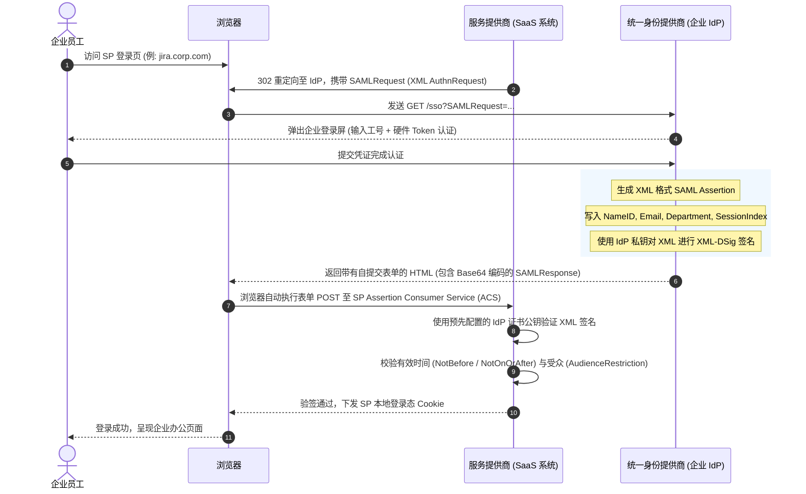
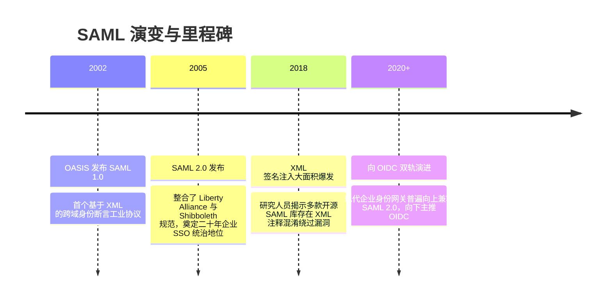

# SAML 2.0 企业联合身份认证 🏢

## 1. 概述（What）

**SAML 2.0（Security Assertion Markup Language 2.0，安全断言标记语言）** 是一种基于 **XML** 的开放标准数据格式与协议。它用于在两个独立的安全域——**身份提供商（Identity Provider, IdP，如 Microsoft Entra ID / Okta）** 与 **服务提供商（Service Provider, SP，如 Salesforce / Jira / 阿里云控制台）** 之间安全交换用户的身份认证与授权断言（Assertions）。

- **核心解决问题**：实现大型企业员工使用内部统一域账号，安全登录数十个由不同第三方云服务商托管的企业 SaaS 系统，且无需将员工密码透露给任何外部 SaaS。
- **典型应用场景**：跨国企业级员工单点登录（B2B SSO）、高校及科研机构的 Shibboleth 跨校资源访问、政企内网与外部合规系统的身份联邦。

---

## 2. 原理详解（How it works）

SAML 2.0 运行的两大核心要素：
1. **XML 签名与加密（XML-DSig / XML-Enc）**：IdP 使用自身私钥对 XML 断言进行强密码学数字签名，SP 使用预先导入的 IdP X.509 证书进行验签，确保证明不可篡改。
2. **浏览器重定向 / 表单中继（Bindings）**：主要包括 HTTP Redirect Binding（用于发送压缩签名的 SAMLRequest）与 HTTP POST Binding（用于通过浏览器自动提交表单中继 Base64 编码的 SAMLResponse）。

### SP 发起的 SAML 2.0 单点登录时序图

图 1-24：SAML 2.0 SP 发起的 Web 浏览器单点登录全时序交互图

---

## 3. 协议与标准（Protocols & Standards）

| 规范 | 制定组织 | 年份 | 关键说明 |
| :--- | :--- | :--- | :--- |
| **SAML 2.0 Core** [1] | OASIS 组织 | 2005 | 定义 XML 模式结构与断言语义 |
| **SAML 2.0 Profiles** [2] | OASIS 组织 | 2005 | 定义 Web 浏览器 SSO Profile 与单点登出（Single Logout, SLO）规范 |
| **W3C XML Signature** [3] | W3C | 2002/2008 | XML 语法与数字签名标准规范 |

### SAML 2.0 vs OIDC 核心架构对比

| 维度 | SAML 2.0 | OIDC (OpenID Connect) |
| :--- | :--- | :--- |
| **报文格式** | 繁复冗长的 XML 格式 | 轻量紧凑的 JSON / JWT |
| **移动端/App 亲和度** | 差（几乎专为传统浏览器重定向设计） | 极佳（天然支持移动端 Native 与 SPA 应用） |
| **签名验证复杂度** | 极高（XML 规范化 C14N 极易引入安全漏洞） | 极简（JWS/JWT 仅需标准 Base64 拼接待验字节） |
| **企业级采纳度** | 传统政企、传统 SaaS 事实标准 | 现代互联网、云原生和移动应用主流 |

---

## 4. 发展历史（Timeline）

图 1-25：SAML 标准演进与漏洞反思

---

## 5. 优缺点与安全性分析

### 优点
- **数十年的企业级生态兼容**：传统企业级巨头软件（SAP、Workday、Salesforce、Cisco）与旧版系统均原生支持。
- **免密码传递**：彻底隔离了员工密码，外部 SaaS 永远无法知晓员工密码。

### 历史沉痛漏洞与安全防御
- **XML 签名包装攻击（XML Signature Wrapping, XSW）**：攻击者在 XML 中伪造一份合法的已签名断言并混淆节点树结构，若 SP 的 XML 解析器与验签器提取节点的逻辑不一致，可导致攻击者伪造任意用户身份登录。**对策**：使用严格经过安全审计的现代 SAML 库，禁止二次节点查询。
- **XXE（XML 外部实体注入）**：XML 解析器若未禁用外部实体解析，黑客可通过提交构造的 DTD 读取服务器内网文件（如 `/etc/passwd`）。**对策**：全局禁用 `DOCTYPE` 与外部实体加载。
- **当前推荐状态**：企业级长期维护。新建消费者端应用首选 OIDC，但企业内网与 B2B 企业客户接入仍需必备 SAML 2.0。

---

## 6. 关联知识点（Related）

- **现代替代方案**：[OIDC 身份层协议](./09-oidc)（JSON 代际的轻量现代 SSO）。
- **企业内网控制**：[RBAC 与 ABAC 权限模型](/03-access-control/01-rbac-abac)。

---

## 7. 参考资料（References）

[1] OASIS. Assertions and Protocols for the OASIS Security Assertion Markup Language (SAML) V2.0.  
https://docs.oasis-open.org/security/saml/v2.0/saml-core-2.0-os.pdf

[2] OASIS. Profiles for the OASIS Security Assertion Markup Language (SAML) V2.0.  
https://docs.oasis-open.org/security/saml/v2.0/saml-profiles-2.0-os.pdf

[3] W3C. XML Signature Syntax and Processing (Second Edition).  
https://www.w3.org/TR/xmldsig-core/
