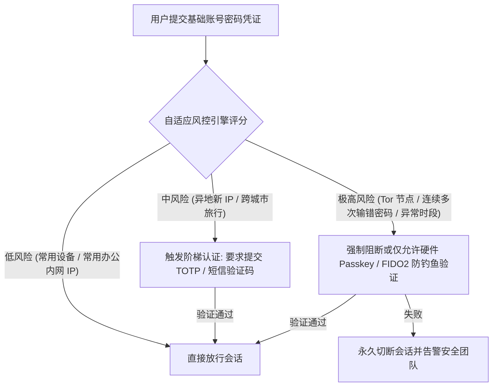
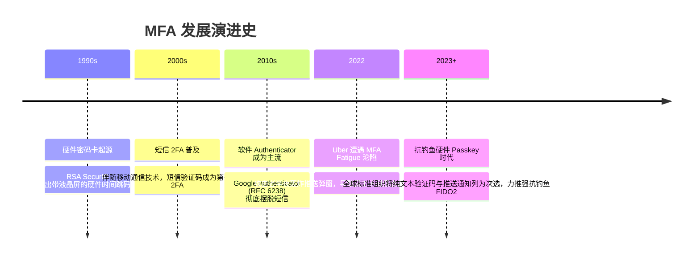

# 多因素认证 (MFA) 体系 🛡️

## 1. 概述（What）

**多因素认证（Multi-Factor Authentication, MFA）** 是一种要求用户在登录或执行敏感操作时，必须同时出示来自**两个或两个以上独立不同认证维度（Authentication Factors）** 的有效证明凭证的安全控制机制。

- **核心解决问题**：即使攻击者通过撞库、键盘记录木马或暗网泄露掌握了用户的静态密码，若无法同时攻破第二种物理隔离或生物隔离的凭证，依然无法入侵系统，阻断了超过 99.9% 的自动化密码喷洒（Password Spraying）攻击。
- **典型应用场景**：所有云服务商控制台（AWS、Azure、GCP）、代码托管平台（GitHub 强制全员 2FA）、企业 VPN / 堡垒机登录、金融高额转账确认。

---

## 2. 原理详解（How it works）

国际安全权威标准将人类认知与物理世界中的凭证严格划分为**三大核心独立因子**（必须跨因子组合才叫严格意义上的 MFA，同因子多个凭据如"两个密码"不属于 MFA）：

```mermaid
graph TD
    MFA[多因素认证 MFA] --> F1["① 所知凭证 (Knowledge: Something you know)<br/>静态密码 / 个人 PIN 码 / 密保答案"]
    MFA --> F2["② 所有凭证 (Possession: Something you have)<br/>TOTP 手机 / YubiKey 物理钥匙 / 银行 U 盾"]
    MFA --> F3["③ 所是凭证 (Inherence: Something you are)<br/>指纹 / 人脸 3D 结构光 / 虹膜特征"]
    
    subgraph 扩展辅助因子 (Contextual / Continuous)
        C1[所处位置: 地理 GPS / 内部子网 IP]
        C2[行为特征: 打字击键节奏 / 鼠标移动轨迹]
    end
```
<div class="diagram-caption">图 1-26：多因素认证三大传统核心因子与上下文动态连续认证</div>

---

### MFA 认证流转与现代自适应风控（Adaptive MFA）

现代企业 MFA 不再机械地要求每次登录都弹出一模一样的验证，而是接入风控引擎进行**风险评分驱动的自适应认证（Adaptive / Step-up Authentication）**：


<div class="diagram-caption">图 1-27：基于风险评分的阶梯式自适应多因素认证决策流</div>

---

## 3. 协议与标准（Protocols & Standards）

| 标准规范 | 制定组织 | 核心内容与安全保障级别（AAL） |
| :--- | :--- | :--- |
| **NIST SP 800-63B** [1] | NIST | 定义 **AAL1**（单因素）、**AAL2**（常规 2FA: TOTP/软令牌）、**AAL3**（防伪造物理硬件 2FA: U2F/Passkey） |
| **PCI-DSS 4.0 (Req 8.4)** [2] | PCI 安全标准委员会 | 明确规定所有对持有持卡人数据环境（CDE）的访问**必须强制实施 MFA** |
| **FIDO 联盟规范** | FIDO | 统一抗钓鱼硬件因子通信机制 |

---

## 4. 发展历史（Timeline）


<div class="diagram-caption">图 1-28：MFA 从硬件跳码到抗钓鱼 Passkey 演进史</div>

---

## 5. 优缺点与安全性分析

### 优点
- **瓦解 99% 的常见撞库**：绝大多数凭证泄露事件中黑客仅有密码，MFA 直接阻断批量自动化攻击链。
- **满足全球合规红线**：等保 2.0 三级、SOC 2、GDPR、PCI-DSS 均硬性要求核心系统配置 MFA。

### 新型攻击面与前沿对抗
1. **MFA 疲劳轰炸攻击（MFA Fatigue / Push Bombing）**：黑客获得密码后，在半夜连续发送几十次 App 推送通知，并伪装 IT 部门致电，诱骗疲惫的员工误触"同意"批准登录。
   - **对策**：采用 **号码匹配（Number Matching）**——要求员工必须在手机端输入电脑屏幕显示的特定两位数字，杜绝盲点同意。
2. **反向代理中间人钓鱼（Evilginx）**：钓鱼网站实时中转透明劫持用户的 2FA 动态码并直接盗走最终 Session Cookie。
   - **对策**：全面淘汰基于验证码的普通 2FA，升级为与域强绑定的 **Passkey / FIDO2 WebAuthn**。
3. **当前推荐状态**：<span class="badge-pill status-recommended">强制要求（基线安全）</span>。对企业管理后台与核心生产环境，推行 AAL3 等级的防钓鱼 MFA 已成行业共识。

---

## 6. 关联知识点（Related）

- **具体因子实现**：[TOTP 时间动态口令](./03-otp-totp)、[Passkey 与 WebAuthn](./05-passkey-webauthn)、[U2F 硬件密钥](./07-u2f-hardware-token)。
- **架构落地**：[零信任架构](/03-access-control/02-zero-trust)（MFA 是零信任持续验证的执行基座）。

---

## 7. 参考资料（References）

[1] NIST. SP 800-63B: Digital Identity Guidelines - Section 4 Authenticator Assurance Levels (AAL).  
https://pages.nist.gov/800-63-3/sp800-63b.html

[2] PCI Security Standards Council. Payment Card Industry (PCI) Data Security Standard v4.0.  
https://www.pcisecuritystandards.org/
