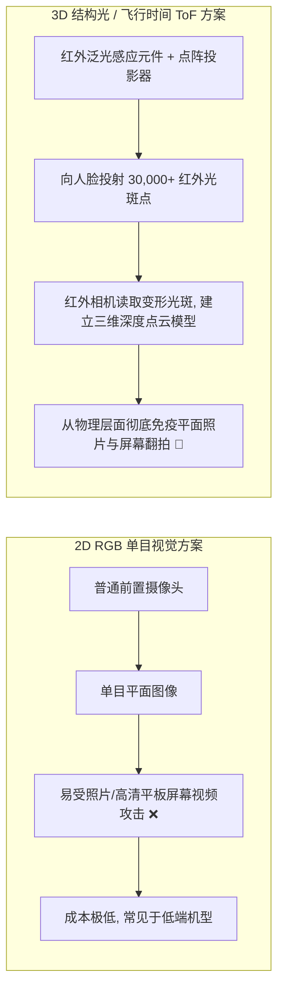
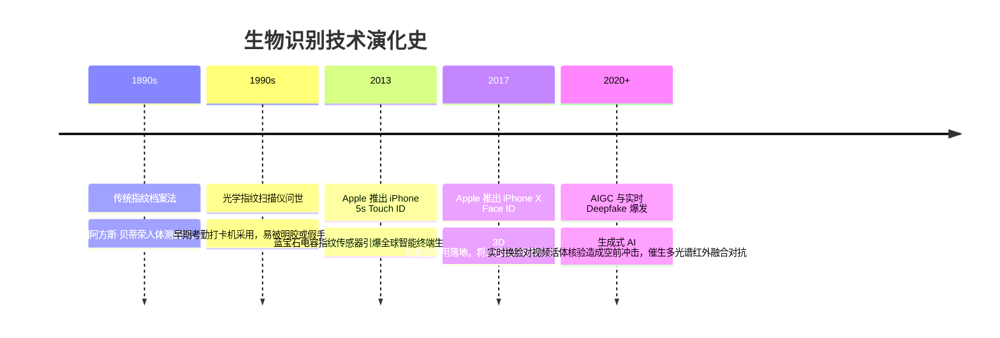

# 生物识别安全 (人脸/指纹/虹膜/声纹) 👁️

## 1. 概述（What）

**生物识别技术（Biometric Authentication）** 是一种利用人体固有的生理特征（如指纹、人脸几何结构、虹膜纹理、视网膜）或行为特征（如声纹、步态、签名击键节律），通过传感器采集并与预先录入的数学特征模板进行概率相似度比对，从而核实个体身份的认证机制。

- **核心解决问题**：摆脱物理钥匙、手机硬件或大脑记忆对身份鉴别的束缚，实现"人即钥匙"（Something you are）的高效免密体验。
- **典型应用场景**：智能手机屏幕解锁（Apple Face ID / Android 指纹）、边境海关 e-Passport 快速通关、手机银行 App 大额转账二次活体验证。

---

## 2. 原理详解（How it works）

生物识别与传统基于密码学的严格二进制精确比对（Hash Match）有着根本不同：**生物识别本质是一个概率分类与模式识别过程**。每次采集的角度、光线、皮肤湿度均会产生微小差异。

### 图表一：生物特征识别全流程与活体检测机制

```mermaid
flowchart TD
    Sensor[传感器采集: 摄像头/红外点阵/电容指纹芯片] --> Preprocess[信号预处理: 降噪/归一化/ROI 区域定位]
    
    Preprocess --> LivenessCheck{活体检测 (Anti-Spoofing)}
    LivenessCheck -- "假体攻击 (照片/硅胶膜/3D面具/Deepfake)" --> RejectFraud[直接阻断, 触发安全风控告警]
    
    LivenessCheck -- "确认真人活体" --> FeatureExtract[特征向量提取: 深度学习嵌入向量 Embedding]
    FeatureExtract --> MatchEngine[比对引擎: 计算余弦相似度 / 欧氏距离]
    
    subgraph 隔离硬件安全存储
        EnclaveTemplate[(已注册特征模板: 锁死在 Secure Enclave)]
    end
    
    EnclaveTemplate --> MatchEngine
    MatchEngine --> ThresholdDecision{相似度 Score >= 预设安全阈值?}
    
    ThresholdDecision -- 是 --> AuthPass[认证通过: 解锁设备/释放加密私钥]
    ThresholdDecision -- 否 --> AuthFail[认证失败: 提示重试或降级使用 PIN 码]
```
<div class="diagram-caption">图 1-29：生物特征采集、活体检测、特征向量提取与安全比对流程图</div>

> **图注说明**：活体检测（Liveness Detection）是防范黑客绕过的关键关卡。现代系统通过红外发射器检测皮肤吸光反射率、微表情微动或随机要求用户完成"眨眼、转头、念随机数字"等交互动作，抵御屏幕重放与打印照片攻击。

---

### 图表二：2D 图像识别 vs 3D 结构光 / ToF 技术路线深度对比


<div class="diagram-caption">图 1-30：2D 视觉平面方案与 3D 红外立体结构光方案技术路线对比</div>

---

## 3. 协议与标准（Protocols & Standards）

| 规范标准 | 制定机构 | 核心关注点 |
| :--- | :--- | :--- |
| **ISO/IEC 19794** [1] | ISO/IEC JTC 1 | 生物特征数据交换格式（指纹、人脸、虹膜通用标准） |
| **ISO/IEC 30107** [2] | ISO/IEC | 生物特征识别假体呈现攻击检测（PAD, Presentation Attack Detection 活体检测评估框架） |
| **FIDO Biometrics Requirements** | FIDO Alliance | 要求生物识别仅在**客户端本地完成（Local Match）**，绝不可上传原始图像至云端 |

### 关键评估指标：FAR 与 FRR
- **误识率（FAR, False Acceptance Rate）**：把非本人误判为本人的概率（安全指标）。Face ID 的 FAR 约为百万分之一（$10^{-6}$）。
- **拒识率（FRR, False Rejection Rate）**：本人正常操作却被系统误拒绝的概率（体验指标）。
- **等错误率（EER, Equal Error Rate）**：FAR 与 FRR 相等时的平衡点，EER 越低说明算法综合能力越强。

---

## 4. 发展历史（Timeline）


<div class="diagram-caption">图 1-31：生物识别技术从物理刑侦到现代多模态演变时间线</div>

---

## 5. 优缺点与安全性分析

### 优点
- **随身携带、永不遗忘**：用户不会把自己的脸或指纹忘在家里。
- **无感秒开**：配合硬件专用神经网络引擎（NPU），解锁耗时仅需数十毫秒。

### 致命本质缺陷与安全铁律
1. **生物特征一旦泄露，终生无法撤销更改（Irrevocable）**：密码被盗可以 3 秒内修改重置；但如果你的高精度人脸点云或指纹特征在云端数据库泄露，你无法"重置自己的脸或手指"。
2. **铁律：禁止云端传输与集中存储原始特征**：任何合规的现代架构（如 WebAuthn / Apple 生物识别）中，人脸比对必须在设备本地硬件隔离区（Secure Enclave）完成，云端只接收非对称加密签名，绝不存储生物原图。
3. **当前推荐状态**：<span class="badge-pill status-recommended">强烈推荐用于本地终端解锁</span>；<span class="badge-pill status-deprecated">严禁用于云端直接比对</span>。

---

## 6. 关联知识点（Related）

- **标准结合**：[Passkey 与 WebAuthn](./05-passkey-webauthn)（生物识别充当本地 Authenticator 的 User Verification 触发开关）。
- **底层硬件保障**：[TEE 与 Secure Enclave](/05-endpoint-security/02-tee-secure-enclave)。
- **AI 攻防**：[AIGC 鉴伪与 Deepfake 防御](/10-ai-security/04-content-authenticity)。

---

## 7. 参考资料（References）

[1] ISO/IEC. ISO/IEC 19794: Information technology — Biometric data interchange formats.  
https://www.iso.org/standard/54832.html

[2] ISO/IEC. ISO/IEC 30107: Information technology — Biometric presentation attack detection.  
https://www.iso.org/standard/67381.html

[3] Apple Platform Security. Face ID and Touch ID Security Overview.  
https://support.apple.com/guide/security/face-id-and-touch-id-sec06663c63b/web
