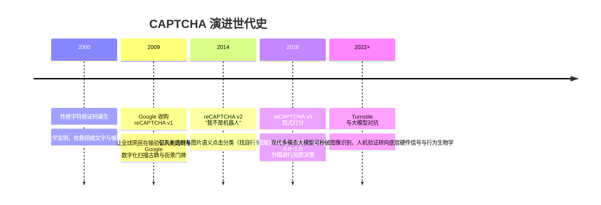

# 图灵验证 (CAPTCHA) 与人机识别 🧩

## 1. 概述（What）

**CAPTCHA（Completely Automated Public Turing test to tell Computers and Humans Apart，全自动区分计算机和人类的公开图灵测试）** 是一种由服务器发起并自动评分的挑战-响应测试机制。

- **核心解决问题**：有效阻断恶意脚本、僵尸网络（Botnet）与自动化黑客工具对 Web 接口的滥用，拦截撞库扫号（Credential Stuffing）、高频刷票/秒杀抢购、垃圾注册、DDoS 慢速洪水与短信轰炸。
- **典型应用场景**：用户登录/注册界面、敏感密码找回接口、电商结算结账页面、防爬虫高防反扒网关。

---

## 2. 原理详解（How it works）

CAPTCHA 历经了从"强迫人类做苦力（识别扭曲字符/红绿灯）"到"无感隐式行为风控评估"的技术跃迁：

```mermaid
flowchart TD
    ClientReq[浏览器加载页面并尝试提交表单] --> CheckVendor{CAPTCHA 引擎检测: Cloudflare Turnstile / reCAPTCHA v3}
    
    subgraph 隐式客户端遥测分析 (无感知)
        T1[浏览器原生 API 指纹完整性: Canvas/WebGL/WebAudio]
        T2[人类行为特征: 鼠标移动曲率/击键加速度/滚动速率]
        T3[底层运行沙箱环境检测: 是否存在 Headless Chrome / Puppeteer 特征]
    end
    
    T1 & T2 & T3 --> ScoreEngine[实时计算人机信任评分 Risk Score (0.0 ~ 1.0)]
    
    ScoreEngine --> Decision{评分是否高于安全阈值?}
    Decision -- "Score >= 0.7 (大概率真人)" --> PassSilent[直接生成加密 Token, 用户完全无感知放行 ✅]
    
    Decision -- "Score < 0.7 (行为可疑)" --> InteractiveChallenge[弹出强交互挑战: 点击旋转图片 / 空间拼图]
    InteractiveChallenge -->|挑战通过| PassSilent
    InteractiveChallenge -->|挑战失败| BlockBot[直接拒绝请求 / 封禁 IP ❌]
    
    PassSilent --> BackendVerify[前端将 Token 提交至业务后端]
    BackendVerify --> ServerAPICall[业务后端调用 CAPTCHA 服务商 /siteverify 接口验证签名]
    ServerAPICall -- 验签合法 --> ExecuteBusiness[执行真正的业务下单/登录逻辑]
```
<div class="diagram-caption">图 1-32：现代无感图灵验证（Invisible CAPTCHA）遥测评分与后端双向核验流程图</div>

---

## 3. 协议与标准（Protocols & Standards）

| 体系 / 标准 | 供应商 / 方案 | 特点与数据隐私合规 |
| :--- | :--- | :--- |
| **Cloudflare Turnstile** [1] | Cloudflare | 基于隐私访问令牌（PAT, RFC 9505），完全尊重用户隐私，替代传统图片验证码 |
| **Google reCAPTCHA v3 / Enterprise** [2] | Google | 基于全局用户行为画像打分，精准度极高但涉及跨站 Cookie 收集 |
| **IETF RFC 9505 (Privacy Pass)** [3] | IETF Privacy Pass WG | 隐私保护认证协议，允许通过加密盲签名证明"我是真人"而不泄露个人身份 |

---

## 4. 发展历史（Timeline）


<div class="diagram-caption">图 1-33：验证码从文字识别到行为风控与隐私通行证的发展里程碑</div>

---

## 5. 优缺点与安全性分析

### 优点
- **前端第一道防线**：以极小成本拦截 95% 以上初级黑客的批量爬虫、脚本并发撞库与接口灌水。
- **无感体验革新**：Turnstile 等现代无感方案让 90% 以上真实网民根本看不到任何弹窗即可平滑通行。

### 挑战与前沿攻防对抗
- **多模态大模型视觉破解（Vision LLM Cracking）**：GPT-4o、Claude 3.5 Sonnet 等视觉大模型对"红绿灯/斑马线/滑块拼接"的识别成功率已超过 95%，传统视觉验证码在现代黑客面前已彻底失效。
- **打码平台与人肉代打（Human-in-the-Loop Farms）**：黑客通过逆向协议将验证码实时中继转发给海外极廉价人工打码平台（如 2Captcha），以几美分每千次的成本秒破。
- **对策与当前推荐**：<span class="badge-pill status-recommended">强烈推荐现代无感验证（Turnstile / PAT）</span>。必须结合后端基于 IP、设备指纹及频次的综合风控，不可单点迷信验证码。

---

## 6. 关联知识点（Related）

- **底层指纹依赖**：[设备指纹技术](/05-endpoint-security/01-device-fingerprint)（用于收集客户端环境特征）。
- **业务风控中枢**：[业务风控体系](/06-security-operations/01-risk-control)（接收 CAPTCHA 评分并参与复合决策）。

---

## 7. 参考资料（References）

[1] Cloudflare. Turnstile: The user-friendly, privacy-preserving CAPTCHA alternative.  
https://www.cloudflare.com/products/turnstile/

[2] Google. reCAPTCHA v3 Documentation.  
https://developers.google.com/recaptcha/docs/v3

[3] IETF. RFC 9505: Privacy Pass: Architectural Framework.  
https://datatracker.ietf.org/doc/html/rfc9505
