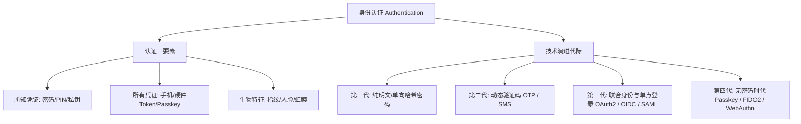

# 一、身份认证（Authentication）体系概览 🛡️

> **身份认证（Authentication, 缩写为 AuthN）** 是确定声明者真实身份的验证过程，回答的核心问题是：**「你是谁？」**（证明你的身份），与授权（Authorization, AuthZ，回答「你能访问什么」）形成安全控制的双支柱。

---

## 🗺️ 身份认证全景图谱

图 1-1：现代身份认证知识图谱与演进代际

---

## 📑 本章节知识点索引

| 知识点 | 核心技术 / 协议 | 典型机制与特点 | 安全评级与状态 |
| :--- | :--- | :--- | :--- |
| [1. 密码与哈希存储](./01-password-hashing) | Argon2id, bcrypt, PBKDF2 | 盐值 (Salt) + 慢哈希 + 内存硬度 | 现代基石 |
| [2. HOTP 算法](./02-otp-hotp) | RFC 4226, HMAC-SHA-1 | 基于事件计数的单向动态密码 | 部分场景 |
| [3. TOTP 时间动态密码](./03-otp-totp) | RFC 6238, Google Auth | 基于时间步长（30s）动态密码 | 广泛推荐 |
| [4. 短信与邮箱验证码](./04-otp-sms-email) | 带外传输 (OOB) | 依赖电信 SS7 或 SMTP 通道 | 易遭中间人/拦截 |
| [5. Passkey 与 WebAuthn](./05-passkey-webauthn) | W3C WebAuthn, FIDO2, CTAP2 | 公私钥挑战响应、防钓鱼无密码 | 最高级别推荐 |
| [6. Magic Link 魔法链接](./06-magic-link) | 签名 Token + 邮箱路由 | 免密临时单次登录链接 | 依赖邮箱安全 |
| [7. U2F 硬件密钥](./07-u2f-hardware-token) | FIDO U2F, YubiKey, USB/NFC | 物理芯片防复制、硬件安全元件 | 高安全首选 |
| [8. OAuth 2.0 授权框架](./08-oauth2) | RFC 6749, RFC 7636 (PKCE) | 委托授权、AccessToken、刷新令牌 | 开放平台标准 |
| [9. OIDC 身份层协议](./09-oidc) | OpenID Connect Core, JWT | 在 OAuth2 之上的标准化身份断言 | 现代 SSO 首选 |
| [10. SAML 2.0 联合身份](./10-saml) | OASIS SAML 2.0, XML 签名 | 企业内网与传统 SaaS 联合登录 | 企业级规范 |
| [11. 多因素认证 MFA](./11-mfa) | NIST SP 800-63B | 组合不同维度因子，抵御凭证填充 | 合规强制要求 |
| [12. 生物识别安全](./12-biometrics) | 3D 结构光, 活体检测, 声纹 | 本地硬件比对，拒绝云端原始特征 | 注意抗攻击度 |
| [13. 图灵验证 (CAPTCHA)](./13-captcha) | Cloudflare Turnstile, reCAPTCHA | 区分人机行为，抗撞库与自动化脚本 | 前端风控必备 |
