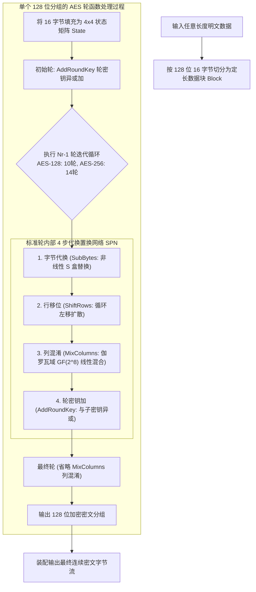
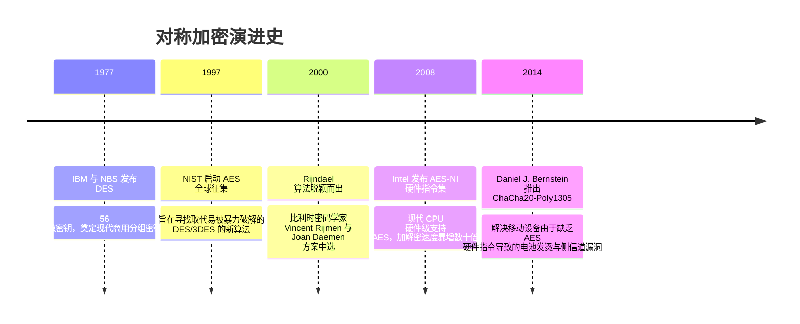

# 对称加密算法 (AES / ChaCha20) 🔒

## 1. 概述（What）

**对称加密算法（Symmetric-Key Cryptography）** 是指加密和解密使用**同一个保密密钥（Secret Key）**的密码体制。它是现代计算机密码学中处理海量数据加密吞吐的主力军。

- **核心解决问题**：在极高吞吐量（每秒数 GB 到数十 GB）与极低 CPU 资源开销下，保证大体量静态文件或高速流媒体传输的高机密性。
- **典型应用场景**：硬盘全盘加密（BitLocker / FileVault）、TLS 数据传输信道、数据库列级与表空间加密、IPsec VPN 隧道。

---

## 2. 原理详解（How it works）

现代对称加密算法主要分为**分组密码（Block Cipher，如 AES）**与**流密码（Stream Cipher，如 ChaCha20）**两大家族。

### 图表：AES 分组密码核心流程图（明文 → 分组 → 轮函数 → 密文）

图 2-2：AES 对称加密明文切片、SPN 替换置换网络与多轮迭代流程图

> **图注说明**：AES（Rijndael 算法）核心基于代换-置换网络（SPN）。通过非线性的 S-box 实现香农的"混淆（Confusion）"，通过行移位与列混淆实现"扩散（Diffusion）"，使得明文哪怕仅改动 1 个比特，密文每个比特都有 50% 的概率发生翻转（雪崩效应）。

---

### 分组工作模式：从危险的 ECB 到现代 AEAD

单靠分组算法本身无法直接加密长于 16 字节的文件，必须借助分组模式：
1. **ECB（电子密码本模式）**：每个块独立加密。**致命缺陷**：相同明文块产生相同密文块，可清晰看出生硬的图像轮廓（如著名的 ECB 企鹅图）。绝对禁止使用。
2. **CBC（密文分组链接模式）**：前一块密文与后一块明文异或。**致命缺陷**：易受密文填充攻击（Padding Oracle Attack）。
3. **现代黄金标准：AEAD（关联数据认证加密，如 AES-GCM 与 ChaCha20-Poly1305）**：
   在加密数据的同时，利用 GHASH 或 Poly1305 计算出不可伪造的认证标签（Auth Tag）。解密时若密文被哪怕篡改了 1 个比特，标签校验直接失败并阻断，兼顾**机密性**与**防篡改完整性**。

---

## 3. 协议与标准（Protocols & Standards）

| 规范标准 | 机构 | 年份 | 关键说明 |
| :--- | :--- | :--- | :--- |
| **FIPS 197** [1] | NIST | 2001 | 《高级加密标准 (AES)》，取代旧时代过时的 DES/3DES |
| **NIST SP 800-38D** [2] | NIST | 2007 | 《GCM 伽罗瓦/计数器模式规范 (AES-GCM)》 |
| **RFC 8439** [3] | IETF | 2018 | 《ChaCha20 与 Poly1305 认证加密》，移动端高效流密码标杆 |

### AES-256-GCM vs ChaCha20-Poly1305 架构选型

| 对比维度 | AES-256-GCM | ChaCha20-Poly1305 |
| :--- | :--- | :--- |
| **底层类型** | 分组密码 (128-bit block) | 流密码 (ARX: 加法/旋转/异或) |
| **硬件加速支持** | 依赖 x86 AES-NI 或 ARMv8 专用指令集 | 纯纯 CPU 通用寄存器运算即可极速运行 |
| **移动端/无指令集设备** | 若无硬件指令集，性能低下且易受 Cache 侧信道攻击 | 无论任何低端嵌入式或手机芯片，吞吐均极高且抗侧信道 |
| **Nonce 撞库风险** | 96-bit 随机 IV 在相同密钥下重复加密即导致私钥泄露 | 同样要求 Nonce 严格不重复（或升级为 XChaCha20 192-bit Nonce） |

---

## 4. 发展历史（Timeline）

图 2-3：对称加密演变时间轴

---

## 5. 优缺点与安全性分析

### 优点
- **极速性能**：现代 Xeon/AMD EPYC/Apple M 系列芯片上，AES-GCM 吞吐可轻易突破 10GB/s。
- **经典抗量子计算鲁棒性**：Grover 量子算法虽然可将暴力搜索复杂度开根号（$2^{256} \to 2^{128}$），但 AES-256 在后量子时代依然保有 128 位的终极安全裕度，**无需在后量子迁移中推倒重来**。

### 致命陷阱与运维隐患
- **Nonce / IV 复用灾难（Nonce Reuse Catastrophe）**：在 GCM 或 ChaCha 模式下，如果使用相同密钥和同一个 IV 加密了两条不同消息，攻击者通过简单的密文异或即可解出明文差值，并进一步恢复 GHASH 密钥，导致后续所有报文被伪造。**铁律：每次加密必须使用 CSPRNG 生成全新唯一的 IV**。
- **当前推荐状态**：强烈推荐使用 AES-256-GCM 或 ChaCha20-Poly1305；严禁使用 DES、3DES、RC4、ECB/CBC 模式。

---

## 6. 关联知识点（Related）

- **握手与密钥交换**：[非对称加密 (RSA/ECC)](./02-asymmetric-encryption)（非对称负责安全传输对称密钥）。
- **传输落地**：[TLS / SSL 协议](./04-tls-ssl)（TLS 记录层使用 AES-GCM 加密载荷）。

---

## 7. 参考资料（References）

[1] NIST. FIPS PUB 197: Advanced Encryption Standard (AES).  
https://csrc.nist.gov/pubs/fips/197/final

[2] NIST. SP 800-38D: Recommendation for Block Cipher Modes of Operation: Galois/Counter Mode (GCM).  
https://csrc.nist.gov/pubs/sp/800/38/d/final

[3] IETF. RFC 8439: ChaCha20 and Poly1305 for IETF Protocols.  
https://datatracker.ietf.org/doc/html/rfc8439
