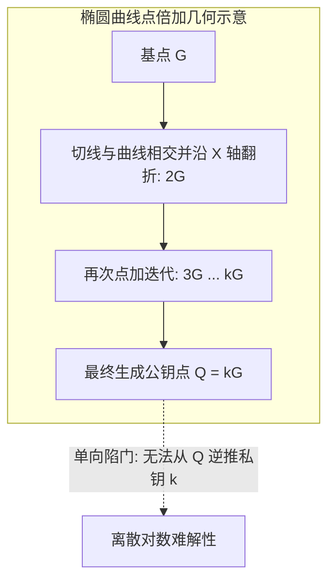
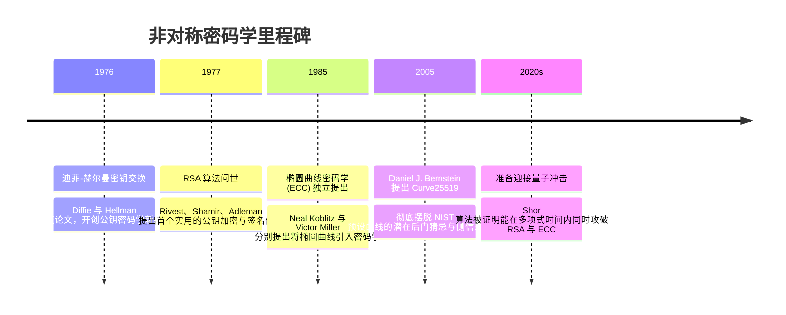

# 非对称加密算法 (RSA / ECC) 🔑

## 1. 概述（What）

**非对称加密算法（Asymmetric / Public-Key Cryptography）** 使用一对在数学上相关但无法单向推导的密钥：**公钥（Public Key，完全公开，用于加密或验签）** 与 **私钥（Private Key，严密保密，用于解密或签名）**。

- **核心解决问题**：彻底攻克了传统对称加密中"在未建立安全信道之前，双方如何安全共享密钥"的先有鸡还是先有蛋的死结问题。
- **典型应用场景**：TLS 握手密钥交换、SSH 远程免密登录、比特币/以太坊区块链交易签名、数字证书签名认证。

---

## 2. 原理详解（How it works）

非对称加密的数学底座是**单向陷门函数（Trapdoor One-Way Function）**：正向计算极快，但在没有私密"陷门"的情况下逆向求解在计算上不可行。

```mermaid
graph LR
    subgraph 公钥加密场景 (机密性传递)
        M1[明文消息] --> Enc[使用接收方的公钥 PubKey 加密]
        Enc --> C1[密文数据: 公网传输]
        C1 --> Dec[仅接收方的私钥 PrivKey 能解密]
        Dec --> M1_Recovered[恢复出原始明文]
    end

    subgraph 私钥签名场景 (身份防抵赖)
        M2[原始文档] --> Sign[使用发送方的私钥 PrivKey 签名]
        Sign --> Sig[生成数字签名 Signature]
        Sig & M2 --> Verify[任何人使用发送方公钥 PubKey 即可验签]
        Verify --> Valid{合法且未篡改}
    end
```
<div class="diagram-caption">图 2-4：非对称密码体系的两大基本范式：公钥加密 vs 私钥签名</div>

---

### 数学难题对比：RSA 质因数分解 vs 椭圆曲线（ECC）

1. **RSA 算法**：
   - 依赖**大整数质因数分解难题（IFP）**：选取两个超大素数 $p$ 和 $q$，计算 $n = p \cdot q$ 极快；但在已知 $n$ 的情况下想因数分解出 $p$ 和 $q$ 极其困难。
   - 加密：$c = m^e \pmod n$；解密：$m = c^d \pmod n$。
2. **椭圆曲线密码学（ECC）**：
   - 依赖**椭圆曲线离散对数难题（ECDLP）**：在有限域椭圆曲线点群 $E(\mathbb{F}_p)$ 上，已知基点 $G$ 和标量 $k$，计算点乘 $Q = k \cdot G$（连续切线翻折点加法）极快；但在已知 $Q$ 和 $G$ 时，反推标量 $k$ 极其困难。


<div class="diagram-caption">图 2-5：椭圆曲线倍乘标量相加单向陷门函数几何机理</div>

---

## 3. 协议与标准（Protocols & Standards）

| 标准规范 | 制定组织 | 年份 | 说明 |
| :--- | :--- | :--- | :--- |
| **RFC 8017 (PKCS #1 v2.2)** [1] | IETF | 2016 | 《RSA 密码学规范》，规定 OAEP 填充与 PSS 签名 |
| **RFC 7748** [2] | IETF | 2016 | 《椭圆曲线 Curve25519 与 Curve448 规范》，现代最高安全性曲线 |
| **FIPS 186-5** [3] | NIST | 2023 | 《数字签名标准 (DSS)》，涵盖 ECDSA 与 EdDSA |

### RSA vs ECC (Curve25519 / secp256r1) 性能与强度大比拼

| 安全级别 | RSA 对应等效密钥长度 | ECC 对应等效密钥长度 | 密钥长度对比差距 | 推荐状态 |
| :--- | :--- | :--- | :--- | :--- |
| **80 位 (已废除)** | 1024 位 | 160 位 | 6.4 倍体积 | <span class="badge-pill status-deprecated">已淘汰</span> |
| **112 位 (过渡)** | 2048 位 | 224 位 | 9.1 倍体积 | <span class="badge-pill status-caution">仅限存量兼容</span> |
| **128 位 (现代标配)**| **3072 位** | **256 位 (secp256r1/X25519)** | **12 倍体积差距** | <span class="badge-pill status-recommended">现代强烈推荐</span> |
| **256 位 (顶级)** | **15360 位** (超大计算负担) | **512 位 (Ed448/P-521)** | **30 倍体积差距** | <span class="badge-pill status-recommended">国防级首选</span> |

---

## 4. 发展历史（Timeline）


<div class="diagram-caption">图 2-6：公钥密码学半个世纪的发展轨迹</div>

---

## 5. 优缺点与安全性分析

### 优点
- **解决密钥分发死锁**：公钥可在公开信道随意广播，无需预先建立受保护信道。
- **不可抵赖与数字身份确权**：由于私钥仅持有人拥有，私钥签名的文档具备不可否认的法定法律效力。

### 致命弱点与量子危机
- **计算极其昂贵**：非对称加密比对称加密（AES）慢 1000 倍以上，因此绝不用非对称算法直接加密 GB 级大文件，而是采用**混合加密（Hybrid Encryption）**：用非对称传递对称密钥，用对称加密传递载荷。
- **量子计算机毁灭性打击（Shor's Algorithm）**：一旦具备几千个物理量子比特的量子计算机出现，Shor 算法可以在数分钟内因数分解 RSA-4096 并解出椭圆曲线离散对数。**对策**：全球正在全面向后量子密码学（PQC, NIST FIPS 203/204）迁移。
- **当前推荐状态**：<span class="badge-pill status-recommended">推荐 Ed25519 / X25519</span>；存量系统 RSA 不得低于 2048 位（推荐 3072/4096 位）。

---

## 6. 关联知识点（Related）

- **数据完整性**：[哈希与数字签名](./03-hash-signature)（签名依赖非对称私钥）。
- **信任链条**：[PKI 与数字证书信任链](./07-pki-certificates)（公钥的身份防冒充绑定）。
- **未来颠覆**：[后量子密码学 PQC 标准化](/11-quantum-security/02-pqc-standards)。

---

## 7. 参考资料（References）

[1] IETF. RFC 8017: PKCS #1: RSA Cryptography Specifications Version 2.2.  
https://datatracker.ietf.org/doc/html/rfc8017

[2] IETF. RFC 7748: Elliptic Curves for Security (Curve25519 and Curve448).  
https://datatracker.ietf.org/doc/html/rfc7748

[3] NIST. FIPS PUB 186-5: Digital Signature Standard (DSS).  
https://csrc.nist.gov/pubs/fips/186-5/final
