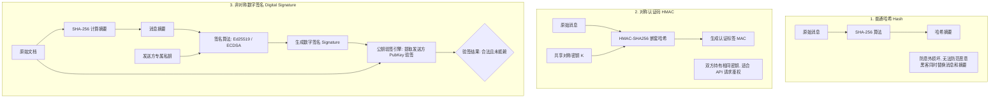
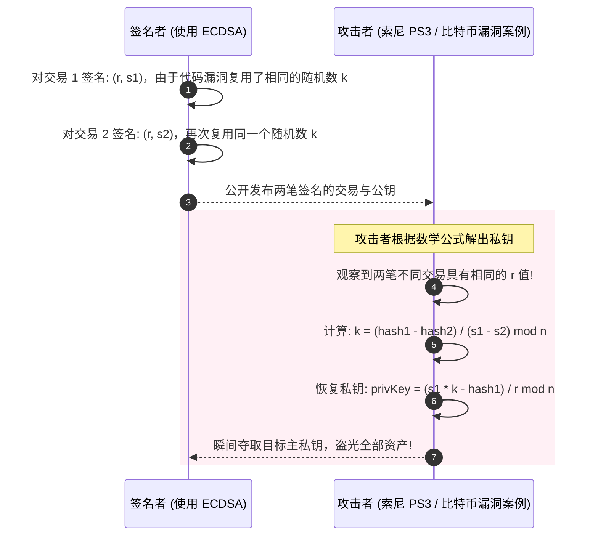
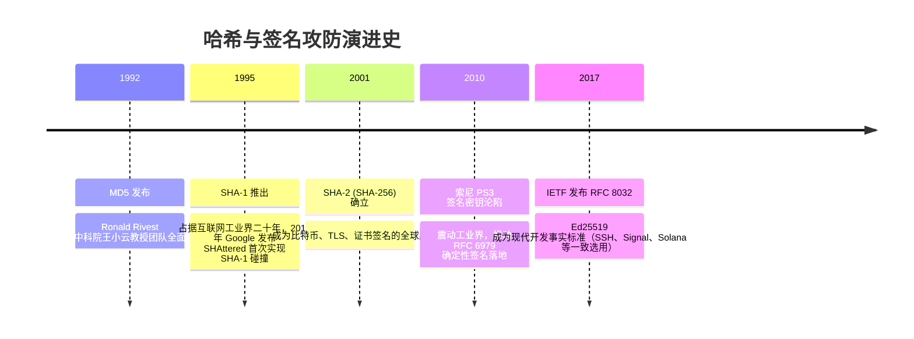

# 哈希与数字签名 (SHA / HMAC / ECDSA / Ed25519) 🖋️

## 1. 概述（What）

**密码学哈希函数（Cryptographic Hash Function）** 是一种将任意长度的输入数据映射为固定长度二进制摘要（Digest）的确定性单向算法；**数字签名（Digital Signature）** 则是利用发送方的非对称私钥对该摘要进行密码学签署，允许任何人使用公钥验证其真实性。

- **核心解决问题**：
  - 哈希解决**完整性（Integrity）**：数据在传输或存储中是否被黑客篡改哪怕 1 个比特；
  - 消息认证码（HMAC）解决**防伪造认证（Authenticity）**：证明消息确实来自拥有共享对称密钥的伙伴；
  - 数字签名解决**不可抵赖性（Non-repudiation）**：防抵赖并锚定真实发送者身份。
- **典型应用场景**：Git Commit 签名、区块链交易广播确认、操作系统驱动与应用安装包代码签名（Authenticode）、JWT 令牌防篡改。

---

## 2. 原理详解（How it works）

### 密码学安全哈希的三大特征
1. **抗原像性（单向性，Pre-image Resistance）**：已知摘要 $h$，找出一个原像 $m$ 使得 $H(m) = h$ 在计算上不可行。
2. **抗第二原像性（弱抗碰撞，Second Pre-image Resistance）**：已知输入 $m_1$，找出另一个不同的输入 $m_2$ 使得 $H(m_1) = H(m_2)$ 在计算上不可行。
3. **抗强碰撞性（Collision Resistance）**：随意找出两个任意不同的输入 $m_1 \neq m_2$，使得 $H(m_1) = H(m_2)$ 在计算上不可行（防范生日攻击）。

### 图表一：哈希、HMAC 与数字签名机制全对比

图 2-7：普通哈希、对称消息认证码（HMAC）与非对称数字签名的机制对比

---

### 图表二：ECDSA 签名中糟糕随机数（Nonce）导致私钥泄露灾难

图 2-8：ECDSA 随机数 Nonce 复用漏洞导致私钥被逆向破解时序图

> **图注说明（确定性签名之救赎）**：2010 年索尼 PS3 越狱事件正是由于 ECDSA 随机数 $k$ 为常数导致的私钥全网泄露。现代标准全面推荐 **Ed25519（RFC 8032）** 或确定性 ECDSA（RFC 6979），由私钥与消息自身哈希派生出 $k$，从根本上杜绝了随机数发生器缺陷。

---

## 3. 协议与标准（Protocols & Standards）

| 标准规范 | 机构 | 年份 | 关键说明 |
| :--- | :--- | :--- | :--- |
| **FIPS 180-4 (安全哈希标准)** [1] | NIST | 2015 | 定义 SHA-1（已废除）、SHA-224、SHA-256、SHA-512 |
| **FIPS 202 (SHA-3 标准)** [2] | NIST | 2015 | 基于 Keccak 海绵结构的下一代哈希标准，彻底规避长度扩展攻击 |
| **RFC 2104 (HMAC 规范)** [3] | IETF | 1997 | 构造公式：$\text{HMAC}(K, m) = H((K \oplus opad) \parallel H((K \oplus ipad) \parallel m))$ |
| **RFC 8032 (EdDSA / Ed25519)** [4] | IETF | 2017 | 现代推荐签名标准，兼顾极高抗侧信道性能与确定性防撞库 |

---

## 4. 发展历史（Timeline）

图 2-9：哈希与数字签名演变与碰撞攻防历史

---

## 5. 优缺点与安全性分析

### 优点
- **摘要紧凑**：无论 100GB 的镜像文件还是 1 字节字符串，SHA-256 均固定为 32 字节。
- **Ed25519 极致安全性**：无复杂分支跳转，天然防御缓存侧信道攻击与计时攻击，验签速度比 RSA 快数十倍。

### 缺陷与已知攻击
- **长度扩展攻击（Length Extension Attack）**：针对 Merkle-Damgård 结构（MD5、SHA-1、SHA-256）。若错误地使用 `Hash(Key || Message)` 作为认证码，攻击者无需知道密钥即可在尾部追加数据并算出有效哈希。**对策**：绝对不要直接拼接哈希作为 MAC，必须使用标准 **HMAC** 或原生抗长度扩展的 **SHA-3 / BLAKE3**。
- **当前推荐状态**：
  - 哈希推荐：SHA-256 / SHA-512 / SHA-3 / BLAKE3；MD5 与 SHA-1 全面废弃。
  - 签名推荐：Ed25519 (EdDSA) 首选。

---

## 6. 关联知识点（Related）

- **底层公私钥**：[非对称加密算法 (RSA/ECC)](./02-asymmetric-encryption)。
- **区块链应用**：[密码学基石：哈希链与 Merkle 树](/09-blockchain-security/01-cryptography-foundations)。

---

## 7. 参考资料（References）

[1] NIST. FIPS PUB 180-4: Secure Hash Standard (SHS).  
https://csrc.nist.gov/pubs/fips/180-4/upd1/final

[2] NIST. FIPS PUB 202: SHA-3 Standard: Permutation-Based Hash and Extendable-Output Functions.  
https://csrc.nist.gov/pubs/fips/202/final

[3] IETF. RFC 2104: HMAC: Keyed-Hashing for Message Authentication.  
https://datatracker.ietf.org/doc/html/rfc2104

[4] IETF. RFC 8032: Edwards-Curve Digital Signature Algorithm (EdDSA).  
https://datatracker.ietf.org/doc/html/rfc8032
