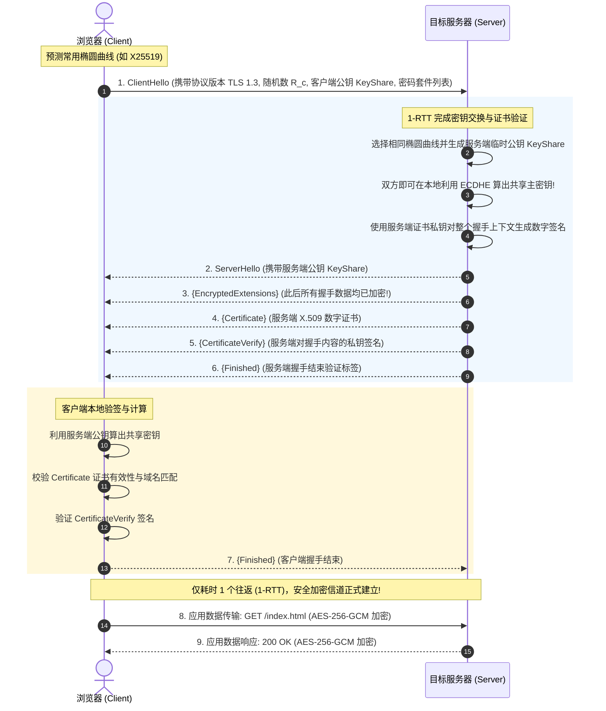
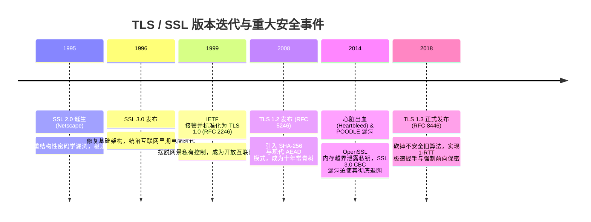

# TLS / SSL 与 HTTPS 传输安全 🌐

## 1. 概述（What）

**传输层安全协议（Transport Layer Security, TLS）** 及其前身 **SSL（Secure Sockets Layer）** 是一种位于传输层（TCP）与应用层（HTTP、SMTP 等）之间的密码学通信协议。它为互联网通信提供三大基本安全保障：**机密性（防窃听）、完整性（防篡改）与身份真实性（防中间人冒充）**。在 HTTP 协议下启用 TLS 保护，即构成了当今互联网默认的 **HTTPS** 通信。

- **核心解决问题**：彻底消除明文 HTTP 通信在不可信公网（公共 Wi-Fi、运营商路由器、骨干网络交换机）中遭受的中间人嗅探（Sniffing）、报文注入篡改（如运营商流量劫持插播广告）与 DNS/域名假冒风险。
- **典型应用场景**：所有现代 Web 站点与 API 接口、在线支付与网银交互、gRPC 微服务加密互联、VPN 隧道。

---

## 2. 原理详解（How it works）

TLS 的核心运作由两大子协议支撑：
1. **握手协议（Handshake Protocol）**：客户端与服务端互相协商支持的密码套件、验证服务端数字证书身份、并基于临时非对称公私钥对（ECDHE）计算出对称加密主会话密钥。
2. **记录协议（Record Protocol）**：握手完成后，双方使用协商好的对称加密算法（如 AES-256-GCM 或 ChaCha20-Poly1305）对上层应用数据（如 HTTP 请求体）进行高速分片、封装与防篡改传输。

---

### 图表一：TLS 1.3 现代 1-RTT 极速握手全时序图

图 2-10：TLS 1.3 基于 ECDHE 的 1-RTT 极速握手与全加密传输时序图

> **图注说明（TLS 1.3 的划时代革命）**：在 TLS 1.2 中，协商参数与证书交换需要耗费整整 2 个往返延时（2-RTT）。TLS 1.3 实现了"在发出 ClientHello 的同时即预测性附带客户端椭圆曲线公钥（KeyShare）"，使得服务器在 ServerHello 中即可下发自己的 KeyShare 并直接开始加密传输后续所有证书内容，将握手网络延迟生生砍去一半，并实现了握手证书本身的隐私防嗅探！

---

### 前向保密（Perfect Forward Secrecy, PFS）
在老旧的 TLS 1.2 RSA 静态密钥交换中，若黑客在公网截获录制了受害者过去五年的所有通信密文，一旦五年后通过物理入侵拿到服务器主私钥，历史所有密文将被瞬间全部解密。  
**TLS 1.3 强制要求必须采用临时密钥交换（ECDHE）**：每次会话临时生成一对点乘公私钥，用完立即销毁。即使黑客未来攻陷了服务器硬件、拿到了服务器的证书私钥，也**绝对无法逆向解密过去已经录制保存在硬盘中的历史会话密文**！

---

### 图表二：TLS / SSL 版本演进与重大漏洞时间轴

图 2-11：TLS/SSL 协议三十年版本迭代与漏洞推动演进史

---

## 3. 协议与标准（Protocols & Standards）

| 规范标准 | 组织 | 年份 | 关键定位 |
| :--- | :--- | :--- | :--- |
| **RFC 8446** [1] | IETF TLS WG | 2018 | 《传输层安全协议 (TLS) 1.3 版》，现役黄金标准 |
| **RFC 5246** [2] | IETF | 2008 | 《TLS 1.2 规范》（需严格修剪 cipher suites 配置） |
| **RFC 8996** [3] | IETF | 2021 | 《正式淘汰弃用 TLS 1.0 与 TLS 1.1》，宣布其违规 |
| **RFC 9001** [4] | IETF QUIC WG | 2021 | 《在 QUIC (HTTP/3) 中集成 TLS 1.3》，UDP 上的现代安全底座 |

### TLS 1.3 废除的不安全特性黑名单
TLS 1.3 采取了激进的"安全修剪"哲学，将导致过去无数历史漏洞的糟粕彻底扫地出门：
- ❌ **废除 RSA 密钥传输**（消除无前向保密的隐患）；
- ❌ **废除 CBC 分组模式**（根除 Lucky Thirteen、POODLE 填充混淆攻击）；
- ❌ **废除 RC4 流密码**（根除偏差窃听攻击）；
- ❌ **废除 SHA-1 / MD5 哈希**；
- ❌ **废除 TLS 压缩**（根除 CRIME / BREACH 旁路压缩信息泄露攻击）。

---

## 4. 发展历史（Timeline）

如上文图 2-11 所示，TLS 的演化史就是一部生动的"攻防博弈史"。尤其是 2014 年爆发的 **Heartbleed（心脏出血，CVE-2014-0160）**，因心跳扩展（RFC 6520）遗漏了边界缓冲区检查，全球超三分之一的 Web 服务器内存遭未授权读取，私钥与用户密码大面积泄露，彻底催生了基础设施级自动化安全扫描与现代代码审计生态。

---

## 5. 优缺点与安全性分析

### 优点
- **端到端网络层绝对防御**：防止来自中间路由器、公共热点乃至电信运营商的一切嗅探与恶意内容注入。
- **1-RTT 极速无感**：配合 Session Tickets 与 0-RTT 早开技术，用户访问 HTTPS 不再有明显的"卡顿感"。

### 缺陷与运维风险
- **0-RTT 重放攻击风险（Replay Attacks）**：TLS 1.3 提供了允许在初次 ClientHello 携带早期数据的 0-RTT 模式，但该报文易遭中间人录制并二次重放。**对策**：Web 服务器必须仅允许对幂等请求（如纯 GET 查询）启用 0-RTT，严禁在 0-RTT 中执行转账或修改密码等 POST 操作。
- **中间人抓包审计阻力**：由于 TLS 1.3 连证书本身都进行了加密，传统企业防火墙的明文 DPI（深度报文检测）失效，迫使企业内网必须部署受管根证书劫持代理。
- **当前推荐状态**：强制全网默认部署 TLS 1.3（向下仅兼容严格配置的 TLS 1.2）；彻底关停 TLS 1.0、1.1 及 SSL 3.0。

---

## 6. 关联知识点（Related）

- **底层加密套件**：[对称加密 AES-GCM](./01-symmetric-encryption)、[椭圆曲线 Curve25519](./02-asymmetric-encryption)。
- **身份防伪造背书**：[PKI 与数字证书信任链](./07-pki-certificates)（浏览器如何确认证书有效）。
- **应用层安全**：[常见 Web 攻击：中间人攻击 MITM](/04-network-security/01-web-attacks)。

---

## 7. 参考资料（References）

[1] IETF. RFC 8446: The Transport Layer Security (TLS) Protocol Version 1.3.  
https://datatracker.ietf.org/doc/html/rfc8446

[2] IETF. RFC 5246: The Transport Layer Security (TLS) Protocol Version 1.2.  
https://datatracker.ietf.org/doc/html/rfc5246

[3] IETF. RFC 8996: Deprecating TLS 1.0 and TLS 1.1.  
https://datatracker.ietf.org/doc/html/rfc8996

[4] Cloudflare Learning Center. What happens in a TLS handshake?  
https://www.cloudflare.com/learning/ssl/what-happens-in-a-tls-handshake/
