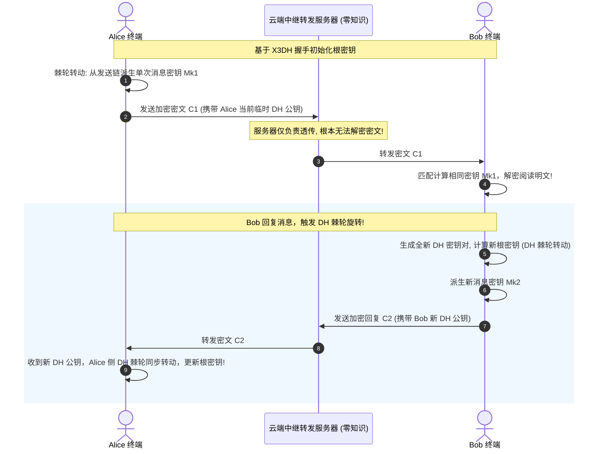
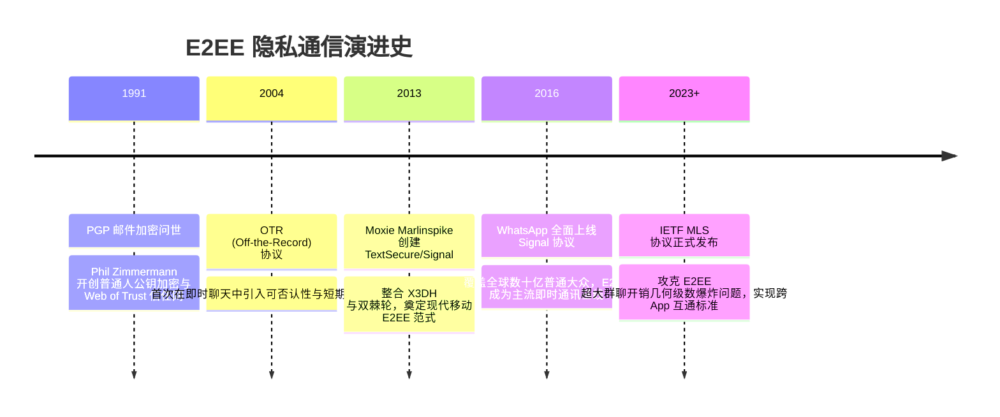

# 端到端加密 (E2EE) 与 Signal 双棘轮协议 💬

## 1. 概述（What）

**端到端加密（End-to-End Encryption, E2EE）** 是一种确保通信数据仅在收发双方的终端设备上进行明文解密的保护机制。在传输全流程中，即便是掌管中央服务器的云服务商、电信运营商、拥有司法调证权的机构或已攻破服务器的黑客，都只能看到完全无解的加密密文。

- **核心解决问题**：终结"传输加密（TLS）在服务端中转时数据落地为明文"的结构性泄露隐患，实现真正的零信任与无服务器参与的隐私通讯。
- **典型应用场景**：Signal 即时通讯、WhatsApp 全网默认聊天、iMessage、Apple 钥匙串高级数据保护（ADP）、端到端加密云盘。

---

## 2. 原理详解（How it works）

现代 E2EE 的工业界黄金标准是 **Signal Protocol（双棘轮算法 Double Ratchet Algorithm）**。它巧妙结合了两大密码学棘轮：
1. **KDF 链棘轮（对称棘轮）**：利用哈希消息认证码逐步派生单条消息密钥，提供**前向保密（PFS）**——一旦未来某个消息密钥泄露，无法回溯破解历史消息。
2. **Diffie-Hellman 棘轮（非对称棘轮）**：每当通信双方进行一轮交替回复（Ping-Pong），双方就重新协商并刷新一次 DH 密钥，提供**后向恢复保密（Break-in Recovery / Future Secrecy）**——即使黑客在某一瞬间物理提取了手机内存并拿到当前全部密钥，只要双方之后正常交替发送了一次消息，系统就能自动恢复到绝对安全的保密状态！

图 2-12：Signal 双棘轮（Double Ratchet）算法持续自愈与前向/后向保密时序图

---

## 3. 协议与标准（Protocols & Standards）

| 规范 | 组织 / 主导者 | 年份 | 说明 |
| :--- | :--- | :--- | :--- |
| **The Double Ratchet Algorithm** [1] | Trevor Perrin & Moxie Marlinspike | 2016 | Signal 核心双棘轮算法官方白皮书规范 |
| **IETF RFC 9420 (MLS 协议)** [2] | IETF MLS WG | 2023 | 《分层分发消息层安全 (MLS)》，首个面向大规模万人群聊的跨平台 E2EE 国际开放协议 |
| **X3DH (Extended Triple Diffie-Hellman)** | Signal | 2016 | 用于离线用户之间异步初次建立安全会话的密钥交换协议 |

---

## 4. 发展历史（Timeline）

图 2-13：端到端加密演进时间线

---

## 5. 优缺点与安全性分析

### 优点
- **零知识架构（Zero-Knowledge）**：云端管理员与运维无权查看用户明文，彻底规避数据库被拖库或特权账号内部作恶的风险。
- **自愈保密性（Self-healing）**：一次性密钥泄露不会污染全链路，后续会话快速自动净化恢复。

### 缺陷与挑战
- **群聊消息扇出性能瓶颈**：传统双棘轮在千人群中发一条消息需要客户端单独加密数百次（IETF MLS 正通过树形结构 TreeKEM 解决此痛点）。
- **元数据泄露（Metadata Leakage）**：虽然通信内容被绝对加密，但通信双方的 IP 地址、发信频次、时间戳等元数据仍暴露在服务器网络日志中。
- **当前推荐状态**：隐私通信与极高安全场景黄金标准。

---

## 6. 关联知识点（Related）

- **底层握手与密钥交换**：[非对称加密 (RSA/ECC)](./02-asymmetric-encryption)。
- **传输层加密区别**：[TLS / SSL 协议](./04-tls-ssl)（TLS 是点到点 Hop-by-Hop，中转服务器解密；E2EE 是终端到终端）。

---

## 7. 参考资料（References）

[1] Signal. The Double Ratchet Algorithm Specification.  
https://signal.org/docs/specifications/doubleratchet/

[2] IETF. RFC 9420: The Messaging Layer Security (MLS) Protocol.  
https://datatracker.ietf.org/doc/html/rfc9420
