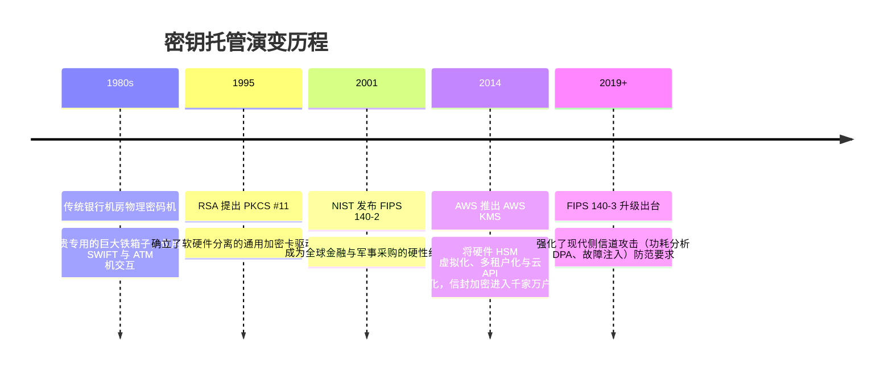

# 密钥管理服务 (KMS) 与硬件安全模块 (HSM) 🗄️

## 1. 概述（What）

**密钥管理服务（Key Management Service, KMS）** 与 **硬件安全模块（Hardware Security Module, HSM）** 是现代企业数据安全基座的核心中枢。它们提供保密密钥从**生成、存储、分发、轮换到最终安全销毁**的全生命周期集中托管与防篡改物理硬件隔离。

- **核心解决问题**：解决"加密数据需要密钥，但谁来安全加密并保护这个密钥自身"的先验递归困境；杜绝开发者将明文私钥硬编码进代码仓库（如 GitHub 泄露 AWS Secret Key）。
- **典型应用场景**：云平台云盘静默透明加密（EBS / S3 SSE-KMS）、金融银行 Visa/MasterCard 信用卡交易 PIN 码验证、CA 根证书签发中心物理签名机。

---

## 2. 原理详解（How it works）

### 现代云原生基石：信封加密（Envelope Encryption）
直接使用 KMS 远程调用加密巨型文件（如 50GB 视频）网络开销巨大且受限于网络带宽。工业界统一采用**信封加密机制**：

```mermaid
flowchart TD
    subgraph KMS / HSM 安全边界 (硬件受控区)
        CMK[(根主密钥 Customer Master Key: 永不出硬件芯片)]
    end

    subgraph 业务应用服务器端 (加解密数据)
        PlainData[原始明文数据]
        App[业务应用程序]
        
        App -->|1. 请求生成数据密钥| KMS_API[调用 KMS: GenerateDataKey]
        KMS_API --> CMK
        CMK -->|利用 CMK 加密派生| GenKeys[生成双份数据密钥 DEK]
        
        GenKeys --> PlainDEK[明文数据密钥 Plaintext DEK]
        GenKeys --> EncryptedDEK[加密密文数据密钥 Ciphertext DEK]
        
        PlainDEK & PlainData --> SymmEnc[本地使用 AES-256-GCM 高速加密]
        SymmEnc --> CipherData[生成业务加密密文数据]
        
        PlainDEK -.->|2. 加密完成后立即从内存安全抹零覆写 0x00| ZeroOut[内存销毁]
    end

    subgraph 最终持久化存储 (数据库 / 存储桶)
        CipherData & EncryptedDEK --> Package[组合存储: 业务密文 + 加密后的数据密钥 DEK]
    end
```
<div class="diagram-caption">图 2-14：基于 KMS 根主密钥与数据密钥（DEK）的信封加密流程图</div>

> **图注说明（信封隐喻）**：数据被装进包裹（密文），用来封锁包裹的钥匙（明文 DEK）被放进了一个带有高科技密码锁的保险信封（密文 DEK）。只有 KMS/HSM 里的根主密钥（CMK）能打开这个信封。数据库被偷窃无妨，因为黑客拿到的信封本身也是密文。

---

## 3. 协议与标准（Protocols & Standards）

| 规范标准 | 制定组织 | 核心内容 |
| :--- | :--- | :--- |
| **FIPS 140-3** [1] | NIST (2019) | 《密码模块安全要求》，现代硬件 HSM 的全球最高级别防篡改认证（分为 Level 1~4） |
| **OASIS KMIP** [2] | OASIS | 密钥管理互操作协议（Key Management Interoperability Protocol），统一企业跨厂商客户端与 KMS 通信接口 |
| **PKCS #11 (Cryptoki)** [3] | OASIS | 底层密码学硬件令牌 C 语言通用抽象接口 API |

### 硬件安全等级：FIPS 140-3 等级纵深

- **Level 1**：纯软件级密码库（如 OpenSSL），无物理防篡改防护。
- **Level 2**：物理防拆封条（Tamper-Evident Seals），外壳被拆开后留下不可逆物理印记。
- **Level 3**：**物理主动主动防御（Tamper-Responding）**。具备微电压、温度与激光传感器，一旦检测到物理探针刺入或开箱，**芯片在纳秒内触发自毁（Zeroization），彻底物理熔断所有主密钥**！
- **Level 4**：针对极限环境（如强放射性、超低温冷冻侧信道）提供终极防护。

---

## 4. 发展历史（Timeline）


<div class="diagram-caption">图 2-15：密钥托管技术从银行专属到现代云原生 KMS 的演变</div>

---

## 5. 优缺点与安全性分析

### 优点
- **根密钥不出芯片**：主密钥永远在专用安全硬件边界内运算，防范任何特权操作系统 Root 提权木马的内存倾倒（Memory Dump）。
- **自动化无感密钥轮换（Key Rotation）**：设置策略后每年自动生成新版密钥版本，旧数据依然可用旧版本解密，新数据自动用新版本加密。

### 缺陷与最佳实践
- **可用性依赖与单点故障**：如果 KMS 宕机或配置了错误的 IAM 策略导致拒绝访问，将引发全站业务瘫痪。**对策**：采用本地短期安全缓存与跨可用区高可用配置。
- **当前推荐状态**：<span class="badge-pill status-recommended">企业级数据落盘加密强制标配</span>。严禁任何生产环境私钥保存在 Git 仓库或明文环境变量中。

---

## 6. 关联知识点（Related）

- **终端设备级 HSM**：[TEE 与 Secure Enclave](/05-endpoint-security/02-tee-secure-enclave)（手机上的微缩版 HSM）。
- **静态数据加密**：[对称加密 AES-GCM](./01-symmetric-encryption)。

---

## 7. 参考资料（References）

[1] NIST. FIPS PUB 140-3: Security Requirements for Cryptographic Modules.  
https://csrc.nist.gov/pubs/fips/140-3/final

[2] OASIS. Key Management Interoperability Protocol (KMIP) Specification.  
https://docs.oasis-open.org/kmip/spec/

[3] OASIS. PKCS #11 Cryptographic Token Interface Base Specification.  
https://docs.oasis-open.org/pkcs11/pkcs11-base/
