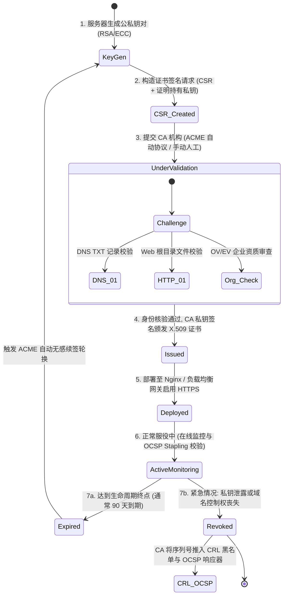
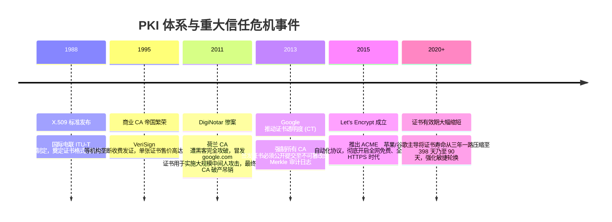

# PKI 与数字证书信任链 📜

## 1. 概述（What）

**公钥基础设施（Public Key Infrastructure, PKI）** 是一套由硬件、软件、人员、策略和标准组成的综合信任安全体系。其核心通过由公认权威的**证书颁发机构（Certificate Authority, CA）** 使用其私钥，为特定主体（如域名、企业法人或开发者）签署符合 **X.509 标准的数字证书（Digital Certificate）**，将一个公开密钥（Public Key）与该主体的真实身份进行防篡改的强密码学绑定。

- **核心解决问题**：彻底解决公钥密码学中"我虽然收到了一个公钥，但我如何证明这个公钥真的属于 Google 还是属于隔壁黑客"的**公钥真实身份防冒充**难题。
- **典型应用场景**：HTTPS 浏览器小锁标志、软件安装包代码签名（Apple Gatekeeper / Windows Defender）、企业 VPN 客户端双向身份识别（mTLS）。

---

## 2. 原理详解（How it works）

### 图表一：架构图 — 分层 CA 证书信任链（Chain of Trust）

```mermaid
graph TD
    subgraph 操作系统 / 浏览器内置可信区 (Root Store)
        RootCA["🏛️ 根 CA 证书 (Root CA Certificate)<br/>• 自签名 (Self-signed: 自身私钥签署自身公钥)<br/>• 预埋在 Windows/macOS/Android 镜像中<br/>• 私钥常年离线存放在物理保险库机房"]
    end

    subgraph 在线发证机构 (Intermediate CA)
        InterCA["🏢 中间 CA 证书 (Intermediate CA / Issuing CA)<br/>• 由 Root CA 私钥签名授权<br/>• 隔离风险: 一旦遭黑客攻击无需撤回操作系统根证书<br/>• 具备签发终端证书权限 (BasicConstraints: CA=True)"]
    end

    subgraph 终端用户服务 (Leaf / End-Entity)
        LeafCert["📄 叶子证书 / 服务器证书 (Server Certificate)<br/>• 由 Intermediate CA 签名<br/>• 绑定特定域名: CN/SAN = sec-pedia.org<br/>• 无权继续签发下一级 (CA=False)"]
    end

    RootCA -->|Root 私钥对 Inter CA 签名背书| InterCA
    InterCA -->|Inter 私钥对服务器证书签名背书| LeafCert

    subgraph 浏览器本地递归验签链路
        Check[浏览器发起 HTTPS 访问] --> V1[读取本地内置 Root CA 公钥验签 Inter CA]
        V1 --> V2[提取 Inter CA 公钥验签 Leaf 证书签名]
        V2 --> V3[比对域名 SAN 是否匹配, 检查有效期与吊销状态]
        V3 --> Pass[信任链完整无误, 亮起绿色小锁安全标示! 🔒]
    end
```
<div class="diagram-caption">图 2-16：X.509 数字证书自顶向下的层次化 CA 信任链验证架构图</div>

> **图注说明**：根 CA 私钥价值连城，若发生泄露将引发全球性灾难。因此，根 CA 签发完中间 CA 后即刻拔掉网线，进入绝密的冷存储物理保险库；日常全部签发流水线均由在线的中间 CA 负责运转。

---

### 图表二：状态图 — 数字证书全生命周期状态流转


<div class="diagram-caption">图 2-17：数字证书从 CSR 生成、CA 签发、生产服役到轮换或吊销的状态机流转图</div>

---

## 3. 协议与标准（Protocols & Standards）

| 规范 | 制定机构 | 年份 | 关键定位 |
| :--- | :--- | :--- | :--- |
| **RFC 5280** [1] | IETF PKIX WG | 2008 | 《X.509 公钥证书与证书吊销列表 (CRL) 规范》 |
| **RFC 8555 (ACME 协议)** [2] | IETF ACME WG | 2019 | 《自动化证书管理环境 (ACME)》，Let's Encrypt 自动续签基石 |
| **RFC 6960 (OCSP)** [3] | IETF | 2013 | 《在线证书状态协议 (OCSP)》，替代陈旧冗长的 CRL 文件 |
| **RFC 9162 (CT 证书透明度)** [4] | IETF | 2021 | 《证书透明度 (Certificate Transparency) 2.0》，公开审计防冒发 |

### 吊销校验机制演进：CRL vs OCSP vs OCSP Stapling

1. **CRL（证书吊销列表）**：CA 定期发布包含全部失效证书序列号的庞大文件。**缺陷**：文件随时间膨胀至几十兆，客户端拉取超时容易跳过检查。
2. **OCSP（在线实时查询）**：浏览器每次访问网站时，向 CA 服务器发请求查询该证书是否已吊销。**缺陷**：向 CA 泄露了用户浏览隐私，且增加 1 个 RTT 延迟；若 CA 宕机浏览器通常选择软失败（Soft-Fail），失去防御意义。
3. **现代最佳实践：OCSP 装订（OCSP Stapling, RFC 6066）**：Web 服务器定期向 CA 轮询并缓存经过 CA 数字签名的最新状态凭据，在 TLS 握手时直接附赠给浏览器，**既零延迟、不泄露隐私，又能杜绝 CA 宕机冲击**！

---

## 4. 发展历史（Timeline）


<div class="diagram-caption">图 2-18：PKI 信任体系从商业垄断、安全丑闻到透明自动化的演变历程</div>

---

## 5. 优缺点与安全性分析

### 优点
- **全球免配置无感信任**：借助操作系统出厂预置的数百个根 CA，全球任意用户首次访问合法网站即可建立安全信任，无需手动交换密钥。
- **证书透明度（CT Logs）阳光监管**：任何人都可以实时监控是否有未授权 CA 为自己的域名颁发了可疑证书。

### 缺陷与单点妥协
- **全信任模型脆弱性（Weakest Link）**：全球操作系统信任的根 CA 超过百余家。理论上，**任何一家 CA（哪怕是小国脆弱机构）被攻击者攻破，攻击者都能为全球任意域名（如 apple.com）合法签署证书**！
- **对策**：
  1. **CAA 域名记录（RFC 8659）**：在权威 DNS 中配置 `CAA` 记录，明令禁止非指定的 CA 签发自身证书。
  2. **证书透明度（CT）强制审计**：Chrome/Safari 强制要求证书必须携带至少两个独立 CT Log 的 SCT 凭据。
- **当前推荐状态**：<span class="badge-pill status-recommended">互联网基石（全面采用 ACME 自动化 90 天证书）</span>。

---

## 6. 关联知识点（Related）

- **传输层载体**：[TLS / SSL 传输安全](./04-tls-ssl)（PKI 证书在 TLS 握手中传递）。
- **底层签名算法**：[哈希与数字签名](./03-hash-signature)。

---

## 7. 参考资料（References）

[1] IETF. RFC 5280: Internet X.509 Public Key Infrastructure Certificate and CRL Profile.  
https://datatracker.ietf.org/doc/html/rfc5280

[2] IETF. RFC 8555: Automatic Certificate Management Environment (ACME).  
https://datatracker.ietf.org/doc/html/rfc8555

[3] IETF. RFC 6960: X.509 Internet Public Key Infrastructure Online Certificate Status Protocol - OCSP.  
https://datatracker.ietf.org/doc/html/rfc6960

[4] Certificate Transparency Project. How Certificate Transparency Works.  
https://certificate.transparency.dev/
