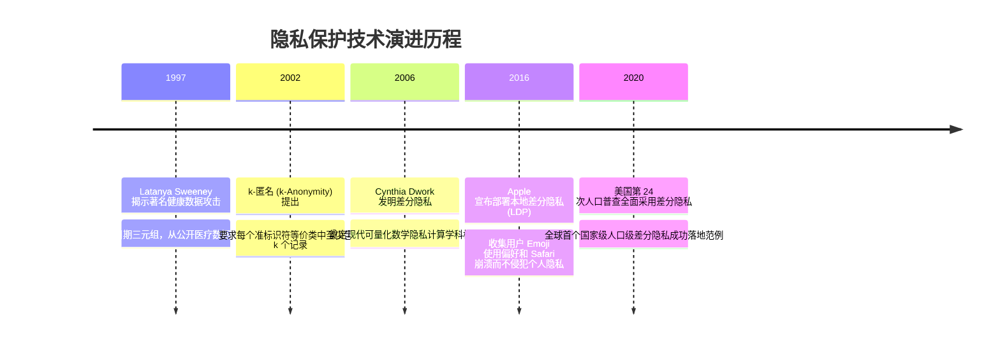

# 隐私保护技术 (数据脱敏与差分隐私) 🛡️

## 1. 概述（What）

**隐私保护技术（Privacy-Preserving Technologies）** 是一组旨在**在释放数据要素价值与统计分析潜力的同时，严密保护原始个体敏感隐私不被反向重构或识别**的算法与工程框架。主流技术路线包括面向生产运维展示的**数据脱敏（Data Masking）** 与具备严密数学可证明安全性的**差分隐私（Differential Privacy, DP）**。

- **核心解决问题**：杜绝"看似移除了姓名，但通过将邮编、性别、出生日期与外部选民登记表进行交叉比对，就能精准重新识别出特定患者病历"的**准标识符链接重识别攻击（Linkage Re-identification Attacks）**。
- **典型应用场景**：医疗临床大数据联合科研、iOS 键盘热门词频统计（本地差分隐私）、美国人口普查局（U.S. Census Bureau）公开统计报表。

---

## 2. 原理详解（How it works）

### 1. 数据脱敏（Data Masking）：静态 vs 动态
- **静态脱敏（Static Data Masking, SDM）**：在将生产数据导出用于测试开发、培训或外部数据分析前，进行不可逆的替换、遮蔽（如将身份证号变为 `110101********1234`）或散列变换。
- **动态脱敏（Dynamic Data Masking, DDM）**：数据库网关或应用层拦截 SQL 查询，根据当前登录用户的权限角色实时计算出遮蔽掩码，数据库底层物理存储仍保持原样。

### 2. 差分隐私（Differential Privacy, DP）：严格数学可证明框架
差分隐私的核心定义由 Cynthia Dwork 提出：**对于任意两个仅相差单个用户记录的邻近数据集 $D_1$ 和 $D_2$，算法输出相同统计结果的概率比值受到严格的隐私预算 $\epsilon$（Epsilon）界定**：

$$\Pr[\mathcal{M}(D_1) \in S] \le e^{\epsilon} \cdot \Pr[\mathcal{M}(D_2) \in S] + \delta$$

这意味着：**任何单个个体加入或退出该数据集，对最终分析结果的影响微乎其微，攻击者无法通过任何背景知识推断出该个体是否存在于数据集中！**

```mermaid
flowchart LR
    subgraph 原始敏感数据库
        DB[(含个体敏感医疗诊断记录: N 条记录)]
    end

    DB --> TrueQuery[统计分析查询: 例如患病率均值]
    TrueQuery --> TrueResult[精确真实统计值: 42.8%]
    
    subgraph 差分隐私扰动机制 (Laplace / Gaussian)
        NoiseGen[根据敏感度计算注入随机噪声: + Lap(Δf / ε)]
    end
    
    TrueResult & NoiseGen --> FinalResult[输出受扰动结果: 43.1%]
    FinalResult --> PublicReport[向公共/第三方数据分析师发布]
    
    Note1[黑客即使拥有全球其他全部人员数据, 也无法通过 43.1% 反推特定个体是否患病!]
```
<div class="diagram-caption">图 2-19：差分隐私机制通过受控隐私预算（$\epsilon$）注入拉普拉斯噪声保护个体隐私原理图</div>

---

## 3. 协议与标准（Protocols & Standards）

| 规范标准 | 来源 | 关键贡献 |
| :--- | :--- | :--- |
| **NIST SP 800-226** [1] | NIST (2024) | 《评估与应用差分隐私指南》，联邦机构差分隐私工程落地权威标准 |
| **ISO/IEC 20889** [2] | ISO/IEC | 《用于增强隐私保护的去标识化技术规范》，系统梳理 k-匿名、l-多样性、t-接近度与差分隐私 |
| **GDPR 假名化与匿名化指引** | 欧盟 EDPB | 区分可恢复的假名化（Pseudonymization）与不可恢复的匿名化（Anonymization） |

---

## 4. 发展历史（Timeline）


<div class="diagram-caption">图 2-20：隐私计算从启发式规则到严格可证明数学差分隐私的演进时间线</div>

---

## 5. 优缺点与安全性分析

### 优点
- **抵抗任意先验背景知识攻击**：不管黑客从其他泄露数据库中掌握了目标受害者的多少外部辅助信息，差分隐私从数学上保证无法突破隐私预算界限。
- **隐私开销定量可控（Privacy Budgeting）**：系统可以精确量化 $\epsilon$，每发起一次查询消耗一定点数，预算耗尽则切断查询通道，杜绝差分重构。

### 缺陷与工程折中
- **可用性（Utility）与隐私的天然权衡**：$\epsilon$ 设置得越小，注入的随机噪声越大，隐私越安全，但统计数据的精度也随之下降。
- **高维细粒度查询复杂**：对于超大规模关联图谱，全局敏感度极高，需要极度精密的噪声校准算法。
- **当前推荐状态**：<span class="badge-pill status-recommended">合规与大数据分析必备</span>。开发测试库推荐动态脱敏，外部数据共享推荐差分隐私。

---

## 6. 关联知识点（Related）

- **AI 隐私结合**：[隐私保护机器学习：差分隐私在 AI 中的应用](/10-ai-security/03-privacy-ml)。
- **法律合规约束**：[GDPR 与 PIPL 数据保护法规](/07-compliance/01-gdpr-pipl)。

---

## 7. 参考资料（References）

[1] NIST. SP 800-226: Guidelines for Evaluating Differential Privacy Guarantees.  
https://csrc.nist.gov/pubs/sp/800/226/final

[2] ISO/IEC. ISO/IEC 20889:2018: Privacy enhancing data de-identification techniques.  
https://www.iso.org/standard/69260.html

[3] Cynthia Dwork. Differential Privacy: A Survey of Results.  
https://www.microsoft.com/en-us/research/publication/differential-privacy-a-survey-of-results/
