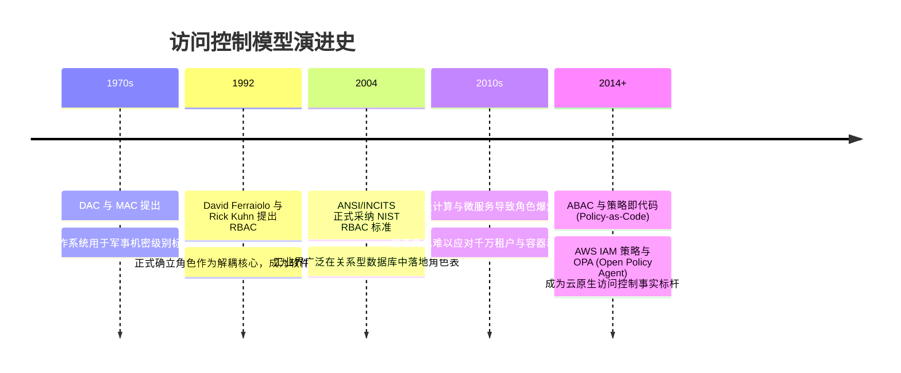

# RBAC 与 ABAC 权限模型 🛡️

## 1. 概述（What）

**基于角色的访问控制（Role-Based Access Control, RBAC）** 与 **基于属性的访问控制（Attribute-Based Access Control, ABAC）** 是软件系统中实现权限管控的两大核心模型架构。

- **RBAC** 通过解耦"用户"与"权限"，引入"角色"作为中介层，用户通过拥有某种角色而间接继承该角色所绑定的系统操作权限；
- **ABAC** 进一步摆脱静态角色的局限，通过动态评估主体（Subject）、客体（Object）、操作（Action）及外部环境（Environment）的多维属性，基于布尔策略逻辑实时计算访问决策。
- **典型应用场景**：企业内部 ERP/OA 权限管理、AWS IAM 策略引擎、多租户 SaaS 平台细粒度数据隔离。

---

## 2. 原理详解（How it works）

### 图表：RBAC 三层架构图（用户 - 角色 - 权限）与 ABAC 动态多维策略引擎

```mermaid
graph TD
    subgraph 经典 RBAC 模型 (静态解耦)
        User1[用户 Alice] & User2[用户 Bob] --> RoleDev[研发工程师角色]
        User3[用户 Charlie] --> RoleAdmin[安全管理员角色]
        
        RoleDev --> Perm1[代码仓库: 读/写]
        RoleDev --> Perm2[CI/CD: 触发构建]
        
        RoleAdmin --> Perm1
        RoleAdmin --> Perm2
        RoleAdmin --> Perm3[生产服务器: SSH Root]
        RoleAdmin --> Perm4[全站用户: 封禁权限]
    end

    subgraph 现代 ABAC 模型 (动态四维属性求值)
        subgraph 四维属性输入
            AttrS["主体属性 (Subject):<br/>部门=风控部, 安全评级=Level-3"]
            AttrO["客体属性 (Object):<br/>机密级别=绝密, 所属项目=天眼"]
            AttrA["操作属性 (Action):<br/>导出 Excel 报表"]
            AttrE["环境属性 (Environment):<br/>时间=工作日 09:00-18:00, 地点=公司内网 IP, 设备=加密合规笔记本"]
        end
        
        AttrS & AttrO & AttrA & AttrE --> PDP[策略决策点 PDP: 运行 XACML / Rego 规则]
        PDP --> PolicyDecision{所有布尔条件均通过?}
        PolicyDecision -- 是 --> Grant[允许访问 Allow]
        PolicyDecision -- 否 --> Deny[明确拒绝 Deny (默认拒绝)]
    end
```
<div class="diagram-caption">图 3-2：RBAC 用户-角色-权限三层解耦关系与 ABAC 动态多维环境策略决策流程图</div>

> **图注说明**：RBAC 适合粗粒度组织架构管理，但在面对诸如"仅允许北京研发部员工在工作日白天通过内网查看未归档的本组文档"等复杂业务场景时，RBAC 会引发严重的"角色爆炸（Role Explosion）"；ABAC 通过属性动态求值，优雅地解决了这一难题。

---

## 3. 协议与标准（Protocols & Standards）

| 规范标准 | 制定机构 | 年份 | 关键定位 |
| :--- | :--- | :--- | :--- |
| **INCITS 359-2004 / ANSI RBAC** [1] | ANSI / NIST | 2004 | 确立 RBAC0（核心）、RBAC1（层次化继承）、RBAC2（静态/动态职责分离 SOD）、RBAC3（统合体） |
| **NIST SP 800-162** [2] | NIST | 2014 | 《基于属性的访问控制 (ABAC) 定义与实施指南》 |
| **XACML 3.0** [3] | OASIS | 2013 | 可扩展访问控制标记语言，定义 PEP（执行点）、PDP（决策点）、PIP（信息点）、PAP（管理点）参考架构 |

---

## 4. 发展历史（Timeline）


<div class="diagram-caption">图 3-3：访问控制模型半个世纪演进脉络</div>

---

## 5. 优缺点与安全性分析

### RBAC vs ABAC 核心权衡矩阵

| 评估维度 | RBAC (基于角色) | ABAC (基于属性) |
| :--- | :--- | :--- |
| **设计复杂度** | 极低，几张关系数据库表（用户-角色-权限）即可跑通 | 较高，需要部署专门的策略解析执行引擎（如 OPA） |
| **维护可扩展性** | 业务变复杂时极易导致数百个僵尸角色难以清理（角色爆炸） | 极佳，增减属性即可自然适配新边界 |
| **计算性能** | 极快（通常在登录时查一次角色写入 Token 或 Session） | 每次请求均需动态提取上下文执行布尔逻辑评估 |
| **审计与可见性** | 清晰透明（用户拥有哪个角色一目了然） | 较难直接看出"谁对资源拥有最终访问权"（需运行策略模拟） |

### 当前推荐组合实践
<span class="badge-pill status-recommended">现代推荐：RBAC 与 ABAC 混合架构</span>。在企业顶层使用 RBAC 划分基础宏观职能（如客服、财务、开发、管理员），在具体微服务或数据行级读取时叠加 ABAC 动态校验环境变量（如 IP、时间、敏感级）。

---

## 6. 关联知识点（Related）

- **网络级演进**：[零信任架构 (Zero Trust)](./02-zero-trust)（零信任是 ABAC 在企业网络基础设施上的全盘实践）。
- **凭据载体**：[Session / JWT / Cookie 安全](./03-session-jwt-cookie)。

---

## 7. 参考资料（References）

[1] NIST. American National Standard for Information Technology - Role Based Access Control (ANSI/INCITS 359-2004).  
https://csrc.nist.gov/projects/role-based-access-control

[2] NIST. SP 800-162: Guide to Attribute Based Access Control (ABAC) Definition and Considerations.  
https://csrc.nist.gov/pubs/sp/800/162/final

[3] OASIS. eXtensible Access Control Markup Language (XACML) Version 3.0.  
https://docs.oasis-open.org/xacml/3.0/xacml-3.0-core-spec-os-en.html
