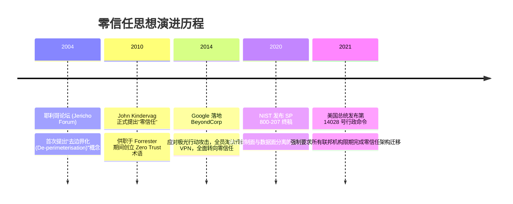

# 零信任架构 (Zero Trust) 🛡️

## 1. 概述（What）

**零信任架构（Zero Trust Architecture, ZTA）** 是一种颠覆传统"基于物理网络边界（城堡与护城河）"的现代化网络安全战略范式。其核心公理是：**「从不信任，始终验证（Never Trust, Always Verify）」** 与 **「假定内网已被攻破（Assume Breach）」**。

- **核心解决问题**：彻底消除黑客只需攻破 VPN 或单台内网主机，即可在企业平坦内网（Flat Network）中肆意进行横向移动（Lateral Movement）并接管全部核心资产的致命隐患。
- **典型应用场景**：后疫情时代全球化远程办公、跨多云混合架构访问、特权运维访问管控、Google BeyondCorp 最佳实践。

---

## 2. 原理详解（How it works）

零信任架构不再以物理 IP 地址或是否身处办公室内网作为信任依据，而是将所有资产和请求视为完全暴露在敌对互联网中，严格围绕三原则运转：
1. **持续验证，从不隐式信任**：对每一次请求、每一个 API 调用进行身份鉴别、设备健康度核验与动态风险评估。
2. **最小权限原则（Least Privilege）**：通过准时制授权（Just-In-Time, JIT）和充足最小权限（Just-Enough-Access, JEA）限制单次操作范围。
3. **假定已被入侵（Assume Breach）**：实施极其严密的微隔离（Micro-segmentation），所有网络流量端到端加密并全量审计。

### NIST SP 800-207 零信任核心组件控制与数据流

```mermaid
flowchart TD
    subgraph 用户与终端环境
        Subject[主体: 用户 + 办公笔记本 / 移动设备]
    end

    subgraph 控制平面 (Control Plane: 大脑)
        PA[策略代理 Policy Agent]
        PE[策略引擎 Policy Engine]
        PA & PE <--> PDP[策略决策点 Policy Decision Point]
        
        subgraph 外部动态情报输入
            CDM[连续诊断与缓解系统: 杀毒/补丁合规]
            TI[威胁情报网 Threat Intelligence]
            IDM[身份系统: IdP / MFA 记录]
            Logs[SIEM 行为大数据日志分析]
        end
        CDM & TI & IDM & Logs --> PDP
    end

    subgraph 数据平面 (Data Plane: 执行关卡)
        PEP[策略执行点 Policy Enforcement Point: 零信任网关 / ZTNA Agent]
    end

    subgraph 企业核心资源受控区
        AppServer[(企业核心业务系统 / 生产数据库)]
    end

    Subject -->|1. 发起访问请求| PEP
    PEP -->|2. 请求决策判定| PDP
    PDP -->|3. 综合多源情报评估, 动态下发短期授权凭证| PEP
    PEP -->|4. 仅放行合法加密连接| AppServer
```
<div class="diagram-caption">图 3-4：NIST SP 800-207 零信任控制平面（PDP）与数据平面（PEP）协同架构图</div>

---

## 3. 协议与标准（Protocols & Standards）

| 规范文档 | 制定组织 | 年份 | 关键定位 |
| :--- | :--- | :--- | :--- |
| **NIST SP 800-207** [1] | NIST | 2020 | 《零信任架构标准》，全球政府与企业零信任转型的绝对宪章指南 |
| **DoD Zero Trust Reference Architecture** [2] | 美国国防部 | 2021 | 军工级零信任七大支柱落地成熟度模型 |
| **CSA SDP (软件定义边界)** [3] | 云安全联盟 (CSA) | 2014+ | 隐藏核心服务器端口、单包授权（SPA）标准规范 |

---

## 4. 发展历史（Timeline）


<div class="diagram-caption">图 3-5：零信任思想从萌芽到国家级法定标准的演变时间线</div>

---

## 5. 优缺点与安全性分析

### 优点
- **彻底粉碎横向移动**：攻击者拿下单个员工电脑后，无法通过内网扫描探测到其他服务器，所有未授权资产在网络层彻底隐身（Dark Cloud）。
- **设备安全与合规强绑定**：员工电脑一旦关闭杀毒软件或未安装最新安全补丁，零信任网关秒级切断其访问权限。

### 落地挑战
- **改造工程量巨大**：老旧遗留系统不支持现代 mTLS 或短期 Token 认证。
- **架构依赖度极高**：PDP 策略决策中心成为全企业生命线，必须具备极高的多活容灾能力。
- **当前推荐状态**：<span class="badge-pill status-recommended">现代化企业安全演进不可逆的终极方向</span>。

---

## 6. 关联知识点（Related）

- **底座身份与设备**：[多因素认证 MFA](/01-authentication/11-mfa)、[设备指纹技术](/05-endpoint-security/01-device-fingerprint)。
- **网络层防护**：[网络安全纵深防御体系](/04-network-security/02-defense-systems)。

---

## 7. 参考资料（References）

[1] NIST. SP 800-207: Zero Trust Architecture.  
https://csrc.nist.gov/pubs/sp/800/207/final

[2] Cloudflare Learning Center. What is a Zero Trust architecture?  
https://www.cloudflare.com/learning/security/glossary/what-is-zero-trust/

[3] Cloud Security Alliance. Software-Defined Perimeter (SDP) Specification v2.0.  
https://cloudsecurityalliance.org/research/working-groups/software-defined-perimeter/
