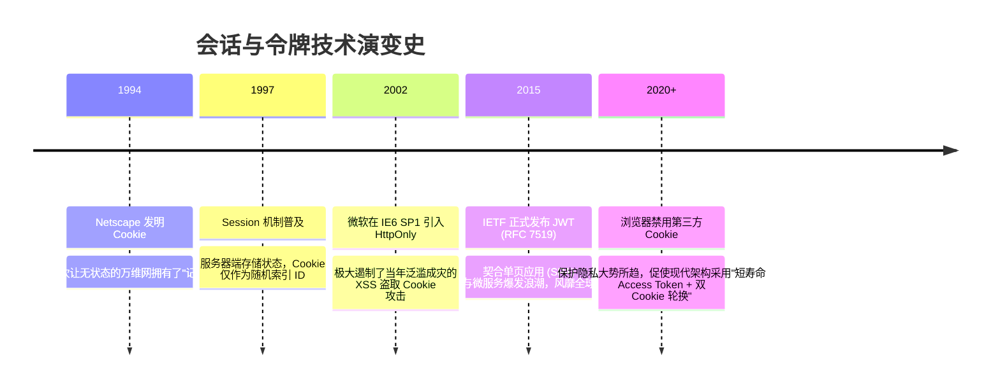

# Session / JWT / Cookie 安全 🍪

## 1. 概述（What）

**Session（服务端会话）**、**JWT（JSON Web Token，无状态自包含令牌）** 与 **Cookie（浏览器状态凭证机制）** 是当今 Web 与移动应用实现登录态保持与无感知鉴权的三大核心技术载体。

- **核心解决问题**：弥补底层 HTTP 协议"无状态（Stateless）"的本质缺陷，在保证百万级并发快速校验的同时，坚决防御凭据被跨站脚本（XSS）盗取、被跨站请求伪造（CSRF）盗用或被恶意重放。
- **典型应用场景**：Web 浏览器登录持久化、微服务分布式架构跨网关鉴权、单页应用（SPA）与移动 App 的 RESTful API 鉴权。

---

## 2. 原理详解（How it works）

### 两种核心范式对比：有状态 Session vs 无状态 JWT

```mermaid
flowchart TD
    subgraph 传统有状态 Session 架构
        Req1[客户端请求] --> Srv1[应用服务器]
        Srv1 <--> RedisDB[(中央 Session 存储 Redis / DB)]
        Srv1 --> Res1[校验 SessionID 并响应]
        NoteS[优点: 服务端单点秒级强制下线吊销<br/>缺点: 高并发下共享缓存成为数据库瓶颈]
    end

    subgraph 现代无状态 JWT 架构
        Req2[客户端请求 Header: Bearer JWT] --> Gateway[微服务 API 网关]
        Gateway --> LocalVerify[本地公钥验签 + 检查 exp 过期]
        LocalVerify --> Microservices[下游数十个微服务自由流通]
        NoteJ[优点: 零数据库查询, 支撑天量并发与跨域<br/>缺点: 签发后无法轻易中途撤销 (除非维护黑名单)]
    end
```
<div class="diagram-caption">图 3-6：有状态中心化 Session 与无状态自包含 JWT 的工作原理与架构对比</div>

---

### Cookie 的三大核心安全防御标头
当使用 Cookie 存放认证凭证（Session ID 或 Refresh Token）时，必须配置以下三大防御标头：
1. **`HttpOnly`**：彻底切断 JavaScript 的访问权限（`document.cookie` 无法读取该 Cookie），从根源上防御 **XSS 脚本窃取会话**。
2. **`Secure`**：强制仅允许在加密的 **HTTPS** 连接下传输该 Cookie，禁止在明文 HTTP 下被中间人嗅探。
3. **`SameSite` 策略**：彻底根除 **CSRF（跨站请求伪造）**：
   - `SameSite=Strict`：任何跨站请求（即使从外部网站点击超链接跳过来）均不携带 Cookie；
   - `SameSite=Lax`（现代浏览器默认）：仅在顶层导航 GET 跳转时携带，拦截所有第三方 POST 表单伪造；
   - `SameSite=None; Secure`：显式允许跨域共享，必须强制搭配 HTTPS。

---

## 3. 协议与标准（Protocols & Standards）

| 规范文档 | 组织 | 年份 | 说明 |
| :--- | :--- | :--- | :--- |
| **RFC 7519 (JWT 规范)** [1] | IETF | 2015 | 《JSON Web Token (JWT)》，定义 Header/Payload/Signature 结构 |
| **RFC 6265bis (Cookie 安全升级草案)** [2] | IETF | 现役 | 引入 `__Host-` 和 `__Secure-` 前缀保护，默认 Lax 策略 |
| **RFC 8725 (JWT 最佳安全实践 BCP)** [3] | IETF | 2020 | 详述防范 `alg: "none"` 算法混淆漏洞与时钟回退攻击 |

### JWT 的经典致命弱点与防范军规

1. **`alg: none` 攻击**：早期部分缺陷库允许客户端将 Header 中的算法篡改为 `none` 并移除签名，服务端若未经配置直接信任 Payload，黑客可随意伪造 `admin: true` 凭据。**军规：服务端必须硬编码白名单强制要求验证指定算法（如 RS256/ES256）**。
2. **算法混淆攻击（Key Confusion）**：原本使用 RS256（非对称）验证的服务端，被黑客将 `alg` 篡改为 HS256（对称），并用服务端的公开公钥作为对称密钥签署恶意 Payload。若服务端混淆使用验签函数，验签会离奇通过！**军规：非对称与对称验签流程在代码中彻底硬隔离**。

---

## 4. 发展历史（Timeline）


<div class="diagram-caption">图 3-7：Web 会话凭证演化三十年</div>

---

## 5. 优缺点与安全性分析

### 优点
- **JWT 极致扩展性**：微服务节点本地计算公钥验签，集群扩容无需同步共享内存缓存。
- **Session 强控生命周期**：管理员一旦发现异常账号，在 Redis 中删除对应 Key 即可秒级强制该用户全网下线。

### 现代前后端最佳存储架构实践
<span class="badge-pill status-recommended">强烈推荐的混合实践方案</span>：
1. **Access Token（短期有效，如 5~15 分钟）**：以 JWT 形式下发，仅保存在前端运行时的内存变量（Memory）中，页面关闭自动销毁，彻底免疫 XSS 磁盘窃取。
2. **Refresh Token（长期有效，如 7~30 天）**：保存在带有 **`HttpOnly; Secure; SameSite=Strict; Path=/api/auth/refresh`** 限制的专属安全 Cookie 中。
3. 前端在 Access Token 快过期时，静默调用刷新接口在后台获取新 Access Token；若用户遭遇登出或被封禁，服务端直接将该 Refresh Token 在数据库中置为失效，既享受了无状态的高速，又保障了可撤回的安全底线！

---

## 6. 关联知识点（Related）

- **身份协议结合**：[OIDC 身份层协议](/01-authentication/09-oidc)（ID Token 本身就是 JWT）。
- **前端攻防抵御**：[常见 Web 攻击：XSS 与 CSRF](/04-network-security/01-web-attacks)。

---

## 7. 参考资料（References）

[1] IETF. RFC 7519: JSON Web Token (JWT).  
https://datatracker.ietf.org/doc/html/rfc7519

[2] IETF. RFC 8725: JSON Web Token Best Current Practices.  
https://datatracker.ietf.org/doc/html/rfc8725

[3] The Copenhagen Book. Sessions and Storage Guidelines.  
https://thecopenhagenbook.com/
