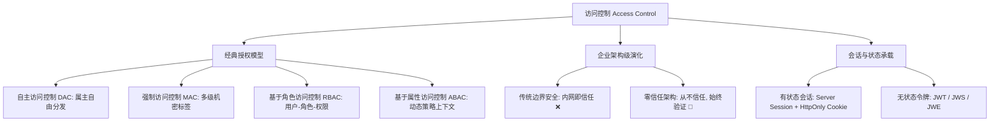

# 三、访问控制（Access Control）体系概览 🛡️

> **访问控制（Access Control，缩写为 AuthZ）** 决定了已经被认证合法的主体（Subject）能够对特定的客体资源（Object）执行哪些具体操作（Action）。它回答的核心问题是：**「你能访问什么？你可以执行什么操作？」**

---

## 🗺️ 访问控制核心演进矩阵

图 3-1：访问控制模型分类与现代零信任架构演变全景

---

## 📑 本章节知识点索引

| 知识点 | 核心标准 / 模型 | 机制特点 | 行业推荐状态 |
| :--- | :--- | :--- | :--- |
| [1. RBAC 与 ABAC 权限模型](./01-rbac-abac) | NIST RBAC, XACML 3.0 | 静态角色分配 vs 动态多维环境属性策略判断 | 企业核心规范 |
| [2. 零信任架构 (Zero Trust)](./02-zero-trust) | NIST SP 800-207 | 摒弃物理网络边界，细粒度持续动态微隔离 | 下一代安全标杆 |
| [3. Session / JWT / Cookie 安全](./03-session-jwt-cookie) | RFC 7519, RFC 6265bis | 客户端存储防御、SameSite、CSRF/XSS 令牌防护 | Web 开发必备 |
