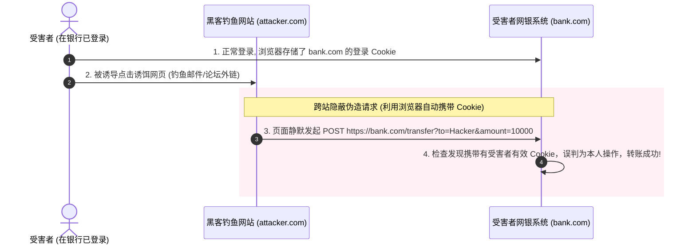
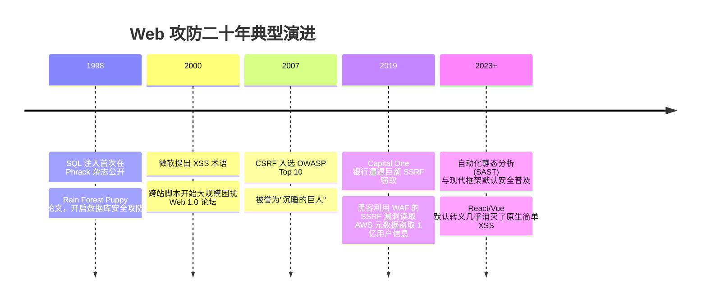

# 常见 Web 攻击手法剖析 ⚔️

## 1. 概述（What）

**常见 Web 漏洞与攻击** 是攻击者利用 Web 应用程序在处理不可信输入、解析外部资源或管理信任边界时的设计缺陷与编程疏忽，实施的非法代码执行、敏感数据窃取与服务滥用行为。

- **核心覆盖范畴**：依据 **OWASP Top 10** 权威榜单，本篇深度拆解五大破坏力极强的攻击原型：
  1. **XSS（跨站脚本攻击）**
  2. **CSRF（跨站请求伪造）**
  3. **SQL 注入（SQL Injection）**
  4. **SSRF（服务端请求伪造）**
  5. **MITM（中间人劫持攻击）**

---

## 2. 原理详解（How it works）

### 1. 跨站脚本攻击（XSS, Cross-Site Scripting）
- **机理**：恶意攻击者将未经充分过滤或转义的 JavaScript 脚本注入到 Web 页面中，当受害者浏览器渲染页面时，恶意脚本在受害者的会话上下文中静默执行。
- **分类**：
  - **存储型（Stored XSS）**：最危险，脚本存入数据库（如恶意留言板），所有访问该页面的用户均被无差别攻击。
  - **反射型（Reflected XSS）**：脚本包含在 URL 参数中，诱骗受害者点击链接触发。
  - **DOM 型（DOM-based XSS）**：前端 JS 直接通过 `eval()` 或 `innerHTML` 渲染不可信 URL 片段触发。
- **防御黄金法则**：
  - 上下文编码转义（Context-aware Output Encoding，如将 `<` 转换为 `&lt;`）；
  - 配置严密的 **CSP（内容安全策略，Content-Security-Policy）**，禁止内联脚本；
  - 会话 Cookie 必须打上 **`HttpOnly`** 标记。

---

### 2. 跨站请求伪造（CSRF, Cross-Site Request Forgery）
- **机理**：受害者在已登录信任网站 A 的情况下，被诱导访问了黑客控制的恶意网站 B。网站 B 偷偷向网站 A 发起接口请求（如转账 POST），受害者浏览器因同源凭据机制自动携带了网站 A 的 Cookie，导致网站 A 误以为是受害者本人的合法操作。

图 4-2：传统 CSRF 利用浏览器默认 Cookie 自动附带机制实施跨站伪造时序图

- **终极防御**：
  - 核心会话 Cookie 启用 **`SameSite=Lax` 或 `Strict`**；
  - 接口使用 **CSRF Token（随机令牌校验）**；
  - 现代前后端分离直接使用 `Authorization: Bearer <JWT>` 头，天然规避表单跨站自动附带。

---

### 3. SQL 注入攻击（SQL Injection, SQLi）
- **机理**：程序员通过简单字符串拼接拼凑 SQL 查询语句，黑客通过在输入框输入 `' OR 1=1 --` 等语法控制字符，破坏原本的语义解析树，夺取对底层数据库的无限制读写权限。
- **终极防御军规**：**100% 强制使用参数化查询（Parameterized Queries / Prepared Statements）**。SQL 引擎在编译期即固定了语法树结构，用户输入的任何字符均被严格当做纯字面标量（Literal），从数学上彻底绝罚注入可能！

---

### 4. 服务端请求伪造（SSRF, Server-Side Request Forgery）
- **机理**：Web 应用提供了"输入外部图片 URL 并由服务器后台代为下载/抓取"的功能，服务器在发起网络请求时**未对目标内网 IP 进行校验过滤**。攻击者输入 `http://169.254.169.254/latest/meta-data/`（AWS 云主机元数据地址）或 `http://192.168.1.1/`，借用服务器的内网信任身份偷取企业云平台 IAM 密钥或扫描内网 Redis。
- **防御法则**：
  - 解析域名获取真实 IP，强制过滤内网保留网段（`10.0.0.0/8`, `172.16.0.0/12`, `192.168.0.0/16`, `169.254.0.0/16`, `127.0.0.1`）；
  - 防范 **DNS 重绑定攻击（DNS Rebinding）**：确保解析 IP 与发起连接时的目标 IP 严格一致，禁止再次发起未校验的 DNS 解析。

---

## 3. 协议与标准（Protocols & Standards）

| 规范 | 机构 | 核心定位 |
| :--- | :--- | :--- |
| **OWASP Top 10 (2021/2025)** [1] | OWASP | 全球 Web 应用程序安全风险权威基线 |
| **W3C Content Security Policy Level 3** [2] | W3C | CSP 标头规范，规范前端脚本加载源白名单与 Nonce 模式 |
| **IETF RFC 6797 (HSTS)** [3] | IETF | HTTP 严格传输安全，强制浏览器仅通过 HTTPS 通信防范 MITM 降级 |

---

## 4. 发展历史（Timeline）

图 4-3：经典 Web 攻击手法演进史

---

## 5. 优缺点与安全性分析

现代 Web 框架（如 React、Vue、Next.js、Spring Boot、Django）在架构上已经默认集成了海量防范措施（如 JSX 默认转义防 XSS、ORM 默认预编译防 SQLi）。现代攻防的主战场已从初级的语法注入转向**越权逻辑漏洞（BAPI / IDOR）**、**第三方开源软件供应链投毒** 与 **云原生元数据 SSRF 攻击**。

---

## 6. 关联知识点（Related）

- **网络边界防护**：[网络安全纵深防御体系：WAF 与 IDS](./02-defense-systems)。
- **传输层加密**：[TLS / SSL 与 HTTPS 传输安全](/02-data-protection/04-tls-ssl)。

---

## 7. 参考资料（References）

[1] OWASP. OWASP Top 10:2021 The Ten Most Critical Web Application Security Risks.  
https://owasp.org/Top10/

[2] W3C. Content Security Policy Level 3.  
https://www.w3.org/TR/CSP3/

[3] IETF. RFC 6797: HTTP Strict Transport Security (HSTS).  
https://datatracker.ietf.org/doc/html/rfc6797
