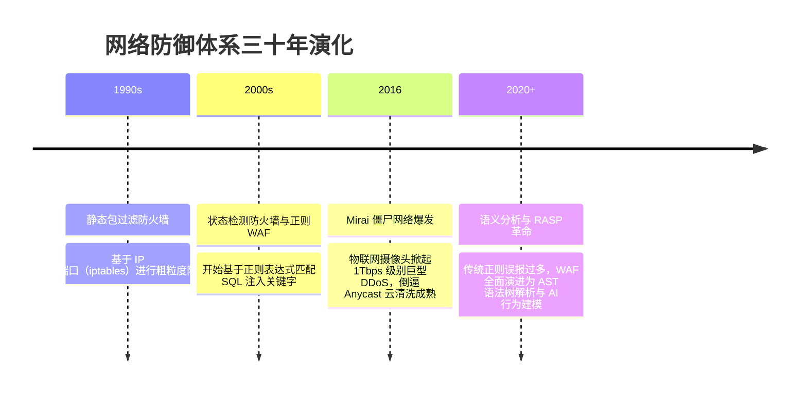

# 网络纵深防御体系 (WAF / IDS / IPS / DDoS防护) 🏰

## 1. 概述（What）

**网络纵深防御体系（Defense-in-Depth Architecture）** 是指在网络传输拓扑的各个逻辑与物理分层（从网络接入层、传输层、应用网关到主机操作系统运行时），设置多道相互协作、梯次互补的安全防御关卡，确保单一防御组件失效时整个系统不会被瞬间穿透。

- **核心四大组件**：
  1. **DDoS 高防与流量清洗中心**（抗击 L3/L4 泛洪洪水）；
  2. **WAF（Web 应用防火墙）**（过滤 L7 HTTP/HTTPS 恶意语义载荷）；
  3. **IDS / IPS（入侵检测与入侵防御系统）**（网络全流量深潜镜像审计与阻断）；
  4. **RASP（应用运行时自我保护）**（浸入 JVM/Node 进程内部拦截威胁）。

---

## 2. 原理详解（How it works）

### 图表：纵深网络防御全链路流量处理流程图

```mermaid
flowchart TD
    PublicTraffic[公网混合流量: 正常用户 + 攻击脚本 + 巨型僵尸网络] --> EdgeBGP[1. 边缘 Anycast BGP 高防网络]
    
    subgraph L3/L4 DDoS 流量清洗层
        EdgeBGP --> VolumetricCheck{检测 SYN Flood / UDP 反弹放大?}
        VolumetricCheck -- 攻击流量 (数百 Gbps) --> Scrubbing[流量清洗机: 丢弃异常畸形包, 触发黑洞路由]
        VolumetricCheck -- 正常业务连接流量 --> NextLayer[放行至数据中心入口]
    end

    subgraph L7 Web 应用防火墙层 (WAF)
        NextLayer --> WAF_Engine[2. WAF 语义解析与 AI 规则引擎]
        WAF_Engine --> WAF_Check{检测 SQLi / XSS / RCE / 爬虫指纹?}
        WAF_Check -- 匹配恶意特征 --> Drop403[阻断并返回 403 Forbidden / 触发验证码]
        WAF_Check -- 干净合法请求 --> LoadBalancer[反向代理与负载均衡 Nginx]
    end

    subgraph 内部网络监听与主机层 (IDS / IPS / RASP)
        LoadBalancer --> AppServer[3. 业务应用容器 Pod]
        MirrorTraffic[镜像全量流量] -.-> Snort_IDS[IDS 旁路监听: Suricata / 威胁情报匹配]
        AppServer --> RASP_Agent[4. RASP 探针: 监控底层底层系统调用 execve / JDBC 行为]
        RASP_Agent --> RealDB[(后端核心数据库)]
    end
```
<div class="diagram-caption">图 4-4：从边缘 DDoS 清洗、WAF 应用过滤到 RASP 运行时探针的多层纵深防御架构</div>

---

## 3. 协议与标准（Protocols & Standards）

| 体系 | 机构 | 核心技术标准 |
| :--- | :--- | :--- |
| **OWASP Core Rule Set (CRS)** [1] | OWASP | ModSecurity 与现代 WAF 的事实标准通用防御规则集 |
| **BGP Anycast (RFC 4786)** [2] | IETF | 利用跨国 Anycast BGP 将数 Tbps 的 DDoS 流量分散稀释到全球数百个机房清洗 |
| **Suricata / Snort 规则标准** | 开源社区 | 网络入侵签名匹配语法与 PCAP 深层审计标准 |

---

## 4. 发展历史（Timeline）


<div class="diagram-caption">图 4-5：网络防御技术演进与大规模流量对抗史</div>

---

## 5. 优缺点与安全性分析

- **WAF 的演进优势与绕过对抗**：传统的基于正则表达式匹配的 WAF（如检测 `union select`）极易被编码混淆（SQL 注释 `/*!50000union*/`、畸形 Unicode 转义、分块传输 Chunked Transfer）绕过。**现代最佳方案**：采用将输入转换为抽象语法树（AST）的语义分析型 WAF，不管如何混淆，只要在语法树上构成危险分支即可精准拦截。
- **当前推荐状态**：<span class="badge-pill status-recommended">企业级对外暴露端口与公网域名的强制基线标配</span>。

---

## 6. 关联知识点（Related）

- **攻防对抗**：[常见 Web 攻击手法剖析](./01-web-attacks)。
- **应急响应处置**：[安全事件应急响应与溯源](/06-security-operations/02-incident-response)。

---

## 7. 参考资料（References）

[1] OWASP. Core Rule Set (CRS) Official Documentation.  
https://coreruleset.org/

[2] IETF. RFC 4786: Operation of Anycast Services.  
https://datatracker.ietf.org/doc/html/rfc4786
