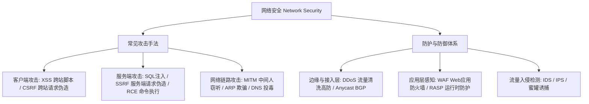

# 四、网络安全（Network Security）体系概览 🛡️

> **网络安全（Network Security）** 关注在公共开放网络环境与应用服务中，抵御针对传输链路、网络层协议、Web 应用逻辑与主机端口的各类恶意渗透、漏洞利用与拒绝服务攻击，构建覆盖从**流量接入层**到**应用运行时**的纵深防御体系。

---

## 🗺️ 网络攻防对抗全景

图 4-1：网络安全攻防技术栈全景

---

## 📑 本章节知识点索引

| 知识点 | 覆盖领域 | 核心机制与防线 | 推荐状态 |
| :--- | :--- | :--- | :--- |
| [1. 常见 Web 攻击手法与防御](./01-web-attacks) | XSS / CSRF / SQLi / SSRF / MITM | 输入验证、参数化查询、CSP 策略、SameSite 隔离 | 开发必备军规 |
| [2. 网络安全纵深防护体系](./02-defense-systems) | WAF / IDS / IPS / DDoS 防护 | 语义分析引擎、正则过滤、Anycast 流量清洗、分布式黑洞路由 | 网络基建标准 |
