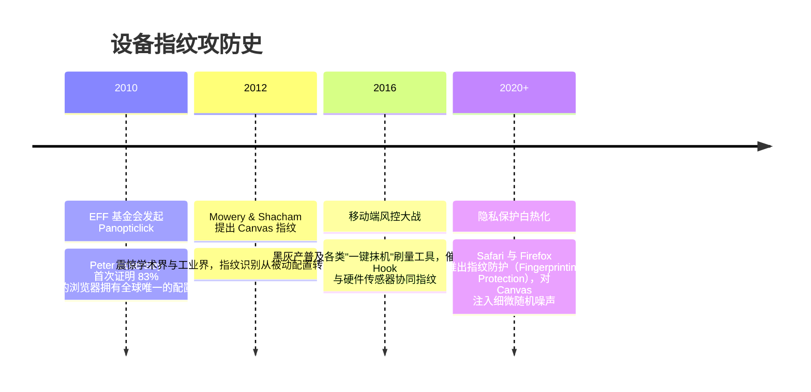

# 设备指纹技术 (Device Fingerprinting) 📱

## 1. 概述（What）

**设备指纹技术（Device Fingerprinting）** 是一种通过在客户端（Web 浏览器、iOS/Android App）运行探测代码，跨维度采集终端硬件、操作系统、底层图形驱动及运行时运行环境的**海量微观技术特征参数**，并在服务端利用统计算法与哈希函数计算出全局相对唯一且稳定的**设备标识 ID（Device ID）**的技术。

- **核心解决问题**：在黑产黑客频繁清除浏览器 Cookie、开启无痕隐私模式、频繁重装 App 或利用群控设备农场刷单作弊时，依然能够精准识别并锁定背后的同一台物理设备。
- **典型应用场景**：电商秒杀抢购防刷、金融借贷防多头借贷、黑灰产群控脚本批量养号拦截、登录撞库防范。

---

## 2. 原理详解（How it works）

### 浏览器端设备特征采集维度
1. **Canvas 指纹**：在隐形 HTML5 `<canvas>` 画布上绘制特定复杂的彩色三维文字、阴影与表情符号。由于不同显卡（NVIDIA / AMD / Intel / Apple Silicon）、不同版本的显卡驱动程序与操作系统光栅化字形引擎在亚像素渲染（Anti-aliasing / Subpixel Rendering）上存在细微硬件数学差异，导出的 PNG Base64 哈希具有高度熵值。
2. **WebGL 与着色器指纹**：查询 GPU 渲染器字符串（如 `Apple M3 Pro`、`ANGLE (NVIDIA RTX 4070)`）及最大顶点纹理支持数。
3. **WebAudio 音频指纹**：利用 AudioContext 振荡器生成高频音频信号并经过滤波处理，测量由于硬件数模转换器（DAC）差异产生的声音浮点波形哈希。
4. **字体枚举行（Font Enumeration）**：利用 JavaScript 测试数十种稀有字体渲染宽高的微小像素差异。

```mermaid
flowchart TD
    subgraph 客户端探测引擎 (Browser / App SDK)
        D1[Canvas 亚像素渲染哈希]
        D2[WebGL GPU 渲染器型号 & 扩展]
        D3[WebAudio 声学动态波形计算]
        D4[屏幕分辨率 / 颜色深度 / 像素比]
        D5[已安装系统字体探测]
        D6[时区 / 语言 / 电池状态 / 传感器]
    end

    D1 & D2 & D3 & D4 & D5 & D6 --> Collector[特征数据打包与加密传输]
    Collector --> ServerEngine[云端设备指纹中枢计算引擎]
    
    subgraph 服务端模糊匹配与图关联
        ServerEngine --> ExactHash[1. 精确哈希匹配 (若环境未变)]
        ServerEngine --> FuzzyMatch[2. 模糊相似度加权匹配 (容忍升级一两个参数)]
        ServerEngine --> GraphRelate[3. 设备图谱关联分析 (识别模拟器与群控抹机)]
    end
    
    FuzzyMatch --> FinalID[输出高稳定性唯一设备指纹: DEV_7a9f812b]
    FinalID --> RiskEngine[注入反欺诈风控规则引擎]
```
<div class="diagram-caption">图 5-2：设备指纹多维度特征探测、网络回传与服务端模糊图谱计算流程图</div>

---

## 3. 协议与标准（Protocols & Standards）

| 规范 | 机构 | 核心内容 |
| :--- | :--- | :--- |
| **W3C Web Platform Design Principles** [1] | W3C | 浏览器隐私防护与抗指纹规范（Anti-Fingerprinting Guidance） |
| **FingerprintJS 规范** [2] | 开源社区 | 业界广泛采用的开源浏览器指纹采集标准库与商用风控套件 |
| **Apple Privacy Manifests** | Apple | iOS 严格限制系统 API 调用（如禁用 MAC 地址与 IMEI 获取，要求声明原因） |

---

## 4. 发展历史（Timeline）


<div class="diagram-caption">图 5-3：设备指纹技术演变与浏览器隐私博弈历史</div>

---

## 5. 优缺点与安全性分析

- **风控价值**：不可篡改且跨 Session 穿透，是反作弊、反欺诈体系不可或缺的核心证据链。
- **隐私争议与对抗**：Tor 浏览器、Brave 和 Safari 正在加大对指纹技术的干扰（例如将所有 Canvas 输出加入微扰动，或将所有用户报告为标准相同的通用配置）。因此，现代企业指纹已从纯浏览器端特征，演进为结合**IP 威胁情报、网络基准 RTT 延迟、TCP/TLS 握手 JA3/JA4 指纹**的综合多维空间画像。
- **当前推荐状态**：<span class="badge-pill status-recommended">业务安全风控体系必备</span>。

---

## 6. 关联知识点（Related）

- **硬件层配合**：[TEE 与 Secure Enclave](./02-tee-secure-enclave)。
- **风控落地**：[业务风控体系与反欺诈](/06-security-operations/01-risk-control)。

---

## 7. 参考资料（References）

[1] W3C. Mitigating Browser Fingerprinting in Web Specifications.  
https://www.w3.org/TR/fingerprinting-guidance/

[2] FingerprintJS. Technical Guide to Browser Fingerprinting.  
https://fingerprint.com/blog/what-is-browser-fingerprinting/
