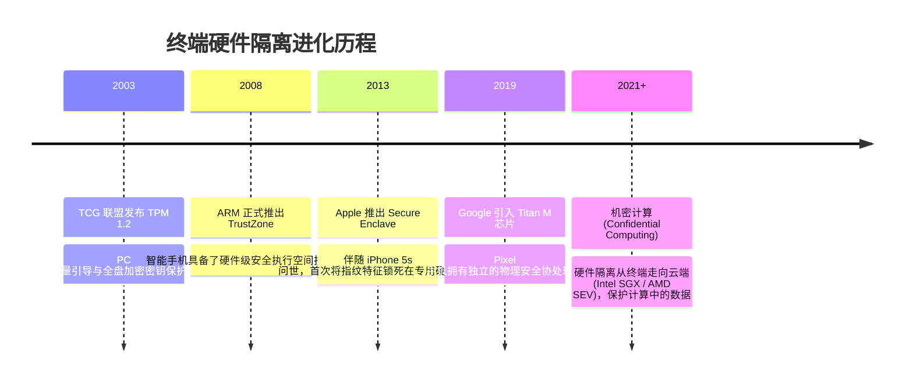

# TEE 与硬件安全隔离 (Secure Enclave / TPM) 🛡️

## 1. 概述（What）

**可信执行环境（Trusted Execution Environment, TEE）** 与 **安全元件（Secure Element, 如 Apple Secure Enclave、Google Titan M2、TPM 2.0 芯片）** 是现代计算机与移动终端硬件中的独立安全硬件孤岛。它在物理主 CPU 与主操作系统（Rich OS，如 iOS、Android、Windows、Linux）之外，开辟出一块拥有**独立安全处理器、独立加密安全内存和防篡改硬件总线**的隔离安全执行空间。

- **核心解决问题**：即使主操作系统遭最高级 Root / 越狱木马内核攻破，黑客的恶意代码也**绝对无法跨越硬件总线边界，窃取由安全隔离硬件保管的生物识别模板、主加密私钥或银行卡卡号**。
- **典型应用场景**：Apple Pay / 银联闪付移动支付、Face ID / 触控指纹特征存储与比对、BitLocker 全盘加密密钥释放、Passkey 私钥保护。

---

## 2. 原理详解（How it works）

### ARM TrustZone 双世界隔离架构
ARM TrustZone 技术通过硬件总线（AXI）上的安全状态位（NS-bit, Non-Secure Bit），在同一物理芯片上虚拟出两个完全平行的运行世界：
1. **普通世界（Normal World / Rich OS）**：运行常规 Android/Linux 操作系统、各种应用 App 和网络驱动。NS 位为 1。
2. **安全世界（Secure World / TEE）**：运行精简小巧的微内核可信操作系统（Trusty OS / QSEE），直接接管加密协处理器与安全硬件存储。NS 位为 0。

```mermaid
graph TD
    subgraph 普通世界 Normal World (不可信)
        App[用户第三方 App] --> OS_Kernel[Android / iOS 操作系统内核]
        Hacker[黑客 Root 提权 / 远程内核木马] -.->|控制整个普通世界操作系统| OS_Kernel
    end

    subgraph 物理硬件隔离安全边界 (TrustZone / Secure Enclave)
        SMC[特权指令 SMC: 安全监控器调用]
        SecureMonitor[安全监控模式 Secure Monitor Mode]
        SMC --> SecureMonitor
    end

    subgraph 安全世界 Secure World (TEE / Secure Enclave)
        SecureOS[微内核可信操作系统 (Trusty OS)]
        TA[可信应用程序 Trusted App]
        
        subgraph 专用物理加密隔离外设
            HW_RNG[真随机数发生器 TRNG]
            AES_Engine[硬件 AES/ECDSA 加密引擎]
            SecureStorage[(安全闪存: 锁死指纹模板/Passkey私钥)]
        end
    end

    OS_Kernel -->|仅能发起有限的 RPC 交互| SMC
    SecureMonitor --> SecureOS
    SecureOS --> TA
    TA --> HW_RNG & AES_Engine & SecureStorage
```
<div class="diagram-caption">图 5-4：ARM TrustZone 普通世界与安全世界（TEE）物理级硬件隔离机制架构图</div>

> **图注说明**：普通世界发起认证请求必须通过 `SMC`（Secure Monitor Call）指令。CPU 模式瞬间切换，清空当前寄存器，进入硬件隔离区。黑客在 Android 内核中调用 `memcpy` 尝试读取安全内存地址时，硬件内存保护单元（TZASC）会直接触发硬件总线总复位中断。

---

## 3. 协议与标准（Protocols & Standards）

| 规范标准 | 制定组织 | 核心定位 |
| :--- | :--- | :--- |
| **GlobalPlatform TEE 规范** [1] | GlobalPlatform | 国际通用的 TEE 客户端 API 与内部核心 API 工业标准 |
| **ISO/IEC 11889 (TPM 2.0)** [2] | TCG (可信计算组织) | 可信平台模块通用密码芯片标准，Windows 11 强制启用基线 |
| **FIPS 140-3 认证** | NIST | 硬件安全芯片物理防探针、防电磁辐射分析标准 |

---

## 4. 发展历史（Timeline）


<div class="diagram-caption">图 5-5：终端安全隔离硬件发展时间轴</div>

---

## 5. 优缺点与安全性分析

### 优点
- **终极物理根信任（Root of Trust）**：只要物理硅片未被破坏，即使手机主系统被挂上 Frida 动态插桩或刷入第三方恶意 ROM，私钥依然稳如泰山。
- **度量启动防篡改（Measured Boot）**：开机时芯片一级级用哈希度量下一阶段引导代码，若检测到内核被植入后门，安全芯片拒不释放全盘解密密钥。

### 缺陷与前沿侧信道威胁
- **硬件漏洞无法OTA修复（Unpatchable Hardware Bugs）**：例如 checkm8 漏洞利用了 BootROM 的物理只读缺陷，一旦芯片出厂永久无法热补丁。
- **微架构侧信道攻击**：Spectre、Meltdown、Downfall 等推测执行侧信道攻击，曾短暂突破部分处理器的内存隔离边界。
- **当前推荐状态**：<span class="badge-pill status-recommended">现代移动端与 PC 身份安全的最高物理压舱石</span>。

---

## 6. 关联知识点（Related）

- **身份认证绑定**：[Passkey 与 WebAuthn](/01-authentication/05-passkey-webauthn)、[生物识别安全](/01-authentication/12-biometrics)。
- **密钥托管硬件**：[KMS 与硬件安全模块 HSM](/02-data-protection/06-key-management-kms-hsm)。

---

## 7. 参考资料（References）

[1] GlobalPlatform. TEE System Architecture Specifications.  
https://globalplatform.org/specs-library/tee-system-architecture/

[2] Trusted Computing Group (TCG). Trusted Platform Module (TPM) 2.0 Library Specification.  
https://trustedcomputinggroup.org/resource/tpm-library-specification/

[3] Apple Platform Security. Secure Enclave Architecture Overview.  
https://support.apple.com/guide/security/secure-enclave-sec59b0b31ff/web
