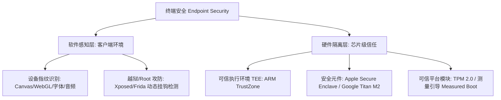

# 五、终端与设备安全体系概览 💻

> **终端与设备安全（Endpoint & Hardware Security）** 将安全防线从云端服务器向前推进到用户手中物理存在的终端硬件（智能手机、个人电脑、IoT 边缘设备）。通过结合**硬件级密码学隔离（TEE / TPM / Secure Enclave）** 与 **客户端软硬件特征环境感知（设备指纹）**，构筑端云协同的安全信任链条。

---

## 🗺️ 终端安全层次架构

图 5-1：终端安全从上层浏览器环境指纹到底层硬件隔离芯片的体系

---

## 📑 本章节知识点索引

| 知识点 | 核心技术 / 规范 | 核心机制与场景 | 推荐状态 |
| :--- | :--- | :--- | :--- |
| [1. 设备指纹技术](./01-device-fingerprint) | Canvas / WebGL / Audio, 字体列表 | 跨会话设备识别、黑灰产设备农场对抗、反作弊 | 风控核心基石 |
| [2. TEE 与 Secure Enclave](./02-tee-secure-enclave) | ARM TrustZone, Apple SE, TPM 2.0 | 物理双世界隔离、指纹私钥锁死、硬件级度量引导 | 硬件顶级标杆 |
