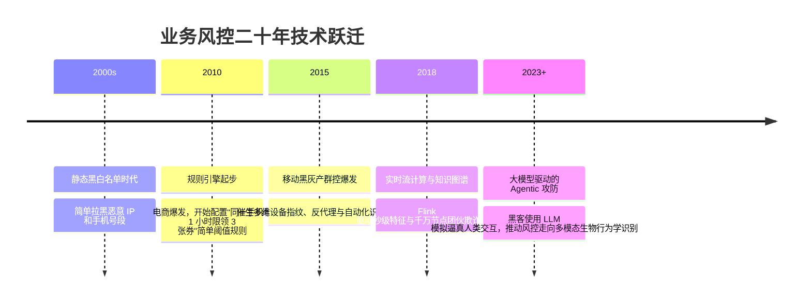

# 业务风控体系与反欺诈 ⚖️

## 1. 概述（What）

**业务风控体系（Business Risk Management & Anti-Fraud System）** 是一种在保障合法用户丝滑体验的同时，利用**海量上下文特征工程、规则引擎、图关联分析与机器学习模型**，在业务调用关键链路上实时识别并拦截恶意黑灰产攻击、欺诈作弊及资金套现风险的技术体系。

- **核心解决问题**：抵御不涉及传统系统代码漏洞的"业务逻辑级合规攻击"——如黄牛倒票抢购、活动优惠券羊毛党批量套现、恶意退款诈骗、网约车虚假刷单、电信网络诈骗洗钱。
- **典型应用场景**：电商促销秒杀防刷、互联网银行信贷反欺诈审批、游戏防外挂作弊、社交平台营销号群控清洗。

---

## 2. 原理详解（How it works）

### 实时风控四层流水线架构

```mermaid
flowchart TD
    UserEvent[用户业务请求: 注册 / 领券 / 支付下单] --> FingerprintGateway[1. 接入层设备与网络指纹采集]
    
    subgraph 实时特征计算引擎 (流计算 Flink)
        FingerprintGateway --> FeatureStream[提取近 1 分钟 / 1 小时滑动窗口统计特征]
        FeatureStream --> Feat1[单 IP 下单频次]
        FeatureStream --> Feat2[单设备关联历史账号数]
        FeatureStream --> Feat3[用户生物打字间隔与传感器抖动]
    end

    subgraph 规则与模型决策中枢 (毫秒级响应 < 50ms)
        Feat1 & Feat2 & Feat3 --> RuleEngine[2. 动态规则引擎 (Drools / 自研 DSL)]
        RuleEngine --> GraphEngine[3. 知识图谱与社团发现: 关联黑产团伙设备网络]
        GraphEngine --> MLModel[4. 机器学习评分模型: XGBoost / 序列风控]
    end

    MLModel --> FinalScore{综合风险评级}
    FinalScore -- "低风险 (<30分)" --> Pass[静默放行 Pass]
    FinalScore -- "中风险 (30~80分)" --> Challenge[触发二次挑战: 弹出滑动验证码 / 短信二次确认]
    FinalScore -- "高风险 (>80分)" --> Block[直接拦截阻断 / 假成功骗过黑客]
```
<div class="diagram-caption">图 6-2：端云协同实时业务风控决策链路与毫秒级特征评估流程图</div>

---

## 3. 协议与标准（Protocols & Standards）

| 规范 / 体系 | 机构 | 关键指引 |
| :--- | :--- | :--- |
| **ISO 31000:2018** [1] | ISO | 《风险管理指南与实施原则》，企业级风险治理顶层框架 |
| **信通院业务安全标准 (T/TAF 080)** | 中国信通院 | 《面向互联网业务的反欺诈系统技术要求与评估规范》 |
| **OWASP Automated Threats to Web Applications** [2] | OWASP | 梳理 OAT-001 至 OAT-021 自动化黑产业务威胁分类（撞库、抢购、暴力刷单） |

---

## 4. 发展历史（Timeline）


<div class="diagram-caption">图 6-3：业务风控对抗技术演进历史</div>

---

## 5. 优缺点与安全性分析

- **风控核心挑战：误伤率（False Positive Rate）与用户体验**：过严的策略会导致真实付费用户被误拦截弹验证码，直接造成商业转化率下滑。
- **现代最佳实践**：**旁路静默灰度测试（Shadow Mode）**——所有新规则必须在后台模拟运行 7 天，观察误伤率低于 0.01% 后方可正式切线上拦截。
- **当前推荐状态**：<span class="badge-pill status-recommended">互联网核心交易链路的生命线</span>。

---

## 6. 关联知识点（Related）

- **底层特征依赖**：[设备指纹技术](/05-endpoint-security/01-device-fingerprint)、[图灵验证 CAPTCHA](/01-authentication/13-captcha)。
- **合规审计**：[GDPR 与 PIPL 数据保护法规](/07-compliance/01-gdpr-pipl)。

---

## 7. 参考资料（References）

[1] ISO. ISO 31000:2018 Risk management — Guidelines.  
https://www.iso.org/standard/65694.html

[2] OWASP. Automated Threats to Web Applications Project.  
https://owasp.org/www-project-automated-threats-to-web-applications/
