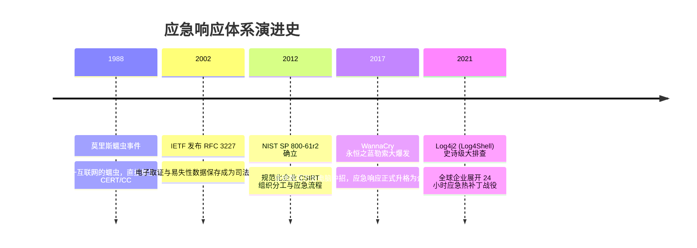

# 安全应急响应体系 (PICERL 模型) 🚨

## 1. 概述（What）

**网络安全应急响应（Computer Security Incident Response）** 是指企业在遭受黑客入侵、数据泄露、勒索软件加密或大规模拒绝服务攻击时，由**计算机安全应急响应团队（CSIRT / CERT）** 启动的一整套**科学化、标准化、分阶段的组织协同与技术止血框架**。

- **核心解决问题**：在遭遇突发网络安全灾难时，避免技术团队盲目慌乱操作（如盲目拔网线导致内存关键挥发性取证证据毁灭），以最小的业务停机代价快速止血、消灭黑客后门并恢复生产。
- **典型应用场景**：生产服务器突遭勒索病毒锁死、数据库遭黑客通过 0day 拖库勒索、内网域控权限被黑客夺取。

---

## 2. 原理详解（How it works）

国际公认的黄金应急响应框架是来自 **SANS 与 NIST SP 800-61** 的 **PICERL 六阶段处置环**：

```mermaid
flowchart TD
    P[1. 准备阶段 Preparation<br/>• 资产测绘清单 / 部署 EDR 探针<br/>• 制定响应剧本 Playbook 与演练] --> I[2. 检测与确认 Identification<br/>• 告警聚合分类 / 研判是否真实被黑<br/>• 划定受害范围与危害等级]
    
    I --> C[3. 遏制与隔离 Containment<br/>• 紧急切断网络横向通道 (短痛止血)<br/>• 物理镜像内存与磁盘 (固定证据)]
    
    C --> E[4. 根除后门 Eradication<br/>• 彻底清除 WebShell / 定时任务<br/>• 修复根本漏洞 (补丁 / 改密)]
    
    E --> R[5. 恢复上线 Recovery<br/>• 从纯净可信备份还原系统<br/>• 灰度放行流量并实施 72h 严密监控]
    
    R --> L[6. 事后复盘 Lessons Learned<br/>• 复盘攻防溯源时间线与归因<br/>• 补齐安全盲区, 更新应急响应剧本]
    
    L -. 持续反哺改进 .-> P
```
<div class="diagram-caption">图 6-4：SANS / NIST PICERL 经典应急响应六阶段全生命周期闭环流程图</div>

---

### 关键止血与取证规范：挥发性顺序（Order of Volatility）
取证必须严格按照**易失性由高到低（RFC 3227 规范）**进行，严禁一上来就强行拔电源断电：
1. **CPU 寄存器与缓存**（关机微秒级蒸发）；
2. **物理内存（RAM）**（关机毫秒级蒸发，必须用 LiME 或 DumpIt 导出完整内存 dump，里面有黑客注入的无文件无落地落地木马与明文密码！）；
3. **活动网络连接状态与路由表**（`netstat -ano`、ARP 缓存）；
4. **运行中的进程树与内存映射**；
5. **本地物理磁盘日志与临时文件**。

---

## 3. 协议与标准（Protocols & Standards）

| 标准体系 | 组织 | 年份 | 关键定位 |
| :--- | :--- | :--- | :--- |
| **NIST SP 800-61 Rev. 2** [1] | NIST | 2012/2024 | 《计算机安全事件处理指南》，全球应急响应核心参考蓝图 |
| **IETF RFC 3227** [2] | IETF | 2002 | 《数字证据采集与保存准则》，规定易失性数据提取铁律 |
| **ISO/IEC 27035** [3] | ISO/IEC | 2016/2023 | 《信息安全事件管理国际标准》 |

---

## 4. 发展历史（Timeline）


<div class="diagram-caption">图 6-5：应急响应重大历史里程碑</div>

---

## 5. 优缺点与安全性分析

- **黄金时间原则（Golden Hour）**：黑客获取内网立足点后，横向移动到域控的平均时间（Breakout Time）约为 1 小时 24 分钟。应急响应团队能否在 15 分钟内完成检测并执行网络微隔离切断，决定了企业是否会遭遇毁灭性勒索。
- **当前推荐状态**：<span class="badge-pill status-recommended">企业核心制度与技术防线</span>。

---

## 6. 关联知识点（Related）

- **监控告警来源**：[网络防御体系 WAF/IDS](/04-network-security/02-defense-systems)。
- **合规通报红线**：[GDPR 与 PIPL 数据泄露通报时限 (72小时内)](/07-compliance/01-gdpr-pipl)。

---

## 7. 参考资料（References）

[1] NIST. SP 800-61 Rev. 2: Computer Security Incident Handling Guide.  
https://csrc.nist.gov/pubs/sp/800/61/r2/final

[2] IETF. RFC 3227: Guidelines for Evidence Collection and Archiving.  
https://datatracker.ietf.org/doc/html/rfc3227

[3] SANS Institute. Incident Handler's Handbook.  
https://www.sans.org/white-papers/33901/
