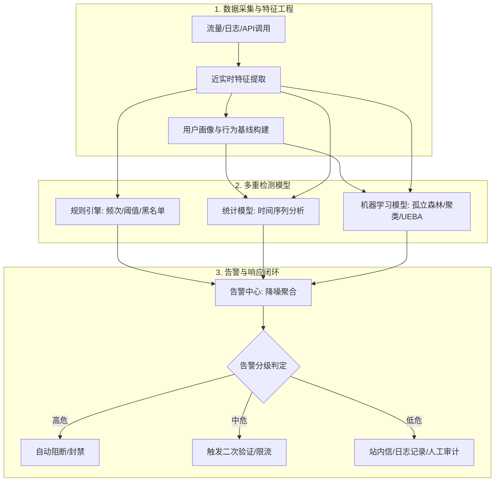
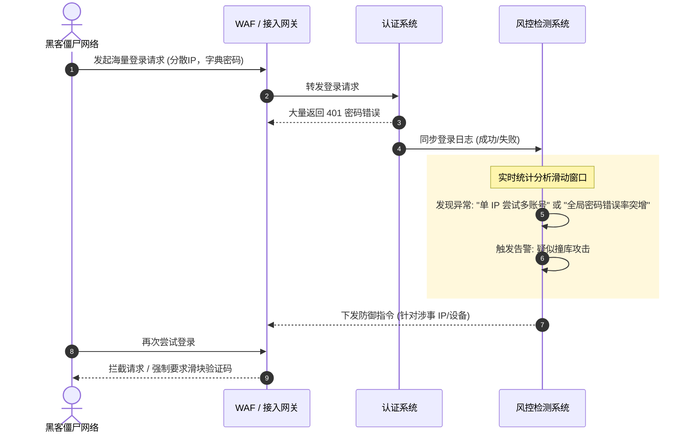
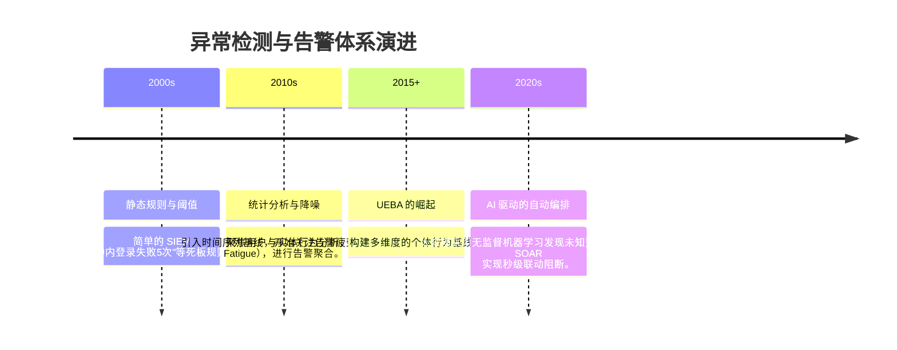
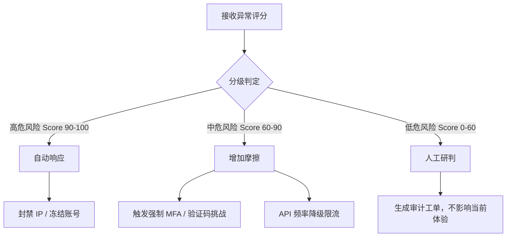

# 异常行为检测与告警 (Anomaly Detection & Alerting) 🚨

## 1. 概述（What）

**异常行为检测与告警系统** 是一种实时监控用户和实体活动，利用规则、统计学和机器学习模型，自动识别出偏离正常基线或匹配已知威胁特征的异常行为，并触发相应告警与自动化响应的安全运营核心中枢。

- **核心解决问题**：在海量业务流量中，精准捕捉隐蔽的自动化攻击（如撞库）、账号被盗（基线偏移）、爬虫滥用及业务欺诈，防止风险扩大。
- **典型应用场景**：电商风控、金融反欺诈、企业内网零信任 UEBA（用户与实体行为分析）、API 网关恶意流量清洗。

---

## 2. 原理详解（How it works）

### 2.1 异常行为检测与响应架构

图 6-10：数据采集→特征提取→检测模型→告警→响应闭环架构图

### 2.2 常见异常场景与应对

- **异地/异常设备登录**：通过设备指纹与历史地理位置基线对比。
- **爬虫/自动化脚本行为**：通过检测操作频率、固定时间间隔、缺乏自然人类抖动。
- **刷单/薅羊毛等业务欺诈**：检测设备复用、账号聚集性（团伙作案）。
- **账号被盗迹象（基线偏移）**：平时只看新闻的用户突然开始大批量导出敏感数据。

### 2.3 撞库攻击检测（Credential Stuffing）

撞库攻击是黑客利用泄露的密码字典，通过僵尸网络对大量账号进行自动化盲试登录。

图 6-11：撞库攻击批量尝试与检测系统响应时序图

---

## 3. 协议与标准（Protocols & Standards）

| 规范体系 | 机构 | 关键描述 |
| :--- | :--- | :--- |
| **MITRE ATT&CK** [1] | MITRE | 提供了针对各种异常行为、横向移动、凭据窃取等攻击手法的全面知识库。 |
| **NIST SP 800-137** | NIST | 信息安全持续监控（ISCM）指南，指导企业构建持续监控与告警体系。 |

---

## 4. 发展历史（Timeline）

图 6-12：从死板规则走向智能 UEBA 与自动化响应的演进历程

---

## 5. 优缺点与安全性分析

### 优点
- **发现未知威胁**：机器学习与基线偏移可以捕捉不符合已知特征的零日攻击（0-day）或内鬼泄露。
- **降低安全风险敞口**：将从发现到响应的平均时间（MTTD/MTTR）从小时级压缩至秒级。

### 挑战
- **告警疲劳（Alert Fatigue）**：如果调优不当，海量误报会淹没真正的威胁，导致安全人员忽略重要告警。
- **自动化阻断的误伤**：自动封禁可能导致重要业务受损，因此需要根据置信度实施分级响应策略。

### 告警分级判定与响应决策

图 6-13：告警分级判定逻辑与降级响应决策树

---

## 6. 关联知识点（Related）

- **基础设施**：[业务风控与反欺诈体系](./01-risk-control)（异常检测的核心前置引擎）。
- **处置闭环**：[安全应急响应与事件处置 (PICERL)](./02-incident-response)。
- **防御手段**：[图灵验证 (CAPTCHA)](/01-authentication/13-captcha)（阻断自动化请求的常见手段）。

---

## 7. 参考资料（References）

[1] MITRE. MITRE ATT&CK Framework.  
    https://attack.mitre.org/

[2] Cloudflare Learning Center. What is credential stuffing?  
    https://www.cloudflare.com/learning/bots/what-is-credential-stuffing/
