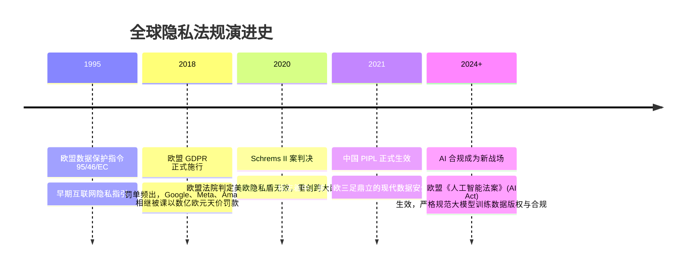

# 全球数据合规 (GDPR 与 PIPL) ⚖️

## 1. 概述（What）

**《通用数据保护条例》（General Data Protection Regulation, GDPR）** 与 **《中华人民共和国个人信息保护法》（Personal Information Protection Law, PIPL）** 分别是欧盟与中国最具划时代意义的现代个人数据保护基础法律。它们赋予了个人对其数字化个人信息（PII）前所未有的自主控制权，并对企业收集、存储、处理及跨国传输个人数据施加了极其严厉的法律责任。

- **核心解决问题**：终结互联网巨头无限制野蛮爬取、过度索权、暗中贩卖用户隐私与大数据杀熟行为；
- **违法后果**：GDPR 顶格罚款可达 **全球年营业额的 4% 或 2,000 万欧元（以较高者为准）**；PII 顶格罚款达 **5,000 万元人民币或上一年度营业额 5%**，并可责令暂停业务或吊销营业执照。

---

## 2. 原理详解（How it works）

### 个人权利核心矩阵与系统架构响应

```mermaid
graph TD
    User[数据主体 (Data Subject / 用户)] --> Rights[法定核心权利]
    
    Rights --> R1["知情同意权 (Informed Consent): 勾选框绝不可默认打勾"]
    Rights --> R2["访问与携带权 (Right to Access & Portability): 允许一键打包导出全部个人数据"]
    Rights --> R3["更正与删除/被遗忘权 (Right to Erasure / Forgotten): 彻底物理清除或永久脱敏"]
    Rights --> R4["拒绝自动化决策权: 拒绝纯算法黑盒定罪/拒贷/杀熟"]

    subgraph 企业系统合规架构落地
        R2 --> ExportService[数据导出服务: 异步生成标准化 JSON/CSV 压缩包]
        R3 --> HardDeletePipeline[物理硬删除管道: 触发各数据库与备份归档级联抹除]
        R1 --> ConsentDB[(用户同意意愿审计记录中心: 存留留证)]
    end
```
<div class="diagram-caption">图 7-2：GDPR/PIPL 用户核心法定权利与后端数据工程架构响应图</div>

---

### 数据跨境传输合规流转（Cross-Border Transfer）
企业若将境内收集的个人数据传输至境外母公司或第三方 SaaS（如 AWS 海外区域、Salesforce），必须严格遵循三选一法定路径：
1. **通过国家网信部门组织的数据出境安全评估**（达到申报门槛，如关键信息基础设施或百万级个人信息）；
2. **订立标准合同（Standard Contractual Clauses, SCC）并完成备案**；
3. **经专业机构进行个人信息保护认证**。

---

## 3. 协议与标准（Protocols & Standards）

| 法规 / 标准 | 颁布机构 | 生效日期 | 核心定位 |
| :--- | :--- | :--- | :--- |
| **Regulation (EU) 2016/679 (GDPR)** [1] | 欧洲议会与欧盟理事会 | 2018-05-25 | 全球数据保护法律标杆，具备"长臂管辖"效应 |
| **中华人民共和国个人信息保护法 (PIPL)** [2] | 全国人民代表大会常委会 | 2021-11-01 | 中国首部个人信息保护专门法 |
| **ISO/IEC 27701** [3] | ISO/IEC | 2019 | 隐私信息管理体系（PIMS），GDPR/PIPL 工程落地对标认证 |

---

## 4. 发展历史（Timeline）


<div class="diagram-caption">图 7-3：全球数据安全与隐私保护立法演进</div>

---

## 5. 优缺点与安全性分析

- **合规即生存底线**：出海企业若无视 GDPR 或境内企业无视 PIPL，不仅面临巨额经济处罚，更面临应用被应用商店全球下架的灭顶之灾。
- **技术防线实施清单**：
  - [x] 登录注册显式告知并记录用户知情同意日志；
  - [x] 提供用户自主注销账号与删除历史所有足迹的功能通道；
  - [x] 建立 72 小时数据泄露安全通报与通知受害者机制；
  - [x] 敏感数据在数据库落盘实施强加密与动态脱敏。

---

## 6. 关联知识点（Related）

- **技术实现支持**：[数据脱敏与差分隐私](/02-data-protection/08-privacy-protection)。
- **安全体系认证**：[ISO 27001 与 SOC 2 认证](./02-iso27001-soc2)。

---

## 7. 参考资料（References）

[1] European Parliament. General Data Protection Regulation (GDPR).  
https://gdpr-info.eu/

[2] 中国人大网. 中华人民共和国个人信息保护法.  
http://www.npc.gov.cn/npc/c30834/202108/a8c4e3672c74491a80b53a172bb753fe.shtml

[3] ISO. ISO/IEC 27701:2019 Security techniques — Privacy Information Management System.  
https://www.iso.org/standard/71670.html
