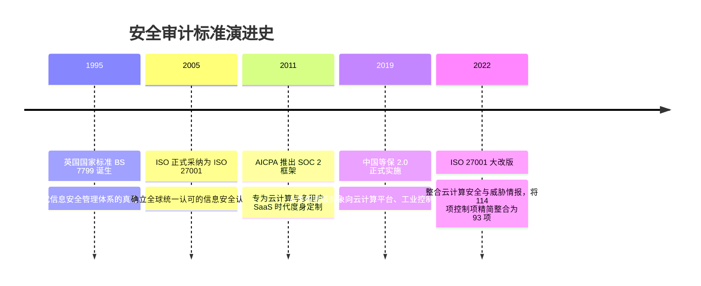

# 安全认证与标准 (ISO 27001 / SOC 2 / 等保2.0) 🏆

## 1. 概述（What）

**信息安全管理体系认证与行业审计报告（Security Certifications & Audits）** 是由具备公信力的第三方独立专业审计机构（如普华永道、德勤、安永、毕马威或国家认可认证机构），对照国际或国家公认标准，对企业**组织架构、管理制度、技术系统设计及持续运营控制措施的有效性**进行全面审查并出具的权威背书。

- **核心解决问题**：解决 B2B 企业商业合作中"客户凭什么敢将核心企业数据托付给你的 SaaS 云服务"的信任鸿沟，替代数千份冗长繁琐的客户尽调安全问卷。
- **典型应用场景**：SaaS 软件向跨国 500 强企业交付售卖、云服务商进入政府采购清单、中国境内大型信息系统过审合规。

---

## 2. 原理详解（How it works）

### 主流三大安全审计体系对比与映射

```mermaid
graph TD
    subgraph 全球通用管理标准: ISO/IEC 27001
        ISO[ISO/IEC 27001:2022] --> ISMS[建立体系 ISMS: 强调 PDCA 持续改进循环]
        ISMS --> AnnexA[附录 A: 93 项控制措施 组织/人员/物理/技术]
        NoteISO[输出: 正式认证证书 Certificate]
    end

    subgraph 北美及全球 SaaS 商业信任标杆: SOC 2
        SOC[AICPA SOC 2 报告] --> TSC[五大信任服务准则 Trust Services Criteria]
        TSC --> S1[安全性 Security: 强制基线]
        TSC --> S2[可用性 Availability]
        TSC --> S3[保密性 Confidentiality]
        TSC --> S4[处理完整性 Processing Integrity]
        TSC --> S5[隐私性 Privacy]
        NoteSOC[输出: 详实长篇审计报告 Report<br/>Type I: 时间点设计有效性<br/>Type II: 6~12 个月持续运行有效性 🌟]
    end

    subgraph 中国法定等级保护: 等保 2.0 (MLPS)
        DJ[网络安全等级保护制度] --> L1to5[第一级至第五级 (金融/核心系统普遍为三级)]
        DJ --> TechAdmin[技术要求 (安全物理/网络/计算/管理) + 管理要求]
    end
```
<div class="diagram-caption">图 7-4：ISO 27001、SOC 2 与中国等保 2.0 核心架构与审计维度全景图</div>

---

## 3. 协议与标准（Protocols & Standards）

| 规范标准 | 制定机构 | 最新版本 | 核心定位 |
| :--- | :--- | :--- | :--- |
| **ISO/IEC 27001** [1] | ISO / IEC | 2022 版 | 全球最普及的信息安全管理体系，聚焦风险管理流程 |
| **AICPA Trust Services Criteria (SOC 2)** [2] | AICPA (美国注册会计师协会) | 现行版 | 北美科技企业与 B2B SaaS 出海合作的绝对硬通货 |
| **GB/T 22239-2019 (等保2.0)** [3] | 国家市场监督管理总局 / 标委会 | 2019 版 | 中国网络安全法法定义务，覆盖云计算、物联网、移动互联 |

---

## 4. 发展历史（Timeline）


<div class="diagram-caption">图 7-5：信息安全认证与合规审计半个世纪的发展轨迹</div>

---

## 5. 优缺点与安全性分析

- **从"为了拿证（Compliance）"到"真实安全（Security）"**：过去部分企业通过临时补齐文档以求混过审计。但当今随着 **SOC 2 Type II（要求审计师抽检连续 6 个月甚至 1 年内每一次生产发布是否包含 Code Review、每一次入离职是否 24 小时内回收权限）** 与持续合规自动化平台（如 Vanta、Drata）的普及，合规已与 CI/CD 和日常 IT 运维严密绑定。
- **当前推荐状态**：<span class="badge-pill status-recommended">SaaS 商业化与大客户采购敲门砖</span>。出海必做 SOC 2 Type II，境内展业必做等保三级。

---

## 6. 关联知识点（Related）

- **技术控制落地**：[访问控制模型 RBAC/ABAC](/03-access-control/01-rbac-abac)、[零信任架构](/03-access-control/02-zero-trust)。
- **事件通报与处置**：[安全应急响应体系](/06-security-operations/02-incident-response)。

---

## 7. 参考资料（References）

[1] ISO/IEC. ISO/IEC 27001:2022 Information security, cybersecurity and privacy protection.  
https://www.iso.org/standard/27001

[2] AICPA. SOC 2 - SOC for Service Organizations: Trust Services Criteria.  
https://www.aicpa-cima.com/topic/audit-assurance/audit-and-assurance-greater-than-soc-2

[3] 国家标准全文公开系统. GB/T 22239-2019 信息安全技术 网络安全等级保护基本要求.  
http://openstd.samr.gov.cn/
