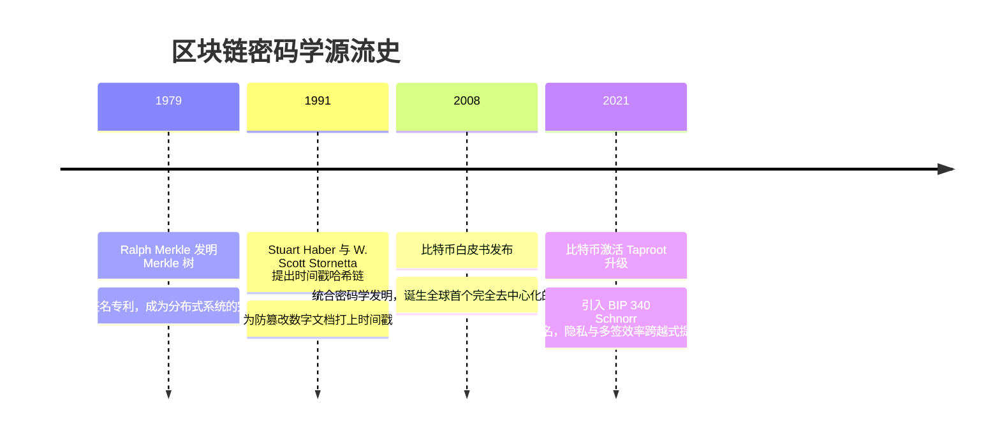

# 密码学基石 (哈希链 / Merkle树 / 数字签名) 🧱

## 1. 概述（What）

**区块链的密码学基石** 是去中心化账本抵御伪造、篡改与单点信任崩塌的数学基座。它主要由三大约束构成：
1. **哈希链（Hash Chain）**：利用前一区块哈希指针（Previous Block Hash）将账本串联为单向生长的链式结构；
2. **Merkle 树（默克尔树）**：将成千上万笔交易自底向上递归哈希，压缩为一个定长的 **Merkle 根（Merkle Root）**；
3. **数字签名（Digital Signatures，如 ECDSA secp256k1 与 Ed25519）**：确认资产转移发起人的真实意愿与所有权归属。

- **核心解决问题**：实现"任何人无需下载几百吉字节的完整全节点账本，只需几百字节的轻证明即可数学验证某笔交易真实存在"的轻节点简化支付验证（SPV）。

---

## 2. 原理详解（How it works）

### 图表：Merkle 树快速 SPV 轻节点包含证明（Merkle Proof）

```mermaid
flowchart TD
    subgraph Merkle 树哈希自底向上汇总
        TxA[交易 Tx0] --> H0[Hash 0 = H(Tx0)]
        TxB["🎯 目标交易 Tx1 (待验证)"] --> H1["Hash 1 = H(Tx1)"]
        TxC[交易 Tx2] --> H2[Hash 2 = H(Tx2)]
        TxD[交易 Tx3] --> H3[Hash 3 = H(Tx3)]
        
        H0 & H1 --> H01[Hash 01 = H(H0 + H1)]
        H2 & H3 --> H23[Hash 23 = H(H2 + H3)]
        
        H01 & H23 --> Root["🌟 Merkle Root = H(H01 + H23) (固化在区块头中)"]
    end

    subgraph 轻钱包 SPV 仅需 2 个哈希节点即可验证 Tx1
        Proof1["① 辅助节点: Hash 0"]
        Proof2["② 辅助节点: Hash 23"]
        
        TxB --> CalcH1[本地计算 H1 = H(Tx1)]
        CalcH1 & Proof1 --> CalcH01[计算 H01' = H(Hash0 + H1)]
        CalcH01 & Proof2 --> CalcRoot[计算 Root' = H(H01' + Hash23)]
        CalcRoot --> Cmp{与区块头 Root 完全一致?}
        Cmp -- 是 --> Valid[在数学上 100% 确认 Tx1 包含在该区块中! ✅]
    end
```
<div class="diagram-caption">图 9-2：Merkle 树结构与 SPV 轻客户端对数复杂度 $O(\log N)$ 存在性证明流程图</div>

> **图注说明**：即使一个区块内包含 100,000 笔交易，验证其中任意一笔交易的真实性仅需要计算 $\approx 17$ 次哈希碰撞并下载不到 1KB 的证明路径，使得手机移动端可以毫无压力地秒级验证比特币或以太坊支付。

---

## 3. 协议与标准（Protocols & Standards）

| 规范 | 机构 / 项目 | 关键说明 |
| :--- | :--- | :--- |
| **Bitcoin Whitepaper** [1] | Satoshi Nakamoto (2008) | 首次将工作量证明、时间戳哈希链与 Merkle 树统合成中本聪共识 |
| **SEC 2: Recommended Elliptic Curve Domain Parameters** [2] | Certicom (SECG) | 规定比特币选用的 **secp256k1** Koblitz 曲线（$y^2 = x^3 + 7 \pmod p$） |
| **BIP 340 (Schnorr Signatures)** [3] | 比特币改进提案 | 引入线性聚合 Schnorr 签名，支持多签批量验证，大幅降低链上体积与手续费 |

---

## 4. 发展历史（Timeline）


<div class="diagram-caption">图 9-3：从经典密码学理论到区块链落地的历史脉络</div>

---

## 5. 优缺点与安全性分析

- **不可篡改性（Immutability）**：由于哈希链的存在，如果要篡改 100 个区块之前的一笔交易金额，会导致该区块 Merkle 根突变，进而导致该区块哈希突变，使得后续 100 个区块的哈希指针全部断裂，攻击者必须重新完成这 100 个区块的全网工作量证明计算，这在算力上是绝对不可能完成的。
- **当前推荐状态**：<span class="badge-pill status-recommended">去中心化账本基石</span>。

---

## 6. 关联知识点（Related）

- **共识竞争**：[共识机制安全 (PoW / PoS)](./02-consensus-mechanisms)。
- **密钥生成**：[密钥与钱包安全 (BIP39/HD/多签)](./03-wallets-keys)。

---

## 7. 参考资料（References）

[1] Satoshi Nakamoto. Bitcoin: A Peer-to-Peer Electronic Cash System.  
https://bitcoin.org/bitcoin.pdf

[2] SECG. SEC 2: Recommended Elliptic Curve Domain Parameters v2.0 (secp256k1).  
https://www.secg.org/sec2-v2.pdf

[3] Bitcoin Improvement Proposals. BIP 340: Schnorr Signatures for secp256k1.  
https://github.com/bitcoin/bips/blob/master/bip-0340.mediawiki
