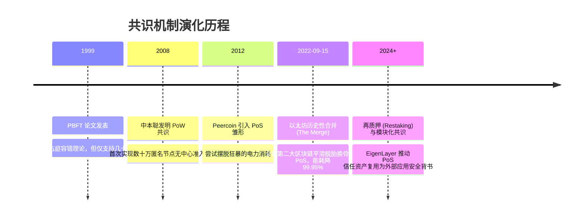

# 共识机制安全 (PoW / PoS / BFT) ⚖️

## 1. 概述（What）

**区块链共识机制（Consensus Mechanism）** 是分布式节点在完全互不信任、存在恶意节点（拜占庭节点）的不可信对等网络中，就**账本的唯一真实状态（区块顺序、交易有效性）达成不可撤销共识**的容错算法与博弈激励协议。

- **核心解决问题**：彻底攻克电子现金领域的**双花问题（Double-Spending）** 与分布式系统的**女巫攻击（Sybil Attack，攻击者伪造数万个虚拟 IP 抢占多数投票权）**。
- **主流实现**：工作量证明（PoW，比特币）、权益证明（PoS，以太坊 Proof of Stake）、拜占庭容错类（PBFT / Raft）。

---

## 2. 原理详解（How it works）

### 图表一：流程图 — 区块打包、广播、网络验证到最终上链全流程

```mermaid
flowchart TD
    Mempool[(全网内存交易池 Mempool)] --> SelectTx[矿工/验证节点: 挑选高 Gas 手续费交易打包并排序]
    SelectTx --> BuildBlock[构建新候选区块头: 计算 Merkle 根 + 填入父块哈希]
    
    subgraph 出块权竞争 (防女巫门槛)
        BuildBlock --> ConsensusType{根据共识机制争取出块权}
        ConsensusType -- "PoW 机制" --> Mining[CPU/ASIC 循环穷举 Nonce 碰撞:<br/>SHA256(SHA256(BlockHeader)) < 目标难度值]
        ConsensusType -- "PoS 机制" --> ProposerSelect[基于质押权益权重随机抽选区块提议者 Proposer]
    end

    Mining & ProposerSelect --> Broadcast[P2P 洪泛广播新区块至全网节点]
    
    subgraph 全网对等节点独立验证
        Broadcast --> Validate1[1. 验证签名是否合法, 账户余额是否充足 (防双花)]
        Validate1 --> Validate2[2. 验证工作量哈希是否达标 / 验证 PoS 验证者轮签名]
        Validate2 --> LongestChain{属于最长有效链 / 获得 2/3 投票签名?}
        LongestChain -- 校验无误 --> CommitBlock[写入本地数据库, 更新状态树, 成为最新区块! ⛓️]
        LongestChain -- 校验失败 --> DropBlock[丢弃孤块并阻断恶意节点]
    end
```
<div class="diagram-caption">图 9-4：区块链从内存池挑单、共识出块竞争到全网对等校验落盘完整流程图</div>

---

### 图表二：PoW vs PoS 资源消耗与安全博弈模型对比

```mermaid
graph LR
    subgraph 工作量证明 PoW (以比特币为代表)
        A1[防女巫依托: 物理世界真实电力与 ASIC 算力]
        A2[资源消耗: ⚡ 全年消耗一个中等国家全社会电量]
        A3[安全攻击成本: 购买并控制全网 51% 物理矿机算力]
        A4[惩罚机制: 攻击失败仅损失电力电费, 矿机硬件仍在]
        A1 --> A2 --> A3 --> A4
    end

    subgraph 权益证明 PoS (以太坊 The Merge 为代表)
        B1[防女巫依托: 链上真金白银原生资产质押 32 ETH]
        B2[资源消耗: 🌱 仅需数台普通电脑, 能耗暴降 99.95%]
        B3[安全攻击成本: 购买并质押市场上 51%~67% 的流通代币]
        B4[惩罚机制: 强力罚没 (Slashing) — 恶意作恶直接在代码层将质押资产清零!]
        B1 --> B2 --> B3 --> B4
    end
```
<div class="diagram-caption">图 9-5：PoW 与 PoS 的底层防女巫锚点、能耗开销与罚没博弈模型深度对比</div>

---

## 3. 协议与标准（Protocols & Standards）

| 规范 | 机构 / 社区 | 核心内容 |
| :--- | :--- | :--- |
| **Bitcoin Core Consensus Rules** [1] | 比特币开发者社区 | 确定最长链原则（Longest Chain Rule）与每 2016 块难度自动调整机制 |
| **Ethereum Consensus Specs (Casper FFG & LMD-GHOST)** [2] | 以太坊基金会 | 最终确定性（Finality）规范，2 个 Epoch 后进入不可逆数学终局 |
| **Practical Byzantine Fault Tolerance (PBFT)** [3] | Castro & Liskov (1999) | 经典三阶段提交（Pre-prepare / Prepare / Commit），容忍 $f < n/3$ 恶意节点 |

---

## 4. 发展历史（Timeline）


<div class="diagram-caption">图 9-6：共识机制发展二十年重大技术跃迁</div>

---

## 5. 优缺点与安全性分析

### 致命共识攻击形式
1. **51% 算力 / 权益攻击与双花（Double Spending）**：
   攻击者秘密在私链上打包一笔大额资产充值到中心化交易所并提现法币；同时在公链上同步买入同等资产。随后凭借超过全网 51% 的算力优势将私链广播覆盖主链，**将充值给交易所的那笔交易从历史链上彻底抹去**，导致交易所蒙受数千万美元实际损失！
2. **长程攻击（Long-Range Attack，PoS 特有）**：攻击者低价购买数年前已经退役的早期验证者私钥，从创世区块分叉出一条全新的历史长链。**对策**：弱主观性（Weak Subjectivity）检查点，新节点启动时必须信任近期合法的链状态快照。
3. **当前推荐状态**：<span class="badge-pill status-recommended">PoS 已成为公链现代共识主流标配</span>；比特币 PoW 作为纯粹的去中心化价值存储资产长期共存。

---

## 6. 关联知识点（Related）

- **密码学支撑**：[密码学基石：哈希链与 Merkle 树](./01-cryptography-foundations)。
- **实战案例**：[区块链典型攻击与事件](./06-common-attacks)（ETC 51% 攻击实录）。

---

## 7. 参考资料（References）

[1] Bitcoin Wiki. Consensus Rules and Block Validation.  
https://en.bitcoin.it/wiki/Protocol_rules

[2] Ethereum Foundation. Proof-of-stake (PoS) Consensus Overview.  
https://ethereum.org/en/developers/docs/consensus-mechanisms/pos/

[3] Miguel Castro and Barbara Liskov. Practical Byzantine Fault Tolerance.  
http://pmg.csail.mit.edu/papers/osdi99.pdf
