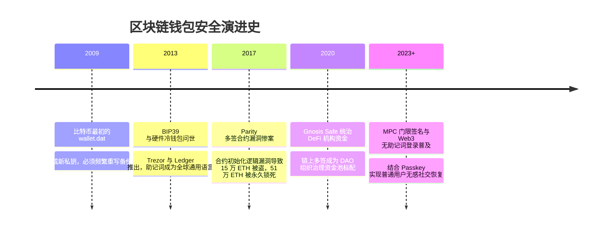

# 密钥与钱包安全 (BIP39 / HD分层确定性 / 多签 / MPC) 👛

## 1. 概述（What）

**区块链钱包（Crypto Wallet）** 的本质并不是真正装代币的物理容器，而是**非对称私钥的安全生成、安全派生、受控保管与链上交易签发工具**。现代区块链钱包围绕 **BIP39（助记词）**、**BIP32/44（分层确定性钱包，HD Wallet）**、**链上智能合约多签（Multi-Sig）** 与 **MPC 门限密码学（Multi-Party Computation）** 构筑起多层次资产防御体系。

- **核心解决问题**：摆脱用户手动记忆 64 位无序十六进制明文私钥的痛苦；解决每生成一个新收款地址都需要重新单独备份私钥的灾难；杜绝单点私钥泄露导致的数亿美元巨额资产瞬间被盗空。
- **典型应用场景**：MetaMask、Phantom 浏览器插件、Ledger / OneKey 硬件冷钱包、Fireblocks 机构托管平台、Gnosis Safe 团队资金金库。

---

## 2. 原理详解（How it works）

### 1. 助记词与分层派生树（BIP39 / BIP32 / BIP44）

```mermaid
flowchart TD
    subgraph BIP39 助记词转换流
        RNG[真随机数发生器 CSPRNG: 生成 128~256 位熵] --> Checksum[计算 SHA-256 校验和并追加尾部]
        Checksum --> WordList[按 11 位一组切分, 映射到 2048 个预定义单词表]
        WordList --> Mnemonics["助记词 (12 或 24 个英文单词)<br/>例: army van defense carry jealous..."]
        Mnemonics & SaltPassphrase[可选密码短语 Passphrase] --> PBKDF2_512[PBKDF2-HMAC-SHA512 迭代 2048 轮]
        PBKDF2_512 --> Seed[生成 512 位二进制主种子 Master Seed]
    end

    subgraph BIP32/44 分层确定性派生树 (HD Wallet)
        Seed --> MasterKey[根私钥 m 与主链码 ChainCode]
        MasterKey --> Path["标准派生路径: m / 44' / 60' / 0' / 0 / 0<br/>44': BIP44 规范<br/>60': 以太坊币种代码 (0'为比特币)<br/>0': 账户索引<br/>0: 外部公开收款链<br/>0: 第 0 个具体子地址私钥"]
        Path --> DerivedKey[(派生出无限多个子私钥与子公钥地址)]
    end
```
<div class="diagram-caption">图 9-7：从随机熵、BIP39 助记词到 BIP44 分层确定性派生树全流程图</div>

> **图注说明（备份的核心价值）**：用户只需用纸笔抄录并安全锁好这 12 或 24 个助记词，未来即可在世界任何一台安装了合规钱包的设备上，**100% 确定性、无损还原出其名下数千个账户的所有历史私钥与资产**！

---

### 2. 团队资金防御：多签钱包（Multi-Sig）vs 链下 MPC 门限签名

- **智能合约多签（如 Gnosis Safe）**：基于链上代码逻辑，设置 $M/N$ 阈值（如 3 个人中必须有至少 2 个人分别使用各自的独立私钥发起并签署交易，智能合约才执行资金划转）。
  - *优点*：链上状态完全透明，审计无死角；
  - *缺点*：每增加一次签名就要消耗一笔昂贵的链上 Gas 手续费，且暴露了内部组织审批结构。
- **MPC 门限签名（如 TSS, Threshold Signature Scheme）**：基于先进的密码学多方安全计算，在**链下**将单一私钥切片为若干份分片（Shares），签名时多方各自利用分片协同计算，在数学上直接合成出一个**标准的单签名（如一条正常的 ECDSA 签名）**。
  - *优点*：上链时与普通个人单签无异，Gas 极低且链上无法察觉背后是机构多方协作，隐私性极高！

---

## 3. 协议与标准（Protocols & Standards）

| 规范 | 提案者 / 组织 | 年份 | 关键定位 |
| :--- | :--- | :--- | :--- |
| **BIP 39** [1] | Marek Palatinus 等 (SatoshiLabs) | 2013 | 《用于生成确定性密钥的助记词标准》，全行业事实基石 |
| **BIP 32** [2] | Pieter Wuille | 2012 | 《分层确定性钱包 (Hierarchical Deterministic Wallets)》 |
| **BIP 44** [3] | Marek Palatinus | 2014 | 《确定性钱包多币种与多账户层级规范》 |
| **EIP-4337 (账户抽象 Account Abstraction)** [4] | 以太坊社区 | 2023 | 摆脱纯私钥控制的外部账户（EOA），实现智能合约钱包社交恢复 |

---

## 4. 发展历史（Timeline）


<div class="diagram-caption">图 9-8：区块链密钥保管与钱包形态发展时间线</div>

---

## 5. 优缺点与安全性分析

### 致命安全误区与黑客攻击链
1. **截图或微信网盘上传助记词**：黑客通过恶意软件常年扫描用户的 iCloud 照片库、网盘和相册，OCR 识别出助记词照片后秒级将链上代币席卷一空。
   - **铁律：助记词绝对禁止触网、严禁复制进剪贴板、严禁保存在云笔记中！必须手抄在防火防水不锈钢金属助记词板上冷存储！**
2. **无限授权钓鱼（Permit / Approve Scams）**：黑客在钓鱼网站中诱骗受害者签署 `approve(spender, 2^256-1)`，受害者误以为只是签名登录，实际上将钱包内全部 USDT/USDC 的无限制扣划权拱手让给恶意合约。
3. **当前推荐状态**：
   - 个人大额资产：<span class="badge-pill status-recommended">硬件冷钱包（断网隔离）</span>；
   - 团队/机构金库：<span class="badge-pill status-recommended">多签合约或 MPC 托管</span>。

---

## 6. 关联知识点（Related）

- **底层公私钥**：[非对称加密算法 (RSA/ECC)](/02-data-protection/02-asymmetric-encryption)。
- **硬件级隔离**：[TEE 与 Secure Enclave](/05-endpoint-security/02-tee-secure-enclave)。

---

## 7. 参考资料（References）

[1] Bitcoin Improvement Proposals. BIP 39: Mnemonic code for generating deterministic keys.  
https://github.com/bitcoin/bips/blob/master/bip-0039.mediawiki

[2] Bitcoin Improvement Proposals. BIP 32: Hierarchical Deterministic Wallets.  
https://github.com/bitcoin/bips/blob/master/bip-0032.mediawiki

[3] Bitcoin Improvement Proposals. BIP 44: Multi-Account Hierarchy for Deterministic Wallets.  
https://github.com/bitcoin/bips/blob/master/bip-0044.mediawiki

[4] Ethereum Improvement Proposals. EIP-4337: Account Abstraction Using Alt Mempool.  
https://eips.ethereum.org/EIPS/eip-4337
