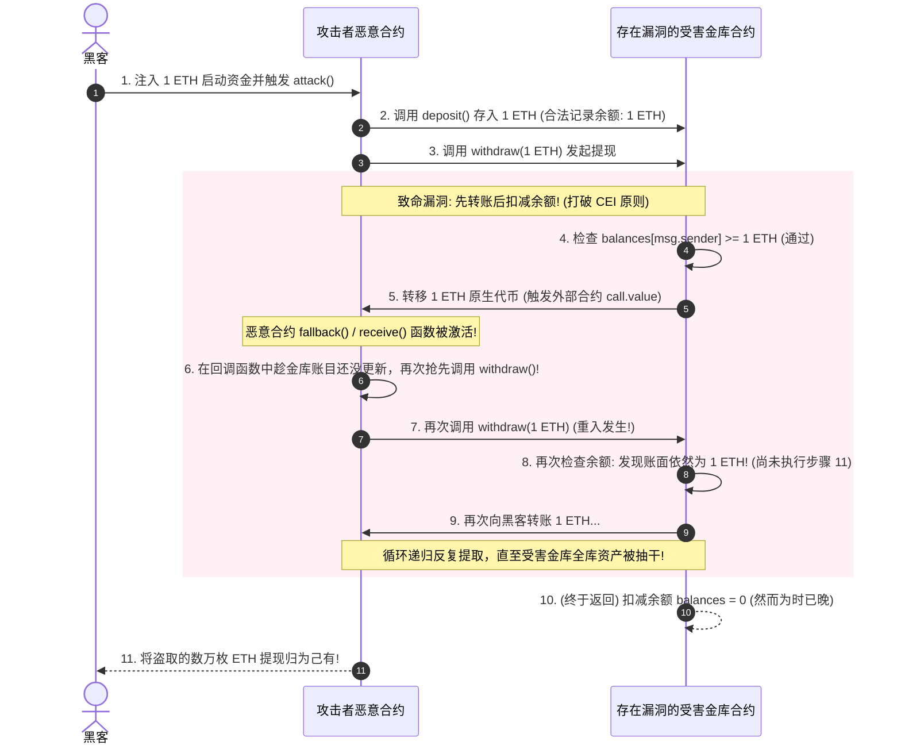
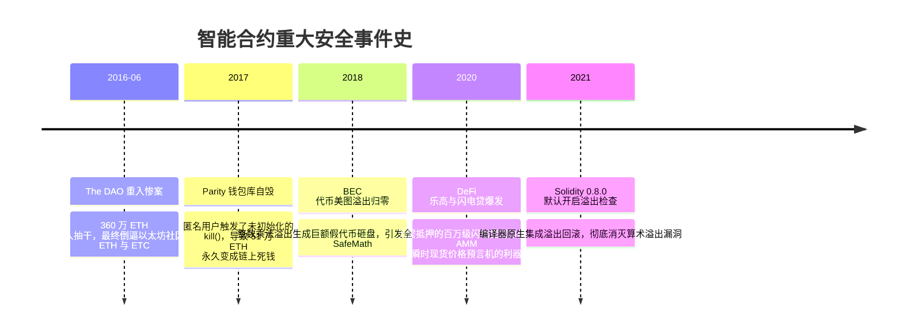

# 智能合约安全与审计 📜

## 1. 概述（What）

**智能合约安全（Smart Contract Security）** 是指运行在以太坊虚拟机（EVM）等去中心化图灵完备区块链环境中的字节码程序的安全性。由于智能合约代码一经部署上链便**不可篡改（Code is Law）**，且直接操纵着成千上万用户的巨额原生加密数字资产，任何微小的逻辑代码缺陷都可能导致上亿美元资产在几秒钟内被黑客洗劫一空，且无法通过人工后台回滚数据库挽回损失。

- **核心覆盖典型漏洞**：
  1. **重入漏洞（Reentrancy Attack）**（导致以太坊硬分叉的 The DAO 惨案元凶）；
  2. **整数溢出与下溢（Integer Overflow/Underflow）**；
  3. **闪电贷价格操纵（Flash Loan Price Manipulation）**；
  4. **未授权权限控制与初始化漏洞**。

---

## 2. 原理详解（How it works）

### 图表：经典重入攻击（Reentrancy Attack）恶意合约循环提款时序图

图 9-9：智能合约经典重入攻击（Reentrancy）反复递归劫持控制流时序图

---

### 防御重入的核心铁律：CEI 原则与重入锁

1. **检查-生效-交互原则（Checks-Effects-Interactions, CEI）**：
   在向任何外部不可信地址发送代币（Interactions）**之前**，必须先在合约内部完成状态变量的更新与扣减（Effects）。这样即使攻击者在回调中再次重入，此时内部余额已清零，重入请求会在第一步 Checks 时直接被 `revert` 阻断！
2. **非重入互斥锁（ReentrancyGuard）**：
   使用 OpenZeppelin 标准库的 `nonReentrant` 修饰器，在函数入口将状态位打为 `LOCKED`，执行完毕再恢复 `UNLOCKED`，直接在状态机层面阻断并发重入。

---

## 3. 协议与标准（Protocols & Standards）

| 规范标准 | 机构 / 社区 | 核心定位 |
| :--- | :--- | :--- |
| **OpenZeppelin Contracts** [1] | OpenZeppelin | 智能合约工业级安全基准库（提供安全 ERC20、ReentrancyGuard、Ownable） |
| **SWC Registry (Smart Contract Weakness)** [2] | 智能合约安全联盟 | 智能合约已知漏洞分类学体系（如 SWC-107: Reentrancy） |
| **SCSVS (智能合约安全验证标准)** [3] | OWASP | 针对智能合约架构、代码与编译安全审计的核对清单 |

---

## 4. 发展历史（Timeline）

图 9-10：智能合约漏洞推动的演化与编译器安全防护史

---

## 5. 优缺点与安全性分析

### 智能合约典型漏洞雷区清单
- **重入攻击（SWC-107）**：务必严格践行 CEI 原则，关键函数加挂 `nonReentrant` 锁。
- **现货价格预言机操纵（Oracle Manipulation）**：直接读取去中心化交易所（如 Uniswap V2 交易对现货比例）作为抵押品价格。黑客通过闪电贷单笔砸盘瞬间拉低价格，在借贷协议中实现以极低成本借光金库。**对策：坚决采用 Chainlink 去中心化预言机或时间加权平均价格（TWAP）**。
- **当前推荐状态**：严格践行静态分析（Slither）+ 模糊测试（Foundry/Echidna）+ 专业第三方双审计。

---

## 6. 关联知识点（Related）

- **重大事件复盘**：[区块链典型攻击与事件](./06-common-attacks)（The DAO、跨链桥攻击）。
- **资产保管**：[密钥与钱包安全 (BIP39/多签)](./03-wallets-keys)。

---

## 7. 参考资料（References）

[1] OpenZeppelin. OpenZeppelin Contracts Security Documentation.  
https://docs.openzeppelin.com/contracts/

[2] Smart Contract Weakness Classification and Test Cases (SWC Registry). SWC-107: Reentrancy.  
https://swcregistry.io/docs/SWC-107

[3] OWASP. Smart Contract Security Verification Standard (SCSVS).  
https://github.com/OWASP/owasp-scsvs
