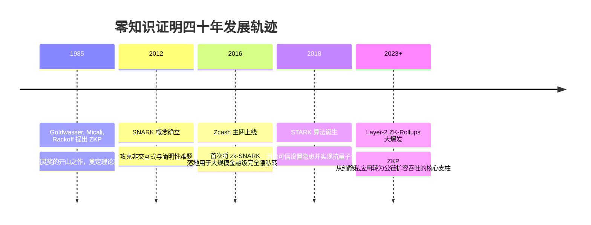

# 零知识证明 (zk-SNARK / zk-STARK) 🔮

## 1. 概述（What）

**零知识证明（Zero-Knowledge Proof, ZKP）** 是一种尖端密码学协议。它允许证明者（Prover）在不向验证者（Verifier）透露任何有效保密信息的前提下，以极高的数学概率使验证者信服某个断言（Statement）是绝对真实的。简而言之：**「我向你证明我知道秘密，但我绝不告诉你秘密是什么」**。

- **核心解决问题**：解决公有区块链"全网公开账本天然缺乏交易隐私"与"全网节点重复计算导致 TPS 性能瓶颈"的双重矛盾。
- **典型应用场景**：Zcash 隐私匿名转账、以太坊 Layer-2 ZK-Rollups 扩容（zkSync、Starknet、Scroll）、去中心化身份（DID）年龄证明（"证明我年满 18 岁而不泄露真实出生年月日"）。

---

## 2. 原理详解（How it works）

零知识证明必须满足三大基本数学性质：
1. **完备性（Completeness）**：若断言为真且双方诚实，验证者必被说服接受。
2. **可靠性（Soundness）**：若断言为假，任何作弊证明者欺骗通过验证的概率微乎其微。
3. **零知识性（Zero-Knowledge）**：验证者除了得知该断言为真以外，无法获取任何有关秘密见证（Witness）的额外信息。

### 图表：zk-SNARK 计算证明生成与链上超快速验证流程

```mermaid
flowchart TD
    subgraph 链下离线复杂计算 (证明者 Prover)
        SecretWitness[私密见证 Witness: 私钥 / 交易密码]
        PublicInput[公开输入: 账户地址 / 承诺哈希]
        
        subgraph 算术化电路表达 (R1CS / PLONK)
            CodeLogic[业务计算逻辑: C(w, x) == 0] --> GateConstraints[转换为成千上万个算术多项式门约束]
        end
        
        SecretWitness & PublicInput & GateConstraints --> ProverEngine[密码学证明引擎: 配对双线性映射 / 多项式承诺]
        ProverEngine --> SuccinctProof["🌟 极简证明 Proof (仅约几百字节!)"]
    end

    subgraph 链上智能合约轻量验证 (验证者 Verifier)
        SuccinctProof & PublicInput --> OnChainContract[以太坊轻量校验合约]
        OnChainContract --> MathVerify{执行椭圆曲线配对校验:<br/>耗时仅需几毫秒 / 固定几万 Gas}
        MathVerify -- 验证通过 --> StateUpdate[批量打包更新百万笔交易状态! 🚀]
    end
```
<div class="diagram-caption">图 9-11：零知识证明从离线算术约束电路生成简明证明到链上快速校验流程图</div>

---

### zk-SNARK 与 zk-STARK 深度技术对比

| 核心维度 | zk-SNARK | zk-STARK |
| :--- | :--- | :--- |
| **全称含义** | 简明非交互式零知识论证 (Succinct Non-interactive) | 可扩展全透明零知识论证 (Scalable Transparent) |
| **可信设置 (Trusted Setup)** | **需要**（初期需仪式生成公共参数，若私钥泄露可伪造证明） | **不需要（Transparent）**，仅依赖公开哈希函数（消除了后门疑虑） |
| **证明体积 (Proof Size)** | **极小（数百字节）**，对以太坊存储极其友好 | 较大（几十 KB），占用较多链上空间 |
| **抗量子计算威胁** | ❌ 依赖椭圆曲线，不抗量子计算 | 🌟 **抗量子计算（Post-Quantum Safe）**，基于纯哈希碰撞 |

---

## 3. 协议与标准（Protocols & Standards）

| 体系算法 | 提出者 / 年份 | 关键突破 |
| :--- | :--- | :--- |
| **Groth16** [1] | Jens Groth (2016) | 当前证明体积最小、验证最快的 zk-SNARK 标杆算法 |
| **PLONK** [2] | Gabizon, Williamson, Ciobotaru (2019) | 通用且可更新可信设置，大幅降低构建新电路的门槛 |
| **STARK 规范** [3] | Eli Ben-Sasson 等 (StarkWare) | 提出 FRI 协议，彻底摒弃可信设置与椭圆曲线，抗量子安全 |

---

## 4. 发展历史（Timeline）


<div class="diagram-caption">图 9-12：零知识证明演化史</div>

---

## 5. 优缺点与安全性分析

- **革命性价值**：突破了区块链“去中心化、安全、可扩展性”不可能三角，在链下证明成千上万笔交易的计算合法性，链上只做极速验签。
- **当前工程痛点**：生成证明（Proof Generation）的计算开销依然极其沉重，通常需要昂贵的专有 GPU 或 FPGA 矿机服务器协助加速。
- **当前推荐状态**：<span class="badge-pill status-recommended">区块链与下一代可信隐私计算未来皇冠上的明珠</span>。

---

## 6. 关联知识点（Related）

- **底层密码学**：[非对称加密 (ECC)](/02-data-protection/02-asymmetric-encryption)、[哈希与签名](/02-data-protection/03-hash-signature)。
- **前沿抗量子**：[后量子密码学 PQC](/11-quantum-security/02-pqc-standards)。

---

## 7. 参考资料（References）

[1] Jens Groth. On the Size of Pairing-based Non-interactive Arguments.  
https://eprint.iacr.org/2016/260.pdf

[2] Ariel Gabizon, Zachary J. Williamson, Oana Ciobotaru. PLONK: Permutations over Lagrange-bases for Oecumenical Non-interactive arguments of Knowledge.  
https://eprint.iacr.org/2019/953.pdf

[3] StarkWare. STARKs Whitepaper and Documentation.  
https://starkware.co/stark-math/
