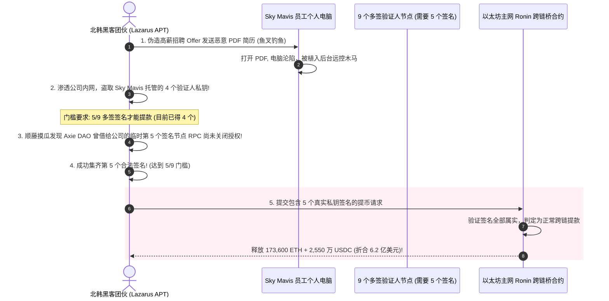
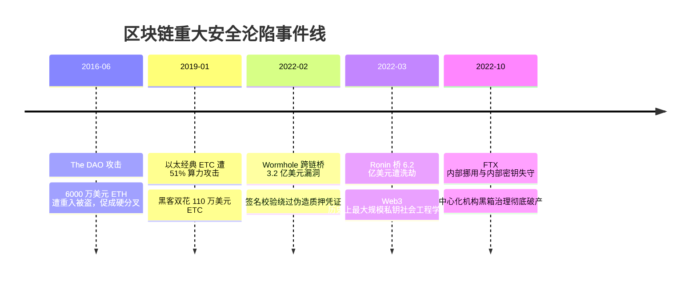

# 区块链典型攻击与重大事件剖析 💣

## 1. 概述（What）

区块链技术的“去中心化”、“匿名性”与“代码即法律”的特性，使其成为全球黑客与国家级 APT 组织最热衷的高回报攻防试验场。回顾区块链十年发展，黑客攻击已从早期的底层 PoW 算力重组，演进为**跨链桥验证人私钥钓鱼劫持、去中心化预言机闪电贷价格操纵与智能合约深层逻辑剥削**。

- **核心剖析典型事件**：
  1. **以太经典（ETC）多次 51% 双花攻击**；
  2. **Ronin 跨链桥 6.2 亿美元私钥盗窃案**（Lazarus Group APT 攻击）；
  3. **Mango Markets 1.1 亿美元预言机闪电贷操纵案**。

---

## 2. 原理详解（How it works）

### 典型攻击：跨链桥验证多签劫持（Ronin Bridge 案例）

图 9-13：Ronin 跨链桥因鱼叉钓鱼员工电脑导致多签私钥失守失窃时序图

---

## 3. 典型攻击手法全景分类

| 攻击类型 | 针对分层 | 典型案例 | 破坏力 | 根本对策 |
| :--- | :--- | :--- | :--- | :--- |
| **51% 算力双花** | 网络共识层 | ETC (以太经典) 多次遭重组 | 交易所巨额充值款被盗 | 增加交易所确认区块数（如 10,000 块）或转向 PoS |
| **跨链桥验证人劫持** | 链间互操作层 | Axie Ronin ($620M)、Wormhole ($325M) | 跨链抵押金库被掏空 | 提高多签阈值、采用 ZK 轻客户端原生证明跨链 |
| **预言机闪电贷操纵** | 应用 DeFi 逻辑层 | Mango Markets ($114M)、bZx | 借贷协议坏账暴击 | 严禁采用单 DEX 现货池做预言机，必须使用 Chainlink 聚合喂价 |
| **治理攻击 (DAO 劫持)** | 链上治理层 | Tornado Cash 治理提案投毒 | 夺取 DAO 核心金库控制权 | 治理提案代码强制静态延迟锁定期（Timelock） |

---

## 4. 发展历史（Timeline）

图 9-14：区块链十年重大安全事件历程

---

## 5. 优缺点与安全性分析

- **去中心化悖论与人性的弱点**：底层密码学（如 SHA-256、secp256k1）在数学上从未被真正攻破过，绝大多数价值数亿美元的区块链攻击，**问题全出在智能合约逻辑编码疏忽（代码写错）或人的安全意识松懈（员工电脑被钓鱼导致私钥泄露）**。
- **当前推荐状态**：高度警惕 / 严格纵深防护。

---

## 6. 关联知识点（Related）

- **共识机制**：[共识机制安全 (PoW/PoS)](./02-consensus-mechanisms)。
- **合约防御**：[智能合约安全与审计](./04-smart-contract-security)。

---

## 7. 参考资料（References）

[1] Rekt News. The Rekt Leaderboard - Top DeFi Hacks in History.  
https://rekt.news/leaderboard/

[2] FBI Cyber Division. North Korean Hackers Stole $620 Million from Axie Infinity.  
https://www.fbi.gov/news/press-releases/statement-on-attribution-of-malicious-cyber-activity-to-the-dprk
