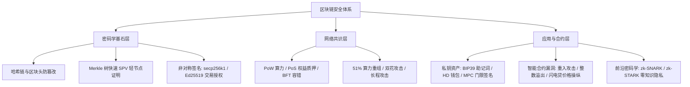

# 九、区块链安全（Blockchain Security）体系概览 ⛓️

> **区块链安全（Blockchain Security）** 探索在完全没有中心化信任机构背书的拜占庭去中心化对等网络中，如何通过密码学算法、博弈论激励与去中心化共识机制，保障分布式账本的数据一致性、资产所有权防篡改与智能合约执行安全。

---

## 🗺️ 区块链安全核心攻防全景

图 9-1：区块链分层安全模型与前沿攻防矩阵

---

## 📑 本章节知识点索引

| 知识点 | 核心技术 / 协议 | 机制与安全边界 | 探索状态 |
| :--- | :--- | :--- | :--- |
| [1. 密码学基石 (哈希链/Merkle/数字签名)](./01-cryptography-foundations) | Merkle Tree, secp256k1, SHA-256, Keccak | 状态证明、轻客户端验证、防伪造交易 | 核心基石 |
| [2. 共识机制安全 (PoW / PoS / BFT)](./02-consensus-mechanisms) | 中本聪共识, Casper, PBKDF | 算力成本防女巫、拜占庭容错、双花防御 | 核心基石 |
| [3. 密钥与钱包安全 (BIP39/HD/多签)](./03-wallets-keys) | BIP39 助记词, BIP32/44 HD, Gnosis Safe, MPC | 派生路径、门限签名、硬件冷钱包隔离 | 资产防线 |
| [4. 智能合约安全与审计](./04-smart-contract-security) | Solidity, EVM, Checks-Effects-Interactions | 重入攻击、整数溢出、重放、闪电贷攻击 | 重灾区 |
| [5. 零知识证明 (zk-SNARK / zk-STARK)](./05-zero-knowledge-proofs) | Groth16, PLONK, STARK, 算术化电路 | 证明知道秘密而不泄露秘密、ZK-Rollup 扩容 | 前沿密码学 |
| [6. 区块链典型攻击与事件](./06-common-attacks) | 51% 攻击, 跨链桥验证漏洞, 预言机操纵 | Ronin 桥事件、The DAO 事件、价格预言机闪电贷 | 实战复盘 |
