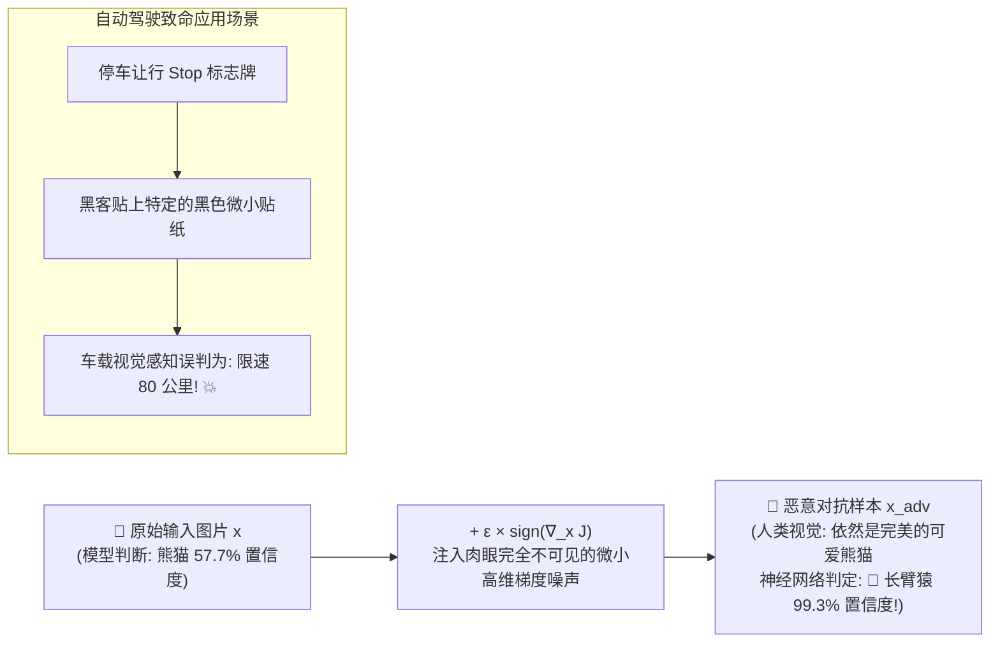
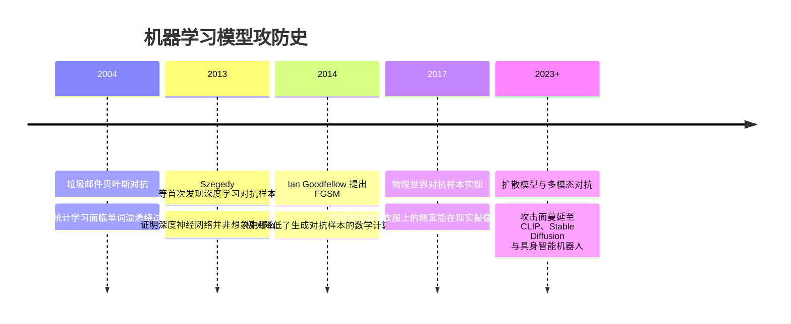

# 模型攻击面 (对抗样本 / 数据投毒 / 模型窃取 / 后门) 🎯

## 1. 概述（What）

**深度学习模型层攻击面** 是指直接针对神经网络数学计算机理、高维非线性决策边界及训练生命周期各环节展开的攻击手法。它揭示了深度学习模型的内在脆弱性：模型虽然拥有强大的模式拟合能力，但在高维连续空间中极易被微小、人类不可察觉的数学扰动所误导。

- **核心四大经典攻击面**：
  1. **对抗样本攻击（Adversarial Attacks）**：在输入数据中注入微小扰动欺骗预测；
  2. **数据投毒（Data Poisoning）**：污染清洗阶段训练集，使模型产出系统性偏见；
  3. **后门木马攻击（Backdoor Attacks）**：植入潜伏触发器（Trigger），正常输入准确率极高，一旦出现触发器便按黑客指令执行恶意逻辑；
  4. **模型窃取与逆向（Model Extraction & Inversion）**：通过黑盒高频 API 探测直接克隆模型权重或还原敏感训练集。

---

## 2. 原理详解（How it works）

### 1. 对抗样本（Adversarial Examples）与快速梯度符号法（FGSM）
Ian Goodfellow 提出的 FGSM 揭示：高维线性累积效应是对抗样本的根本成因。通过沿着损失函数相对于输入数据的梯度上升方向移动微小的步长 $\epsilon$：

$$x_{\text{adv}} = x + \epsilon \cdot \text{sign}(\nabla_x J(\theta, x, y))$$

对人类肉眼而言，图像几乎毫无变化（差异在噪声级别），但对卷积神经网络而言，内部深层特征图发生剧烈偏移，将一张"熊猫"以 99.3% 的极高置信度误判为"长臂猿"！

图 10-2：对抗样本数学扰动原理与自动驾驶物理视觉欺骗案例

---

### 2. 潜伏后门攻击（Trojan / Backdoor Attacks）
攻击者在自动驾驶训练集的一小部分（例如 0.1%）人脸图片角落画上一个黄色便利贴或红点，并将标签篡改为"绿灯通过"。
- 当测试集里没有便利贴时：模型识别准确率高达 99.9%，完美通过所有开发者的质检审查；
- 当黑客在现实中举起这个便利贴时：模型瞬间激活内置潜伏后门，引发严重事故。

---

## 3. 协议与标准（Protocols & Standards）

| 规范体系 | 机构 | 年份 | 关键说明 |
| :--- | :--- | :--- | :--- |
| **NIST AI 100-2e2023** [1] | NIST | 2024 | 《对抗性机器学习：对 AI 系统的攻击与缓解分类学权威报告》 |
| **MITRE ATLAS™** [2] | MITRE | 现行体系 | 面向人工智能系统的威胁战术、技术与常见知识库（对标 ATT&CK） |
| **ISO/IEC 24029** [3] | ISO/IEC | 2021/2023 | 《神经网络鲁棒性评估指南与测试准则》 |

---

## 4. 发展历史（Timeline）

图 10-3：对抗性机器学习发展时间线

---

## 5. 优缺点与安全性分析

- **防御策略：对抗训练（Adversarial Training）**：在训练阶段主动混合生成大量对抗样本一同训练，迫使网络学习更加平滑平坦的决策超平面。
- **当前推荐状态**：关键安全系统（自动驾驶、人脸门禁、医疗诊断）必须进行对抗鲁棒性审计。

---

## 6. 关联知识点（Related）

- **大模型新形态**：[LLM 专属安全：提示词注入与越狱](./02-llm-security)。
- **训练隐私防御**：[隐私保护机器学习：差分隐私训练](./03-privacy-ml)。

---

## 7. 参考资料（References）

[1] NIST. NIST AI 100-2e2023: Adversarial Machine Learning: A Taxonomy and Terminology of Attacks and Mitigations.  
https://csrc.nist.gov/pubs/ai/100/2/e2023/final

[2] MITRE. ATLAS (Adversarial Threat Landscape for Artificial-Intelligence Systems).  
https://atlas.mitre.org/

[3] Ian Goodfellow et al. Explaining and Harnessing Adversarial Examples (FGSM).  
https://arxiv.org/abs/1412.6572
