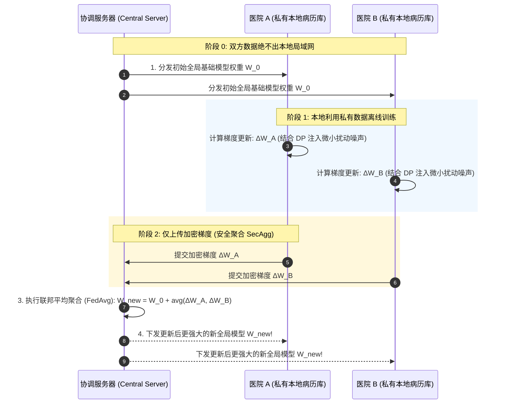
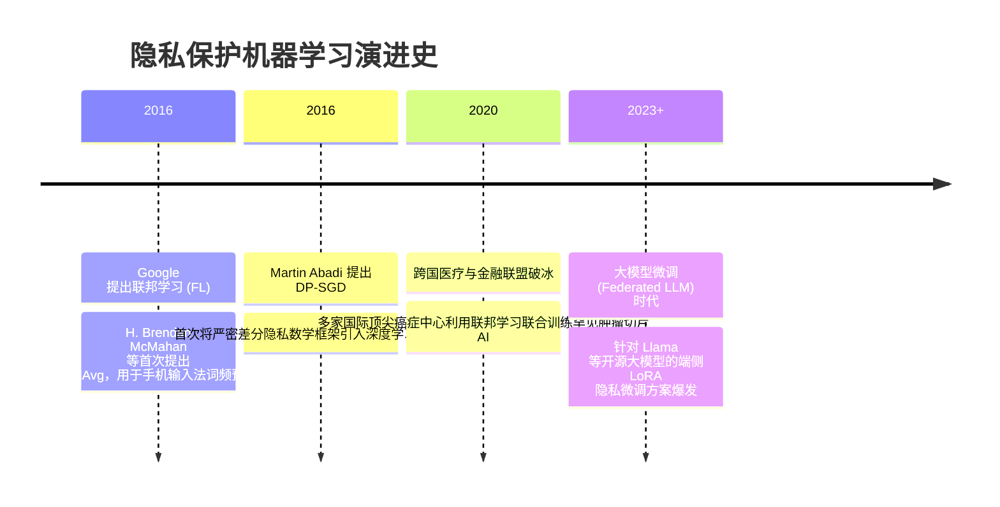

# 隐私保护机器学习 (联邦学习 / 差分隐私 / 多方计算) 🧠

## 1. 概述（What）

**隐私保护机器学习（Privacy-Preserving Machine Learning, PPML）** 融合了密码学、分布式系统与统计机器学习理论，旨在解决 AI 时代的“数据孤岛”与隐私泄露两难困境。实现**「数据可用不可见、数据不动模型动」**，在完全保护各参与方本地私有数据不被窥探的前提下，联合训练出高精度的共享全局模型。

- **核心解决问题**：杜绝黑客通过**成员推断攻击（Membership Inference Attacks）** 或 **模型逆向攻击（Model Inversion）** 反推病人真实病历、金融用户资产账单；攻克跨机构数据共享的合规壁垒。
- **三大核心支柱**：
  1. **联邦学习（Federated Learning, FL）**；
  2. **差分隐私随机梯度下降（DP-SGD）**；
  3. **安全多方计算（Secure Multi-Party Computation, MPC）**。

---

## 2. 原理详解（How it works）

### 图表：横向联邦学习（Federated Learning）参数聚合架构流程图

图 10-6：横向联邦学习本地训练与安全梯度聚合（FedAvg）协同流程图

---

### 差分隐私随机梯度下降（DP-SGD）
仅仅不传原始数据是不够的，因为模型梯度本身也可能隐式记住罕见的特异样本。  
Google 提出的 **DP-SGD（Differential Privacy SGD）** 在训练步骤中加入两道数学防御：
1. **梯度裁剪（Gradient Clipping）**：对每个样本的梯度计算其 $L_2$ 范数，将其裁剪限制在阈值 $C$ 之内，防止异常样本梯度过大破坏全局；
2. **高斯加噪（Gaussian Noise Addition）**：在裁剪后的平均梯度中注入校准的高斯随机噪声 $\mathcal{N}(0, \sigma^2 C^2 \mathbf{I})$，在数学上严格限制成员推断攻击。

---

## 3. 协议与标准（Protocols & Standards）

| 规范 | 机构 / 组织 | 核心内容 |
| :--- | :--- | :--- |
| **IEEE 3652.1-2020** [1] | IEEE | 《联邦学习体系架构与应用指南》，全球首个联邦学习国际标准 |
| **TF-Privacy / Opacus** [2] | Google / Meta | 工业级开源 DP-SGD 差分隐私深度学习训练套件 |
| **ISO/IEC 4922** | ISO/IEC | 信息安全：安全多方计算标准规范 |

---

## 4. 发展历史（Timeline）

图 10-7：隐私机器学习十年发展时间线

---

## 5. 优缺点与安全性分析

- **优势**：彻底打破行业数据壁垒，使金融联合征信、跨省跨院罕见病科研在严苛的 GDPR / PIPL 法律框架下成为现实。
- **前沿攻防对抗**：恶意客户端投毒攻击（Byzantine Attacks）——恶意参与方可能故意上传有毒的梯度破坏全局模型。**对策**：采用鲁棒聚合算法（如 Krum、Trimmed Mean）剔除异常离群梯度。
- **当前推荐状态**：政企金融与医疗 AI 合规刚需。

---

## 6. 关联知识点（Related）

- **底层数学**：[隐私保护技术：差分隐私原理](/02-data-protection/08-privacy-protection)。
- **法规约束**：[GDPR 与 PIPL 数据保护法规](/07-compliance/01-gdpr-pipl)。

---

## 7. 参考资料（References）

[1] IEEE Standards Association. IEEE 3652.1-2020: Guide for Architectural Framework and Application of Federated Learning.  
https://standards.ieee.org/ieee/3652.1/7352/

[2] Martin Abadi et al. Deep Learning with Differential Privacy.  
https://arxiv.org/abs/1607.00133
