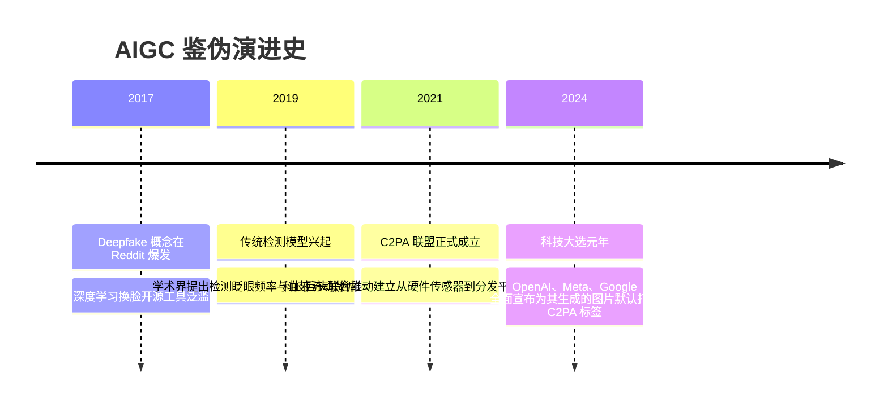

# AIGC 鉴伪与内容溯源 (Deepfake检测 / C2PA数字水印) 🖼️

## 1. 概述（What）

随着 Sora、Midjourney、Stable Diffusion 与实时换脸算法的爆发，生成式 AI 产生的声音、照片与视频逼真度已全面超越人类肉眼辨别极限。**AIGC 鉴伪与内容凭据溯源体系** 旨在建立跨硬件、跨平台、防篡改的媒体内容真伪校验链条，为数字内容赋予可追溯的"数字身份证"。

- **核心解决问题**：遏制政治大选虚假视频造谣、实时换脸视频冒充亲属/领导诈骗、影视与艺术作品版权确权。
- **两大主流路线**：
  1. **被动鉴伪检测（Passive Detection）**：通过深度学习模型检测伪造画面的生理学异常（如缺少眼球微跳动、光影边缘反常）；
  2. **主动可信溯源（Active Provenance）**：以 **C2PA 国际标准** 与不可见隐写水印（Digital Watermarking）为核心的主动防伪。

---

## 2. 原理详解（How it works）

### C2PA 内容凭据标准（Content Credentials）架构机理

由 Adobe、Microsoft、Intel、Arm、BBC 等联合发起的 **C2PA（Coalition for Content Provenance and Authenticity）** 是当前全球最具权威性的媒体确权标准：

```mermaid
flowchart TD
    subgraph 创作生成端 (硬件相机 / AI 模型)
        Camera[可信相机拍摄 / DALL-E / Sora 生成图像] --> GenHash[计算像素资产数据哈希]
        Metadata["元数据绑定 (Manifest):<br/>• 创作时间与地理位置<br/>• 创作者签名 / 模型版本 (GPT-4o)<br/>• 编辑历史 (是否经过裁剪/滤镜)"]
        GenHash & Metadata --> SignEngine[使用经 CA 认证的专有私钥进行非对称签名 (JUMBF 格式)]
        SignEngine --> EmbeddedImg[输出带 C2PA 凭据的防篡改图像]
    end

    subgraph 消费与鉴伪端 (社交平台 / 浏览器)
        EmbeddedImg --> SocialFeed[用户在 Twitter / 网页看到图片]
        SocialFeed --> C2PA_Icon["查看 ℹ️ CR 图标 (Content Credentials)"]
        C2PA_Icon --> VerifySig{验签证书信任链 & 比对像素哈希}
        VerifySig -- "若像素或元数据被篡改" --> Warning["🚨 警示: 凭据签名失效, 内容已遭二次篡改!"]
        VerifySig -- "验证通过" --> ProvenanceTree["✅ 完整呈现可信溯源树:<br/>'该图片于 2026-09 由真实硬件相机拍摄, 经 Photoshop 调整亮度'"]
    end
```
<div class="diagram-caption">图 10-8：C2PA 跨平台数字内容凭据签署、嵌入与端侧验签全流程图</div>

---

### 不可见隐写数字水印（Digital Watermarking）
C2PA 元数据若遭遇彻底的截图（Screenshot）可能会被剥离。因此需要配合**频域抗剪裁隐写水印（如 Google SynthID）**：
- 在图像高频离散余弦变换（DCT）或潜在特征空间（Latent Space）直接嵌入隐蔽标记；
- 即使图像经过压缩、加滤镜、高斯模糊甚至手机翻拍，AI 解码器依然能以 99% 的置信度读出"由 AI 生成"的底层隐形水印。

---

## 3. 协议与标准（Protocols & Standards）

| 规范体系 | 主导组织 | 状态 | 关键定位 |
| :--- | :--- | :--- | :--- |
| **C2PA Specification v1.4 / v2.0** [1] | C2PA 联盟 / Linux 基金会 | 现行国际标准 | 基于 X.509 签名与 JUMBF 容器的内容溯源行业统一技术标准 |
| **国家网信办《生成式人工智能服务管理暂行办法》** [2] | 中国国家互联网信息办公室 | 2023 施行 | 明确要求 AI 生成内容必须添加显著标签与隐式数字水印标识 |
| **Google SynthID** [3] | Google DeepMind | 商业标杆 | 针对文本、音频、图像的端到端生成式不可见水印技术 |

---

## 4. 发展历史（Timeline）


<div class="diagram-caption">图 10-9：生成式 AI 鉴伪与溯源标准演变历程</div>

---

## 5. 优缺点与安全性分析

- **主动 C2PA 溯源优势**：建立在不可篡改的密码学公私钥签名上，只要签名有效即具有法律效力的铁证。
- **被动 Deepfake 检测痛点**：陷入"猫鼠游戏"——检测模型一发布，黑客立刻将该检测模型作为判别器（Discriminator）加入 GAN 网络的对抗损失中，训练出完美绕过检测的更逼真假视频。
- **当前推荐状态**：<span class="badge-pill status-recommended">国际大厂默认强制标配 C2PA + SynthID 双轨制</span>。

---

## 6. 关联知识点（Related）

- **底层数字证书**：[PKI 与数字证书信任链](/02-data-protection/07-pki-certificates)。
- **哈希防篡改**：[哈希与数字签名](/02-data-protection/03-hash-signature)。

---

## 7. 参考资料（References）

[1] Coalition for Content Provenance and Authenticity (C2PA). Technical Specification v2.0.  
https://c2pa.org/specifications/specifications/2.0/specs/C2PA_Specification.html

[2] 中华人民共和国国家互联网信息办公室. 生成式人工智能服务管理暂行办法.  
http://www.cac.gov.cn/2023-07/13/c_1690898327029107.htm

[3] Google DeepMind. SynthID: Robust watermarking for AI-generated images, audio, and text.  
https://deepmind.google/technologies/synthid/
