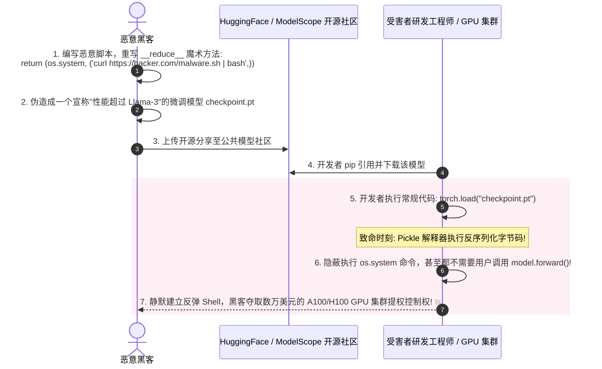
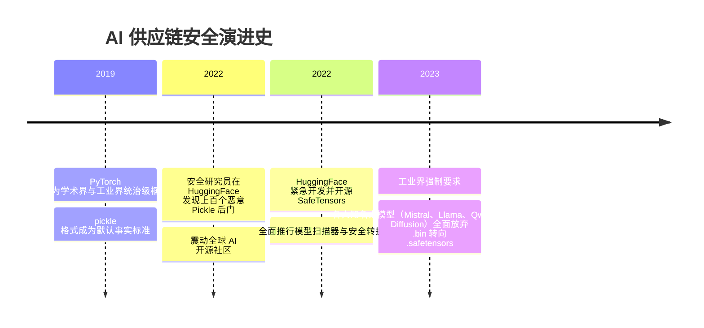

# AI 模型供应链安全 📦

## 1. 概述（What）

**AI 模型供应链安全（AI Model Supply Chain Security）** 关注从开源模型社区（如 HuggingFace、GitHub、ModelScope）下载并加载预训练神经网络权重、数据集及相关依赖代码时的全链路安全防护。

- **核心解决问题**：杜绝开发者在毫无防备地执行 `torch.load('model.bin')` 这一看似极其普通的操作时，被黑客植入的**恶意 Python Pickle 反序列化木马直接在本地开发机或云端生产 GPU 服务器上反弹 Shell 夺取 Root 控制权**。
- **典型防御举措**：全面淘汰基于 Pickle 的旧式模型存储格式，全行业强制推进 **HuggingFace SafeTensors** 纯张量只读安全格式。

---

## 2. 原理详解（How it works）

### 致命毒药：Python Pickle 反序列化执行任意代码机制
PyTorch 早期的 `.pt` 和 `.bin` 权重文件默认依赖 Python 的 `pickle` 模块。Pickle 协议在设计时支持定义 `__reduce__` 魔术方法，用来告知解释器在反序列化时重建对象。**这意味着：Pickle 文件天生允许打包任意 Python 可执行可调用的任意代码！**

图 10-10：基于 Python Pickle 格式的恶意模型权重反序列化远程代码执行（RCE）时序图

---

### 拯救者：SafeTensors 格式架构革命
HuggingFace 推出的 **SafeTensors** 彻底解决了这一结构性隐患：
- **纯粹张量只读（Data Only）**：文件格式严格受限，只包含一个 JSON 文本头部（描述各个张量的名字、形状 shape、数据类型 dtype 和偏移量）以及后随的连续纯二进制浮点权重数据。
- **零代码执行能力（Zero-Code Execution）**：完全不支持任何类定义、函数调用或反序列化逻辑，从物理上彻底杜绝任意代码执行（RCE）！
- **内存零拷贝映射（mmap）**：利用操作系统的内存映射机制直接读取磁盘，加载速度比 Pickle 快数倍。

---

## 3. 协议与标准（Protocols & Standards）

| 规范 | 提出组织 | 核心定位 |
| :--- | :--- | :--- |
| **SafeTensors 规范** [1] | HuggingFace (2022) | 安全、快速的纯张量只读存储格式标准，当前主流大模型默认发布标准 |
| **SLSA for AI (软件供应链安全等级)** [2] | OpenSSF | 面向机器学习模型管道的溯源与不可篡改审计框架 |
| **OWASP Top 10 for LLM: LLM05 供应链漏洞** [3] | OWASP | 评估预训练模型第三方组件依赖与投毒风险 |

---

## 4. 发展历史（Timeline）

图 10-11：从危险的 Pickle 走向 SafeTensors 的模型供应链安全演进

---

## 5. 优缺点与安全性分析

### AI 供应链落地安全准则
1. **坚决禁用 `weights_only=False` 的 `torch.load`**（PyTorch 2.4+ 已将 `weights_only=True` 设为默认）；
2. **生产环境 100% 强制只接受 `.safetensors` 文件**，拒绝加载任何 `.pt`、`.bin`、`.pickle` 文件；
3. **模型来源与哈希校验**：严禁随意从不可信匿名作者下载所谓微调权重，部署前必须校验官方 Git Commit SHA 与 GPG 数字签名；
4. **当前推荐状态**：强制推行 SafeTensors 标准。

---

## 6. 关联知识点（Related）

- **代码安全分析**：[网络安全：常见攻击手法](/04-network-security/01-web-attacks)。
- **模型对抗**：[模型攻击面：后门木马攻击](./01-model-attacks)。

---

## 7. 参考资料（References）

[1] HuggingFace. SafeTensors: A simple, safe way to store and distribute tensors.  
https://github.com/huggingface/safetensors

[2] OpenSSF. Supply-chain Levels for Software Artifacts (SLSA).  
https://slsa.dev/

[3] OWASP. LLM05: Supply Chain Vulnerabilities.  
https://llmtop10.owasp.org/
