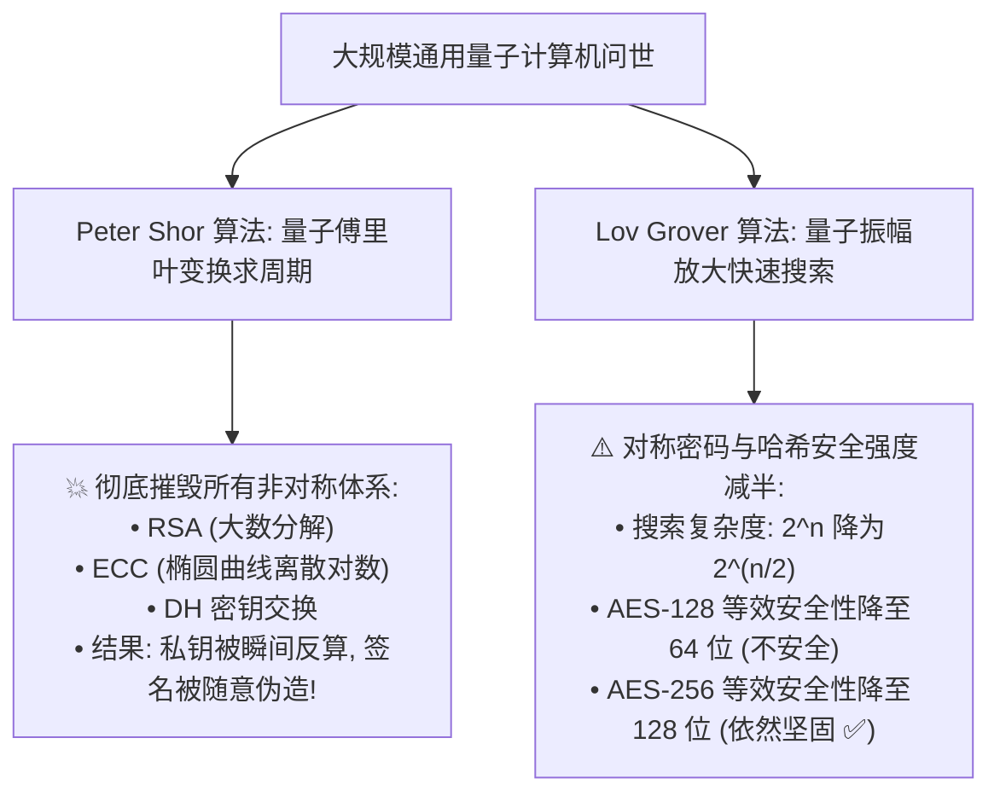
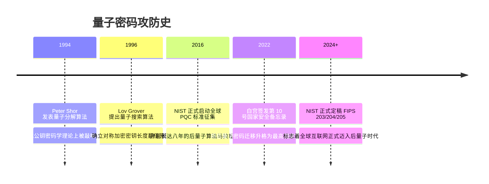

# 量子计算对现代密码学的威胁 ⚛️

## 1. 概述（What）

**量子计算威胁（Quantum Threat to Cryptography）** 是指基于量子力学原理（量子叠加态 Superposition 与量子纠缠 Entanglement）构建的大规模容错通用量子计算机（Fault-Tolerant Quantum Computer），对当前支撑全球互联网金融、HTTPS 加密、电子政务与区块链底层的所有主流公钥密码学体系所造成的**毁灭性颠覆**。

- **核心受害算法**：RSA、ECC（椭圆曲线密码）、Diffie-Hellman 密钥交换、DSA、ECDSA 全部将在多项式时间内被彻底破解。
- **现实紧迫风险**：**"先窃取后解密"（Harvest Now, Decrypt Later, SNDL）** 威胁——敌对国家情报机构正在全量录制抓取今天的互联网密文，等待数年后量子计算机问世进行追溯解密。

---

## 2. 原理详解（How it works）

### 1. Shor 算法：公钥体系的终结者（Peter Shor, 1994）
- **核心数学机制**：Shor 算法利用**量子傅里叶变换（QFT, Quantum Fourier Transform）**，能在多项式时间 $O((\log N)^3)$ 内以极大概率计算出模指数函数的周期。
- **降维打击后果**：
  - 将解决 RSA 大数质因数分解从经典计算机的亚指数级（数万年）缩减至**数分钟**！
  - 攻破椭圆曲线离散对数（ECDLP）同样降至多项式时间。
  - **这意味着：只要一台拥有几千个逻辑量子比特的机器开机，全球所有基于 RSA-4096 和 ECC-256 的公私钥对将形同虚设！**


<div class="diagram-caption">图 11-2：Shor 算法与 Grover 算法对经典密码体系的破坏深度对比图</div>

---

### 2. Grover 算法：对称体系的温和挑战（Lov Grover, 1996）
- **机理**：利用量子叠加态与振幅放大（Amplitude Amplification），在无序数据库中搜索目标项的复杂度从 $O(N)$ 降为 $O(\sqrt{N})$。
- **防御对策简单直接**：**直接将对称密钥长度翻倍！** 将 AES-128 升级为 AES-256，其等效量子搜索安全度为 $2^{128}$，在物理世界仍然是绝对无法穷举的。

---

### 3. "先窃取后解密"（SNDL: Harvest Now, Decrypt Later）威胁模型

```mermaid
sequenceDiagram
    autonumber
    actor Alice as 跨国企业 / 国防部 (Alice)
    participant Internet as 公开互联网主干网络
    actor Adversary as 敌对国情报窃听中心 (NSA / 外国黑客)
    actor Bob as 合作机构 (Bob)

    Note over Alice,Bob: 2026年: 采用经典 TLS 1.3 (RSA/ECDH) 传输绝密商业机密与军事蓝图
    Alice->>Bob: 发送传输密文数据流 C
    Internet-.->|骨干光纤无感知镜像窃听分光| Adversary
    
    rect rgb(255, 240, 245)
        Note over Adversary: 2026年: 今日录制并海量冷存储密文 C (SNDL)<br/>虽当前无力解密, 但绝密情报保密期长达 10~30 年!
        Adversary->>Adversary: 数据打上标签落盘存入庞大磁带机房
    end

    Note over Adversary: 假设 2032 年: 敌对国率先造出 10,000 量子比特计算机 (Q-Day 到来!)
    Adversary->>Adversary: 提取出当年的历史密文 C
    Adversary->>Adversary: 运行 Shor 算法 3 分钟内破解历史 ECDH 私钥!
    Adversary->>Adversary: 完整解密出二十年前的绝密战略与核心商业机密! 💥
```
<div class="diagram-caption">图 11-3："先窃取后解密"（Harvest Now, Decrypt Later, SNDL）现实威胁时序图</div>

> **图注说明（紧迫性）**：如果你的企业核心机密（研发配方、并购底牌、公民核心档案）保密期超过 10 年，那么**量子威胁绝不是十年后的远虑，而是必须今天立即升级防御的燃眉之急！**

---

## 3. 协议与标准（Protocols & Standards）

| 规范文件 | 机构 | 年份 | 关键定位 |
| :--- | :--- | :--- | :--- |
| **White House NSM-10 (国家安全备忘录)** [1] | 美国白宫总统府 | 2022 | 明确命令所有联邦机构限期向后量子密码（PQC）全面迁移 |
| **BSI Quantum Threat Assessment** [2] | 德国联邦信息安全局 (BSI) | 持续更新 | 建议所有高保密通信从 2024 年起强制引入混合抗量子密钥交换 |
| **IETF RFC 9370 (IKEv2 混合密钥交换)** [3] | IETF | 2023 | 针对 IPsec VPN 的后量子混合预共享密钥抗量子过渡扩展 |

---

## 4. 发展历史（Timeline）


<div class="diagram-caption">图 11-4：量子威胁与全球防御标准演进史</div>

---

## 5. 优缺点与安全性分析

- **莫斯卡定理（Mosca's Theorem / $X + Y > Z$）**：
  - 设 $X$ 为你的机密需要保持保密的时间（例如 15 年）；
  - 设 $Y$ 为企业完成系统架构后量子迁移所需的时间（例如 5 年）；
  - 设 $Z$ 为距离实用化量子计算机问世的年限（例如 10 年）。
  - 若 $X + Y > Z$（即 $15 + 5 > 10$），**说明即使现在开始迁移，你已经晚了！你的部分机密注定会被 SNDL 攻破！**
- **当前推荐状态**：<span class="badge-pill status-caution">高度紧迫</span>。企业应全面启动加密敏捷性（Crypto-Agility）盘点。

---

## 6. 关联知识点（Related）

- **数学解决方案**：[后量子密码学 PQC 标准化](./02-pqc-standards)。
- **物理解决方案**：[量子物理密码 (BB84 QKD 与 QRNG)](./03-qkd-qrng)。

---

## 7. 参考资料（References）

[1] The White House. National Security Memorandum on Promoting United States Leadership in Quantum Computing While Mitigating Risks to Vulnerable Cryptographic Systems (NSM-10).  
https://www.whitehouse.gov/briefing-room/statements-releases/2022/05/04/national-security-memorandum-on-promoting-united-states-leadership-in-quantum-computing-while-mitigating-risks-to-vulnerable-cryptographic-systems/

[2] Peter W. Shor. Algorithms for quantum computation: discrete logarithms and factoring.  
https://ieeexplore.ieee.org/document/365700

[3] Cloudflare Research. Post-quantum cryptography: The time to act is now.  
https://blog.cloudflare.com/post-quantum-for-all/
