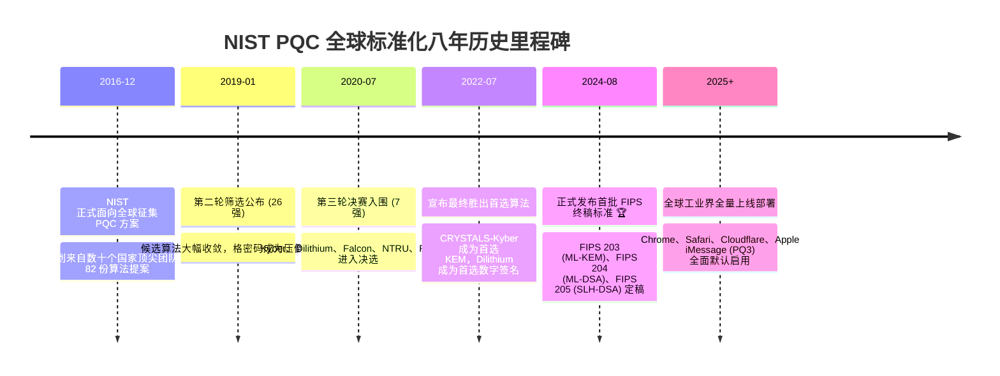

# 后量子密码学 PQC 标准化 🛡️

## 1. 概述（What）

**后量子密码学（Post-Quantum Cryptography, PQC）** 指的是**能够运行在当今现存的经典硅基计算机与网络硬件上，但其数学基础能够抵御未来已知的所有大规模通用量子计算机（含 Shor 与 Grover 算法）攻击**的新一代数学密码算法体系。

- **核心解决问题**：在无需推翻现有全球互联网光纤、路由器、操作系统与手机硬件的前提下，实现平滑、无感地向抗量子加密时代跨越。
- **划时代里程碑**：2024 年 8 月，美国国家标准与技术研究院（NIST）正式发布了全球首批 PQC 联邦信息处理标准（FIPS）：
  - **FIPS 203 (ML-KEM)**：基于模格的密钥封装机制（原 CRYSTALS-Kyber）；
  - **FIPS 204 (ML-DSA)**：基于模格的数字签名算法（原 CRYSTALS-Dilithium）；
  - **FIPS 205 (SLH-DSA)**：基于无状态哈希的数字签名算法（原 SPHINCS+）。

---

## 2. 原理详解（How it works）

### 格密码学（Lattice-Based Cryptography）的核心数学机理
PQC 的绝对统治性数学分支是**格密码学**，其安全性建立在高维欧式空间几何格点中求解**容错学习难题（LWE, Learning With Errors）** 与 **最短向量难题（SVP, Shortest Vector Problem）**。
- 在几百维到上千维的高维空间中，由于缺乏代数周期的特殊阿贝尔群对称性，Shor 算法的量子傅里叶变换完全失效！
- 无论是经典计算机还是量子计算机，在没有私钥帮助下，在高维格中寻找最近格点的复杂度均为高昂的指数级。

---

### 图表一：时间轴 — NIST PQC 全球标准化八年关键进程


<div class="diagram-caption">图 11-5：NIST PQC 标准化八年马拉松与最终定稿历程</div>

---

### 图表二：架构图 — 经典密码与 PQC 混合部署（Hybrid Mode）双保险方案

由于全新的格密码算法在数学完备性与工程实现上仅经历了数年的实战洗礼，为防范 PQC 算法可能潜藏未被发现的纯数学缺陷，工业界在过渡期统一采用**经典算法 + PQC 算法的混合模式（Hybrid Deployment，如 X25519Kyber768）**：

```mermaid
graph TD
    subgraph 客户端握手发起 (Chrome / Safari / 终端)
        Client[客户端]
        Client --> K1[生成传统经典临时公钥: X25519_Client]
        Client --> K2[生成后量子临时公钥: ML-KEM-768_Client]
        K1 & K2 --> CombinedHello["ClientHello 携带双公钥 (Hybrid KeyShare)"]
    end

    subgraph 网络传输信道
        CombinedHello --> CombinedServer[服务端计算双协商]
    end

    subgraph 服务端双重密钥协商与派生
        CombinedServer --> S1[计算传统经典共享密钥: Secret_Classical]
        CombinedServer --> S2[计算后量子封装共享密钥: Secret_PQC]
        
        S1 & S2 --> HKDF["标准 HKDF 提取器 (RFC 5869):<br/>MasterSecret = HKDF-Extract(Secret_Classical || Secret_PQC)"]
        HKDF --> Master[最终单一对称会话主密钥 MasterSecret]
    end

    subgraph 终极双保险安全保证
        Master --> SafeVerdict["🛡️ 终极安全底线保证:<br/>• 即使未来量子计算机瞬间攻破 X25519，只要 ML-KEM 安全，密文依然无法解密!<br/>• 即使某天科学家发现 ML-KEM 的数学盲区，只要 X25519 安全，传统黑客依然无法攻破!<br/>• 双重算法必须同时在数学上被攻破，通信才会失守!"]
    end
```
<div class="diagram-caption">图 11-6：经典椭圆曲线与格密码 PQC 混合部署（Hybrid Mode）架构图</div>

---

## 3. 协议与标准（Protocols & Standards）

| 正式标准编号 | 原提案名称 | 密码原语类别 | 基础数学难题 |
| :--- | :--- | :--- | :--- |
| **FIPS 203** [1] | CRYSTALS-Kyber | 密钥封装 (KEM) | 模容错学习 (Module-LWE) |
| **FIPS 204** [2] | CRYSTALS-Dilithium | 数字签名 (Signature) | 模格中带舍入的短整数解 (MSIS / MLWE) |
| **FIPS 205** [3] | SPHINCS+ | 数字签名 (Signature) | 无状态哈希碰撞 (Hash-based，抗量子绝对安全备份) |
| **IETF RFC 9180 扩展** | HPKE with PQC | 混合公钥加密标准 | 现代抗量子混合密钥分发扩展规范 |

---

## 4. 发展历史（Timeline）

如上述图 11-5 所示，从 2016 年 NIST 启动全球海选，到经历彩虹签名（Rainbow）算法在决赛前夕被一台普通笔记本电脑在几天内攻破的戏剧性转折，最终格密码学（ML-KEM / ML-DSA）以极佳的兼顾性能与密钥体积的综合优势胜出。

---

## 5. 优缺点与安全性分析

### 优点
- **彻底根除量子破译隐患**：即使敌对国造出百亿逻辑量子比特的量子巨兽，格难题依然具有指数级防范裕度。
- **计算速度惊人**：令人意外的是，ML-KEM（Kyber）在现代 CPU 上的密钥生成与封装计算速度**甚至比经典的 RSA-3072 快数十倍**！

### 工程挑战与代价
- **公钥与密文体积显著膨胀**：
  - 经典 ECC 仅需 32 字节（256 位）；
  - 而 ML-KEM-768 的公钥需要 **1184 字节**，密文需要 **1088 字节**（膨胀了 30 多倍）。
  - 这对 UDP 上的 DNS 报文与 QUIC 初始包（MTU 限制）带来了严峻的 TCP/UDP 分片风暴挑战。
- **当前推荐状态**：<span class="badge-pill status-recommended">强烈推荐开启 X25519+ML-KEM-768 混合密钥交换</span>。Cloudflare、Google Chrome 与 Apple 已全网默认启用。

---

## 6. 关联知识点（Related）

- **威胁源头**：[量子计算威胁：Shor/Grover算法](./01-quantum-threats)。
- **网络集成**：[TLS / SSL 传输安全](/02-data-protection/04-tls-ssl)。

---

## 7. 参考资料（References）

[1] NIST. FIPS PUB 203: Module-Lattice-Based Key-Encapsulation Mechanism Standard (ML-KEM).  
https://csrc.nist.gov/pubs/fips/203/final

[2] NIST. FIPS PUB 204: Module-Lattice-Based Digital Signature Standard (ML-DSA).  
https://csrc.nist.gov/pubs/fips/204/final

[3] NIST. FIPS PUB 205: Stateless Hash-Based Digital Signature Standard (SLH-DSA).  
https://csrc.nist.gov/pubs/fips/205/final
